# JVM

java virtual machine （java二进制字节码运行环境）

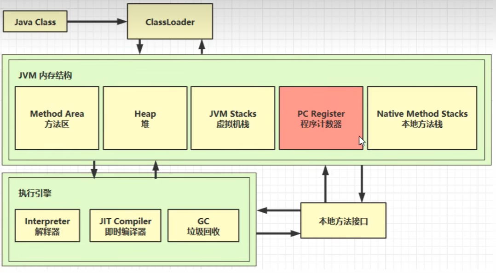

# 内存结构

## 1.程序计数器

program counter register （寄存器）。记住下一条指令的地址

特点：1.线程私有。2.不会存在内存溢出。

```java
指令对应的地址:二进制字节码     jvm指令    java源代码
0: getstatic     #20// PrintStream out = System.out;
3: astore_1 // --
4: aload_1 // out.println(1);
5: iconst_1 // --
6: invokevirtual #26 // --
9: aload_1 // out.println(2);
10: iconst_2 // --
11: invokevirtual #26 // --
14: aload_1 // out.println(3);
15: iconst_3 // --
16: invokevirtual #26 // --
19: aload_1 // out.println(4);
20: iconst_4 // --
21: invokevirtual #26 // --
24: aload_1 // out.println(5);
25: iconst_5 // --
26: invokevirtual #26 // --
29: return
```


## 2.虚拟机栈

### 2.1定义

java virtual mechanic stacks 每个线程运行时需要的内存空间

一个栈由多个**栈帧（一个方法的调用）**组成，当方法运行完毕之后当前栈帧出站释放 

每个线程只能有一个**活动栈帧**，对应每次方法调用时所占的内存

栈帧：参数，局部变量，返回地址

```java
/**
 * 演示栈帧
 */
public class Demo1_1 {
    public static void main(String[] args) throws InterruptedException {
        method1();
    }

    private static void method1() {
        method2(1, 2);
    }

    private static int method2(int a, int b) {
        int c = a + b;
        return c;
    }
}
```

问题：

1.垃圾回收是否涉及栈内存？

   不需要，栈内存方法调用结束会自动出栈不需要GC

2.栈内存越大越好吗？

​    不是，栈内存越大线程数变少，因为内存是固定的，最多增加了方法递归调用，不会使代码运行效率更快

3.方法内的局部变量是否是线程安全？

   如果方法内局部变量没有逃离方法的作用访问，它是线程安全的；如果是局部变量引用了对象，并逃离方法的作用方法，需要考虑线程安全

### 2.2 栈内存溢出

栈帧过多，栈帧过大

### 2.3 线程运行诊断

cpu占用过多：

用top定位哪个进程对cpu的占用过高

jstack进程id，根据线程id找到有问题的线程

程序运行时间过长没结果：

## 3.本地方法栈

native method stacks 调用本地方法时提供的内存空间。不由java代码编写的使用c/c++编写的本地方法接口

## 4.堆

### 4.1 定义

heap  通过new关键字创建的对象都会使用堆

特点：线程共享，需要考虑安全问题；有垃圾回收机制

### 4.2 堆内存溢出

```java
/**
 * 演示堆内存溢出
 * -Xmx8m
 */
public class Demo1_5 {
    public static void main(String[] args) {
        int i = 0;
        try {
            List<String> list = new ArrayList<>();
            String a = "hello";
            while (true) {
                list.add(a);
                a = a + a;
                i++;
            }
        } catch (Throwable e) {
            e.printStackTrace();
            System.out.println(i);
        }
    }
}
```


### 4.3 堆内存诊断

1. jps 工具

- 查看当前系统中有哪些 java 进程

1. jmap 工具

- 查看堆内存占用情况

1. jconsole 工具

- 图形界面的，多功能的监测工具，可以连续监测


## 5.方法区

method area 

### 5.1 定义

所有java虚拟机共享的区域，存储了类结构相关的信息（成员变量，方法数据，类构造器，成员方法）

在虚拟机被启动时创建，逻辑上是堆的组成部分

### 5.2 方法区组成


元空间里的：类的[运行时常量池]

每个 Class 文件加载后，自带一份**运行时常量池**，存类里的字面量、符号引用（方法名、字段名、类名等）。

JDK1.8：这块放在 Metaspace（元空间，方法区实现），就是图左下角元空间里标注的「常量池」。

堆里红色块：全局「StringTable 字符串常量池」

这是**全局共享的字符串池**，专门缓存 `""` 字面量字符串，也就是你图右边堆里红色的 StringTable。

JDK6：StringTable 在永久代（方法区内部）；

JDK7 及 1.8：StringTable 迁移到 Java 堆，**不在元空间**。

### 5.3 方法区内存溢出

使用的系统内存所以不会出现内存溢出

```java
/**
 * 演示元空间内存溢出
 * -XX:MaxMetaspaceSize=8m
 */
public class Demo1_8 extends ClassLoader { // 可以用来加载类的二进制字节码
    public static void main(String[] args) {
        int j = 0;
        try {
            Demo1_8 test = new Demo1_8();
            for (int i = 0; i < 10000; i++, j++) {
                // ClassWriter 作用是生成类的二进制字节码
                ClassWriter cw = new ClassWriter(0);
                // java版本号，public，类名，包名，父类，接口
                cw.visit(Opcodes.V1_8, Opcodes.ACC_PUBLIC, "Class" + i, null, "java/lang/Object", null);
                // 返回 byte[]
                byte[] code = cw.toByteArray();
                // 执行了类的加载
                test.defineClass("Class" + i, code, 0, code.length); // Class 对象
            }
        } finally {
            System.out.println(j);
        }
    }
}
```


```java
/**
 * 演示永久代内存溢出
 * -XX:MaxPermSize=8m
 */
public class Demo1_8 extends ClassLoader {
    public static void main(String[] args) {
        int j = 0;
        try {
            Demo1_8 test = new Demo1_8();
            for (int i = 0; i < 20000; i++, j++) {
                ClassWriter cw = new ClassWriter(0);
                cw.visit(Opcodes.V1_6, Opcodes.ACC_PUBLIC, "Class" + i, null, "java/lang/Object", null);
                byte[] code = cw.toByteArray();
                test.defineClass("Class" + i, code, 0, code.length);
            }
        } finally {
            System.out.println(j);
        }
    }
}
```


### 5.4 常量池

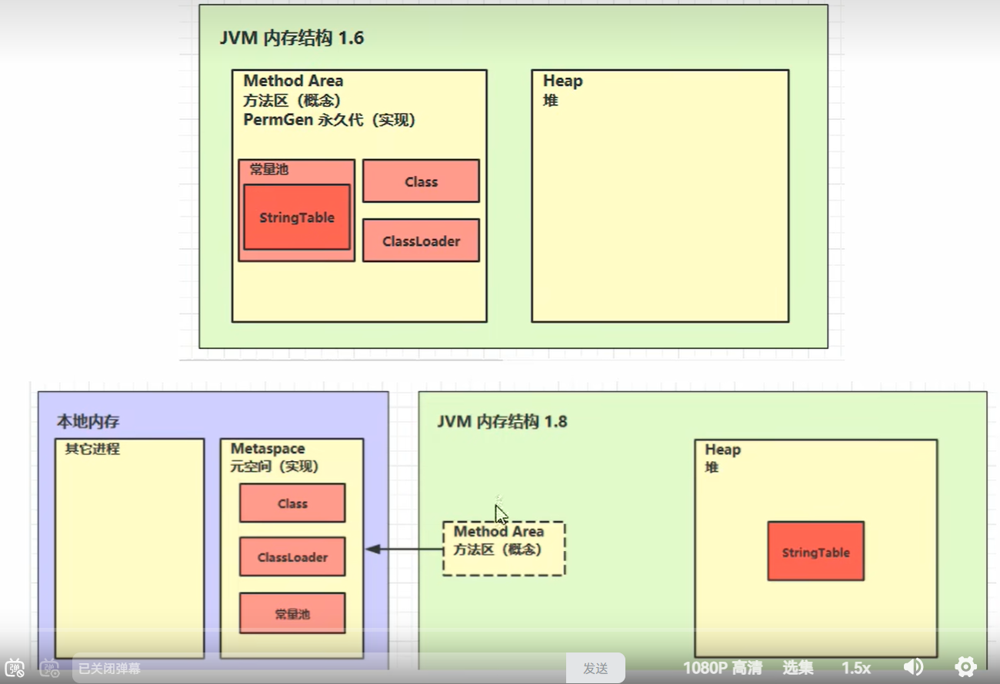

就是一张表，虚拟机指令根据这张表找到要执行的类名，方法名，参数类型，字面量等信息

1. Class 文件常量池（静态常量池）

1. **创建时机**：`javac` 编译 `.java` 生成 `.class` 文件时，存在**磁盘字节码文件**中；
2. 存储内容
   - 字面量：字符串、整型 / 浮点常量、`XXX.class` 字面量；
   - 符号引用：类名、字段、方法、方法描述符（如 `System.out.println` 全部以符号形式存储）；
3. **特点**：静态固定，仅文本符号，无真实内存地址，是类所有符号信息的存储仓库；
4. **边界**：只是 `.class` 文件其中一段，不包含方法字节码、字段修饰符等其他类信息。


### 5.5 运行时常量池

常量池是*.class文件中的，当该类被加载时他的常量池信息会放入运行时常量池，并把符号地址变为真实地址

1. **创建时机**：类加载阶段（加载后、链接阶段），在**方法区（JDK8 + 元空间）** 开辟内存；
2. **来源**：完整拷贝 Class 文件常量池所有条目；
3. **核心操作（链接 - 解析）**：把池内**符号引用**翻译为虚拟机可直接使用的直接引用（内存地址）；
4. 特点
   - 属于内存区域，伴随类生命周期；
   - **动态可变**：运行时可通过 `String.intern()` 新增常量；
   - 存放本类全部字面量 + 所有代码用到的类 / 字段 / 方法引用，不局限于成员方法。


### 5.6 字符串常量池

 Stringtable

存储内容：**堆中 String 对象的引用**

作用：复用字符串，`"xxx"` 字面量、`intern()` 都操作它

和运行时常量池是两个完全独立的内存结构

```java
String s1 = "a";
String s2 = "b";
String s3 = "a" + "b";
String s4 = s1 + s2;
String s5 = "ab";
String s6 = s4.intern();

// 问
System.out.println(s3 == s4); //false
System.out.println(s3 == s5); //true
System.out.println(s3 == s6);

String x2 = new String("c") + new String("d");  //new String()创建在堆中,再赋值给x2
String x1 = "cd";
x2.intern(); //主动将串池还没有的字符串放入串池

// 问，如果调换了【最后两行代码】的位置呢，如果是jdk1.6呢
System.out.println(x1 == x2);  //true,jdk1.6为false
```

常量池中的信息会被加载到运行时常量池中，此时a,b,ab都是常量池中的符号，还没有变为java字符串对象

```java
String s1 = "a";
String s2 = "b";
String s3 = "a" + "b";
```


```java
String s1 = "a";
String s2 = "b";
String s4 = s1 + s2; //new stringBuilder().append("a").append("b").toString(); 
//toString()创建了一个新的字符串对象
```


```java
String s5 = "a"+"b";  //直接找已经拼接好的ab
//编译优化结果已经确定为ab
```


### 5.6 StringTable的位置

jdk1.6在方法区的永久代中，jdk1.7放入到堆中


### 5.7 StringTable垃圾回收

字符串常量中的不用的会被gc回收

回收条件：字符串不存在**任何强引用**（局部变量、静态变量、对象属性等全部无引用）；

JDK6 字符串常量池在永久代、强引用，几乎无法 GC；JDK7 + 移到堆，采用弱引用，方法结束后若无任何全局强引用，GC 触发时可回收闲置字符串；静态常量、系统类持有的字符串永远不会回收。


### 5.8 StringTable性能调优

StringTable底层是hash表，所以可以通过修改桶的个数，减少hash碰撞

设置stringtable的桶的个数调大

-XX:StringTableSize = 1009

什么情况下要用到StringTable？常量折叠

```java
intern()
```


## 6. 直接内存

direct Memory

### 6.1 定义

不属于jvm结构属于系统内存

常见于nio	操作时的数据缓冲区，回收成本高，但io性能高

不受jvm管理


普通io需要将文件拷贝2次，第一次从磁盘拷贝到系统缓冲区，然后java指令从系统缓冲区读取到java缓冲区，速度很慢

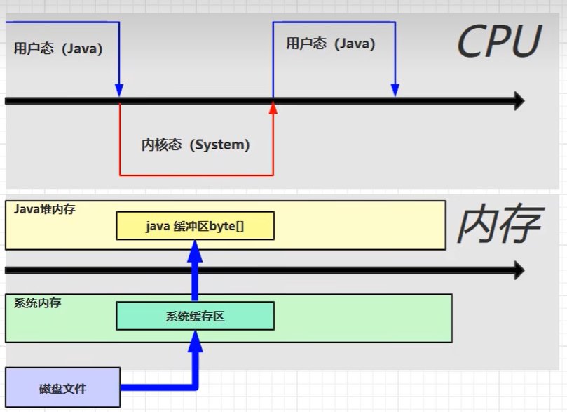


在操作系统中划分一块直接内存，java指令可以直接访问，共享的内存区域，提高io效率，减少了一次拷贝

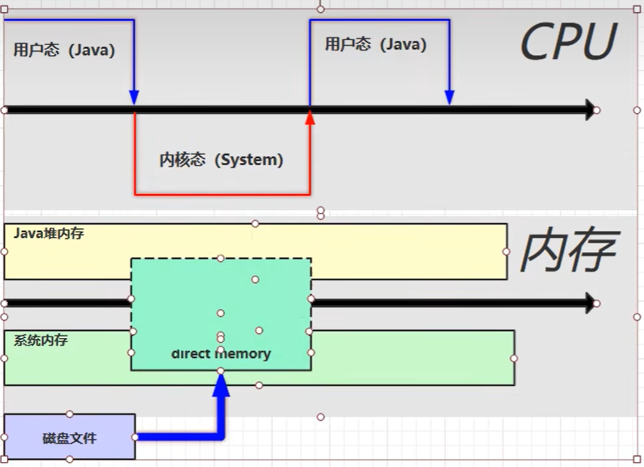


# 垃圾回收

## 1 如何判断对象可以回收

### 1.1 引用计数法

变量引用一次计数+1，不引用-1，为0回收，弊端：循环引用

### 1.2 可达性分析算法

java虚拟机中的垃圾回收器采用这种方式来探索存活对象

扫描堆中对象，看是否能沿着根对象（不能被删除的对象）为起点的引用链找到该对象，找不到表示可以回收

### 1.3 四种引用

##### 强引用

创建new对象并且赋值给一个变量，那么该变量就是强引用

```java
Object obj = new Object();
```


##### 软引用

当没有强引用时，发生了垃圾回收，会回收掉软引用对象,内存充足时，GC**不回收**；

```java
import java.lang.ref.SoftReference;

public class SoftRefDemo {
    public static void main(String[] args) {
        // 1.创建对象，包装为软引用
        Object obj = new Object();
        SoftReference<Object> softRef = new SoftReference<>(obj);
        // 断开强引用，只剩软引用
        obj = null;

        // 内存充足时，能拿到对象
        System.out.println(softRef.get()); // java.lang.Object@xxx

        // 手动触发GC（仅提醒，不一定立即执行）
        System.gc();
        try {
            Thread.sleep(1000);
        } catch (InterruptedException e) {
            e.printStackTrace();
        }

        // 内存依然充足，对象还在
        System.out.println(softRef.get()); // 不为null

        // 如果堆内存占满，JVM即将OOM时，软引用对象会被清空，get()返回null
    }
}
```

特点

- 内存够用：存活；内存不够：回收；
- 适合缓存场景，牺牲缓存避免 OOM。


##### 弱引用

当没有强引用时，不管内存是否够用，都会回收掉弱引用对象

生命周期极短，典型用途：`WeakHashMap`、StringTable

```java
import java.lang.ref.WeakReference;

public class WeakRefDemo {
    public static void main(String[] args) {
        Object obj = new Object();
        WeakReference<Object> weakRef = new WeakReference<>(obj);
        // 断开强引用，只剩弱引用
        obj = null;

        // GC前可以拿到对象
        System.out.println(weakRef.get()); // 不为null

        // 触发GC
        System.gc();
        try {
            Thread.sleep(1000);
        } catch (InterruptedException e) {
            e.printStackTrace();
        }

        // 只要GC执行完毕，弱引用直接被清空，返回null
        System.out.println(weakRef.get()); // null
    }
}
```


带引用队列（回收后通知）

回收后的对象会进入 `ReferenceQueue`，可以监听对象被回收：

```java
import java.lang.ref.ReferenceQueue;
import java.lang.ref.WeakReference;

public class RefQueueDemo {
    public static void main(String[] args) throws InterruptedException {
        ReferenceQueue<Object> queue = new ReferenceQueue<>();
        Object obj = new Object();
        WeakReference<Object> weakRef = new WeakReference<>(obj, queue);
        obj = null;

        System.gc();
        Thread.sleep(1000);

        // 取出被回收的引用
        System.out.println(queue.poll());
    }
}
```


##### 虚引用（直接内存地址）

必须配合引用对列使用，创建时关联一个引用对列

只要目标对象不存在任何**强、软、弱引用**，哪怕还挂着虚引用，JVM 照样直接回收这个对象。

虚引用这条指针，不会给对象增加任何存活权重，GC 标记阶段直接判定对象可回收。

```java
ReferenceQueue<Object> queue = new ReferenceQueue<>();
Object target = new Object();
// 仅创建虚引用，没有其他任何引用
PhantomReference<Object> pr = new PhantomReference<>(target, queue);
target = null; // 切断唯一强引用
```

此时：

目标对象只剩虚引用，**虚引用拦不住 GC**。

执行`System.gc()`后，JVM 直接销毁`target`对象，释放它的堆内存。

虚引用唯一作用：事后通知

对象被彻底回收之后，这个`PhantomReference`包装对象会被丢进`ReferenceQueue`。

我们通过队列感知：“刚才那个对象已经彻底没了”，去清理配套资源（堆外内存、文件句柄）。

补充直观对比

1. 只剩软引用：内存够 → 对象不回收；
2. 只剩弱引用：不触发 GC → 对象不回收；
3. 只剩虚引用：随时能回收，虚引用毫无阻拦作用。


##### （终结器引用）

不是你手动标记，**JVM 自动创建**：

只要一个类重写了 `finalize()`，new 对象时 JVM 就会自动绑定一条 `FinalReference` 指向这个对象。

第一次 GC 完整流程

1. 所有普通强引用全部断开；
2. GC 标记阶段发现：对象有 `FinalReference`（重写了 finalize）；
3. 不会直接销毁对象，把这个 `FinalReference` 扔进内部 **Finalizer 队列**；
4. 此时对象依旧存活，堆内存不释放，相当于 “暂缓回收”。

Finalizer 线程处理队列

后台专门线程取出队列里的对象，**临时生成强引用锁住对象**，执行 `finalize()`；

- 执行期间对象不可能被回收；
- `finalize()` 跑完，这条临时强引用消失。

什么时候才会真正回收（第二次 GC）

`finalize` 执行完毕后：

对象身上只剩下 `FinalReference`，没有任何强引用托底。

等到**下一次 GC**到来，JVM 看到它已经执行过 finalize，不再二次入队，直接彻底回收、释放内存。

## 2 垃圾回收算法

### 2.1 标记清除

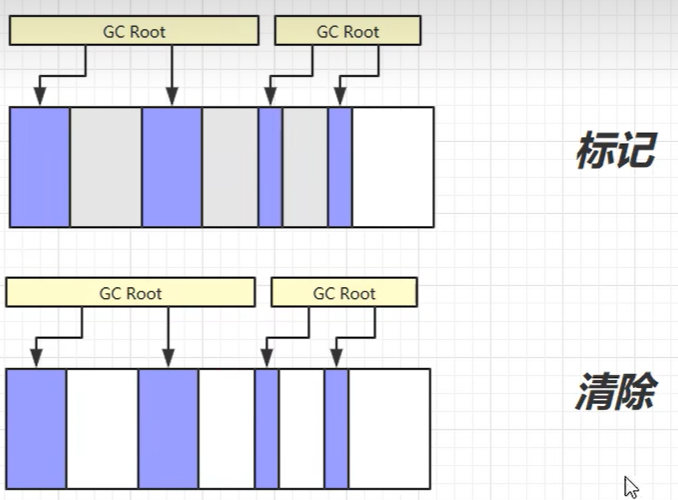

**从 GC Roots 出发遍历，能到达的对象 → 标记存活；没被标记的 = 垃圾对象**，没有引用的会被标记为需要回收的对象，凡是**未标记的垃圾对象**，直接回收这块内存；

速度快

缺点：产生大量内存碎片；两个阶段都需要 STW（Stop-The-World）标记阶段要暂停用户线程，防止引用关系不断变化；

清除阶段一般也会 STW。


### 2.2 标记整理

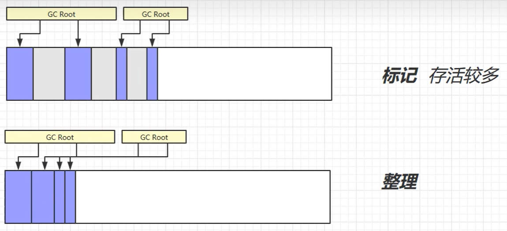

还是需要标记，但是不同的是需要将可用对象进行整理，将对象之间紧凑排列，连续空间变多；

没有碎片

缺点：整理需要移动复制拷贝，效率低


### 2.3 复制

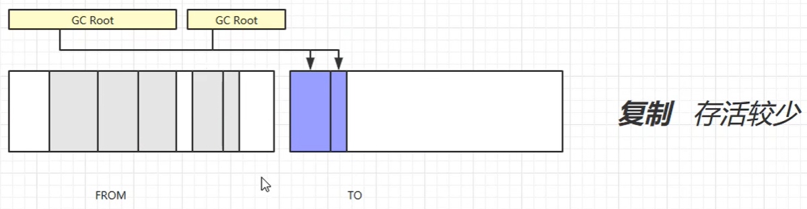

将内存区域化成了大小相等的2块内存区域（from，to），标记不会引用的对象，将引用的对象复制到to内存区域中，此时from区域就只剩下没有引用的对象，此时清空from区域，然后再交换from和to；

没有内存碎片

缺点：占用双倍内存空间

## 3 分代垃圾回收

结合前面的垃圾回收算法，结合使用

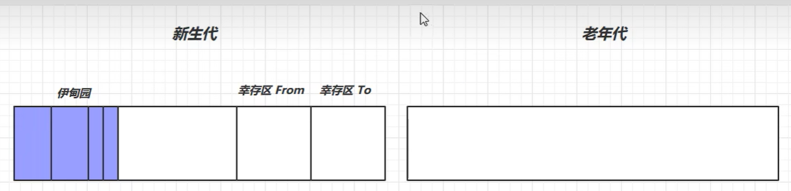

新生代（没价值的对象）的垃圾回收比较频繁，老年代（有价值的对象）的不怎么动

伊甸园：对象创建的区域

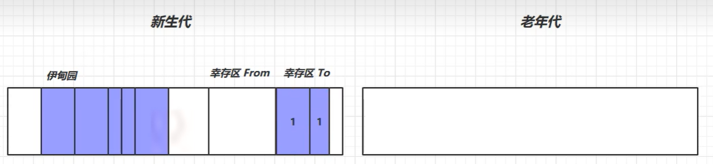

当伊甸园中的区域无法放下创建的对象时会触发一次小的垃圾回收（minor GC）,就会沿着rootGC去向下寻找，将还引用的对象复制到幸存区to中将幸存的每个对象并计数+1，伊甸园中没有被rootGC引用的对象会被回收，交换from和to位置

minor GC会触发stop the world：暂停用户线程，等GC完成之后在恢复运行

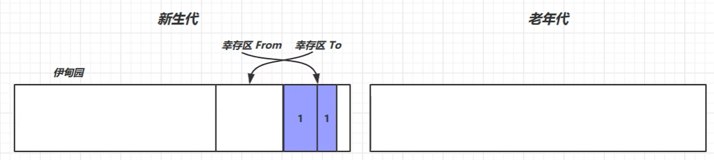

此时可以继续将新建的对象放入伊甸园中，此时若伊甸园满了，再次触发一次minor GC，同时也会对幸存区from中也进行一次垃圾回收，将幸存的对象再次放到幸存区to中再+1，再交换from和to

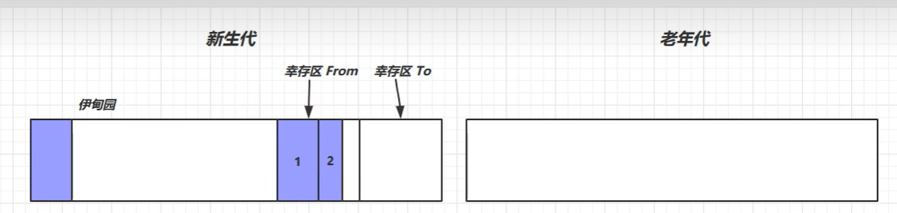

当辛存区的对象计数达到阈值（最大15次），就说明该对象引用次数较多，晋升到老年代

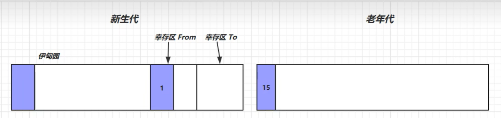

当老年代区域和新生代区域都满了，新对象哪里都装不进去了，会先触发一次minor GC，若还不够则再触发一次Full GC,对老年代进行一次垃圾回收，STW时间更长

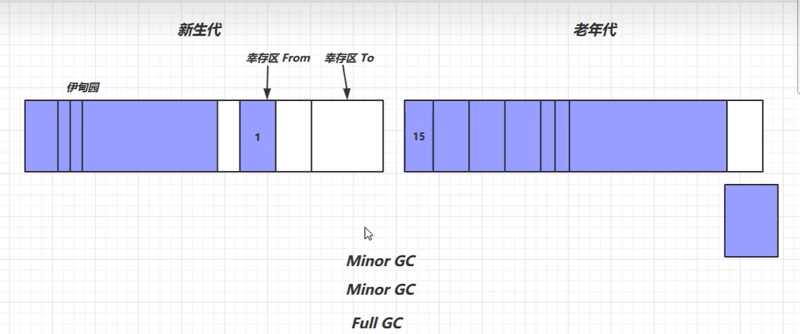

## 4 垃圾回收器

**串行**

单线程

堆内存较小，适合个人电脑


**吞吐量优先**

多线程

堆内存较大，需要多核cpu

让单位时间内，STW的时间最短

意思是：假设总共花费了2次GC，每次GC花费0.3s 0.3s 总共花费了0.6s，虽然单次花费时间较长，但次数少

**响应时间优先**

多线程

堆内存较大，需要多核cpu

尽可能让单次STW的时间缩短

意思是：总共花费了5次GC，每次GC花费0.1s 0.1s 0.1s 0.1s 0.1s，一共花费了0.5s时间

### 4.1 串行

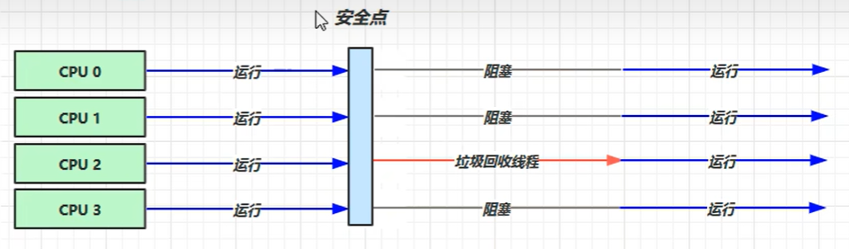

到达安全点时cpu停下来，等待GC回收完成之后其他cpu再运行，GC期间阻塞

### 4.2 吞吐量优先

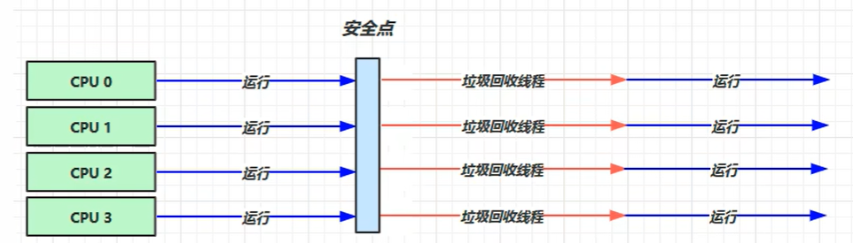

到达安全点后cpu停下来，GC会开启多个线程进行GC，此时所有cpu都会进行GC，cpu占有率会突然彪高

### 4.3 响应时间优先

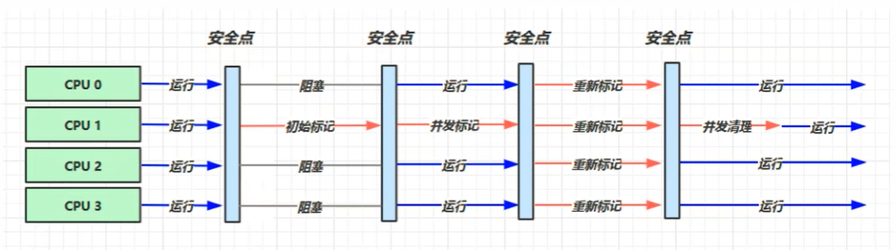

**CMS（Concurrent Mark Sweep，并发标记清除收集器）** 

初始标记 (STW)：标记 GC Roots 直接可达的存活对象；

并发标记：顺着起点遍历，标记全部存活对象；此时业务线程同时运行，引用关系持续变化；

重新标记 (STW)：暂停业务，修复并发标记时引用变动造成的漏标；

并发清理：回收所有未标记的垃圾，不会移动存活对象，产生内存碎片。

四个阶段拆解

1. 初始标记（Initial Mark）【STW】

- 需要暂停全部用户线程（图中 CPU0/2/3 阻塞，只有 GC 线程 CPU1 执行）
- **只标记 GC Roots 直接关联的对象**，不会递归遍历整个引用链
- 耗时很短，STW 停顿时间少


2. 并发标记（Concurrent Mark）【无 STW】

- **GC 线程 和 用户线程同时并发运行**，不需要暂停业务
- 顺着初始标记的对象，递归遍历整个引用链，标记所有存活对象
- ⚠️ 隐患：用户线程持续运行，可能在这段时间**修改引用、新增对象**，产生漏标（浮动垃圾）


3. 重新标记（Remark）【STW】

- 再次触发 STW，暂停所有用户线程
- 修正【并发标记阶段】因为业务线程运行而变动的引用，补标记漏掉的存活对象
- 停顿时间一般长于初始标记，但远低于串行收集器


4. 并发清理（Concurrent Sweep）【无 STW】

- GC 线程与用户线程并发执行
- 清理所有未被标记的垃圾对象
-  **不会整理内存**，回收后产生大量内存碎片


先纠正一个根本认知：

✅ GC 正确思路：**标记存活对象，剩下的默认是垃圾**

❌ 不是直接去找垃圾对象！你想法这里刚好颠倒了。


问题 1：为什么初始标记只标记 GC Roots 直接指向的对象？

1）底层算法：可达性分析（正向遍历）

JVM 没法逆向扫描：“谁引用了这个对象”，逆向扫描代价极高。

只能正向遍历：**从 GC Roots 出发，顺着引用链一路找到所有活着的对象**。

逻辑：能走到 = 存活；没走到 = 垃圾。

2）初始标记的定位（CMS 第一阶段，STW！）

初始标记阶段**用户线程全部暂停（STW）**，这个阶段不能做耗时操作！

- 如果 STW 阶段递归遍历整条引用链，停顿时间会变得很长；

- 所以只做最轻量工作：只扫描 GC Roots

  直接一层

  的对象（一级对象），不递归往下走。

  

  这一步只是

  找到遍历起点

  ，不是完整标记。

> 举例子
>
> GC Roots → A 对象 → B 对象 → C 对象
>
> 初始标记只标记 **A**，B、C 暂时不处理。

问题 2：为什么要多次标记？第一次标记完不能直接找垃圾？


先澄清：**不是 3 次独立标记，是一套连续流程**

1. 初始标记（STW）：标记根直达对象（起点）
2. 并发标记（和业务线程一起跑）：顺着起点递归遍历全部存活对象
3. 重新标记（STW）：修补并发期间产生的引用变动

关键矛盾：并发标记阶段【用户线程还在运行】

如果是**串行 GC（STW 全程暂停）**：一次完整标记就完事。

但 CMS 是**并发 GC**，并发标记时业务线程继续创建对象、修改引用！

举一个并发标记期间的经典场景（三色标记漏标问题）

1. GC 线程正在遍历，标记到 A→B→C

2. 用户线程同时执行：切断 A 对 B 的引用，新增 D→B

3. 如果没有重新标记：

   

   GC 线程此时看不到 D→B 这条新引用，B 会被误当成垃圾回收（严重 bug）

三次步骤完整串起来

1. 初始标记（STW）

   

   暂停业务，标记 GC Roots 直接可达对象，拿到遍历起点。

2. 并发标记（不暂停）

   

   GC 线程顺着起点遍历所有存活对象；

   但此时业务线程同时在修改引用关系，标记会产生漏洞

   。

3. 重新标记（STW）

   

   短暂暂停所有业务线程，扫描并发标记这段时间内所有变动的引用，修复漏标，得到一份

   准确无误的存活对象清单

   。

👉 重点：

**初始标记本身是残缺的，只能拿到第一层对象，根本没有完成全部存活对象标记！**

第一次标记结束 ≠ 找到全部垃圾，必须并发标记递归遍历，最后重新标记查漏补缺。

**拓展面试高频追问**

> 重新标记阶段修复的是什么问题？
>
> 修复三色标记的**对象漏标问题**，防止还在被业务使用的存活对象被错误回收。

> 浮动垃圾哪里来？
>
> 并发清理阶段业务线程新建的垃圾，本轮 GC 来不及标记回收，只能等待下一次 GC。

### 4.4 G1(garbage first)

同时注重吞吐量和低延迟，默认暂停目标是200ms，超大堆内存，会将划分为多个大小相等的region，整体是标记+整理算法，2个区域之间是复制算法

#### 4.4.1 G1垃圾回收阶段

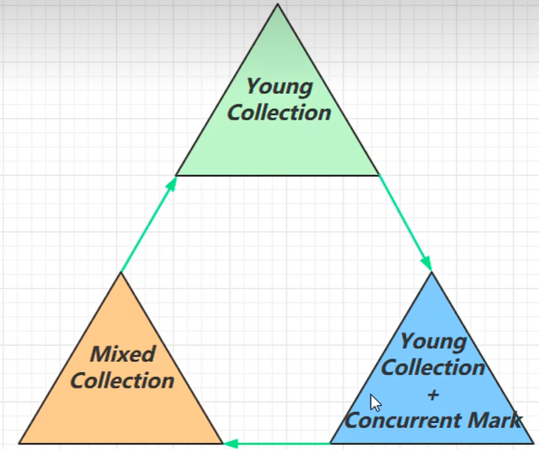

**Young Collection **

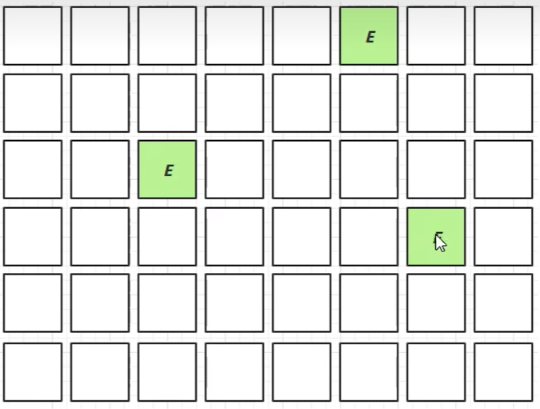

每一个空格代表一块区域包含新生代和老年代e代表伊甸园，s代表幸存区

当伊甸园被沾满后会拷贝到辛存区

之后辛存区满了之后会将一部分晋升到老年代o，一部分会被再次拷贝到辛存区

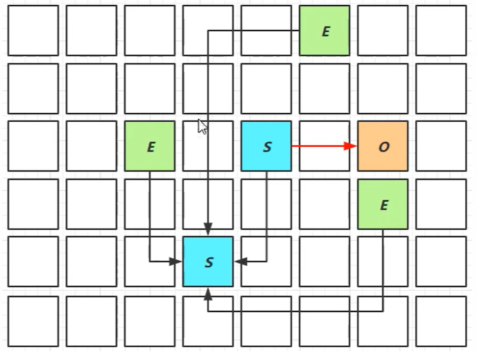


**Young Collection + concurrent Mark**

在 youngGC 进行 GCRoot 的初始标记

老年代占用堆空间比例达到阈值时45%进行并发标记（不会STW）

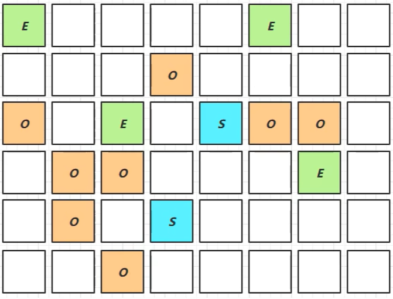


**Mixed Collection**

会对E,S,O进行全面的垃圾回收

最终标记会STW

拷贝存活会STW

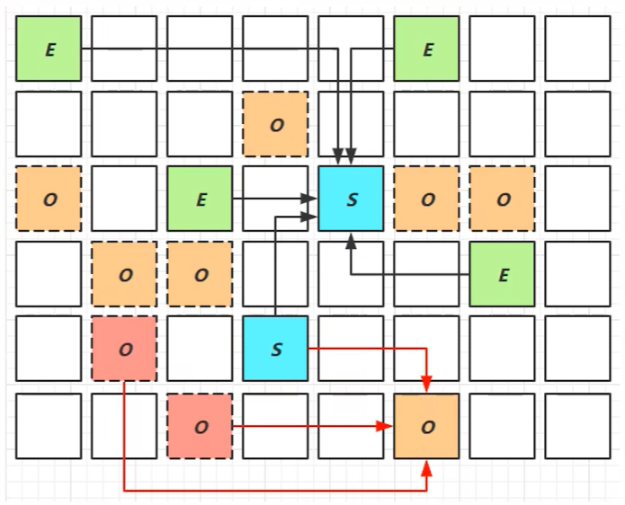

## 5 垃圾回收调优

### 5.1 调优领域

内存

锁竞争

cpu占用

io

### 5.2 确定目标

低延迟 还是 高吞吐量 选则适合的GC回收器

CMS，G1，ZGC

parallel GC


### 5.3 最快的GC是不发生GC

查看FullGC前后的内存占用，考虑下面的问题

无效数据是不是太多？


数据表示是否太臃肿？

​	对象图

​	对象大小


是否内存泄露？

### 5.4 新生代调优

新生代特点：

所有的new操作的内存分配非常廉价：TLAB： thread-local allocattion buffer

死亡对象的回收代价是0

大部分对象用过即死

minorGC的时间远超过fullGC


1.新生代内存调大，越大越好吗？

越大回收时间越长


**-Xmn**

设置新生代（托儿所）堆的初始大小与最大大小（单位：字节）。新生代区域执行 GC 的频率高于其他内存区域。

如果新生代容量过小，会频繁触发**Minor GC（新生代垃圾回收）**；

如果新生代容量设置过大，则容易触发**Full GC（全堆垃圾回收）**，而 Full GC 耗时通常很长。

Oracle 官方建议：新生代大小占总堆内存的比例保持在 **25% ~ 50%** 之间。


幸存区大到能保留（当前活跃对象+需要晋升的对象）


### 5.5 老年代调优

以CMS为例

CMS的老年代内存越大越好

先尝试不做调优，如果没有fullGC那么。。。？否则先尝试新生代调优

观察发生FullGC时老年代内存占用，将老年代内存预设调大1/4 - 1/3

