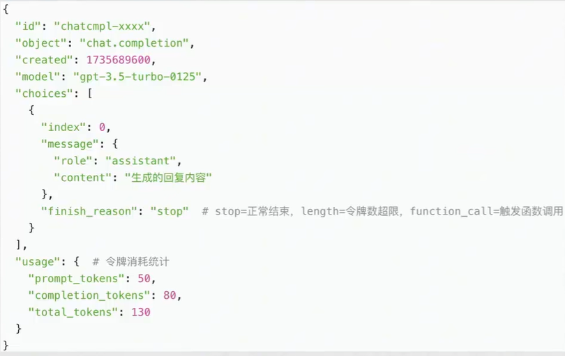
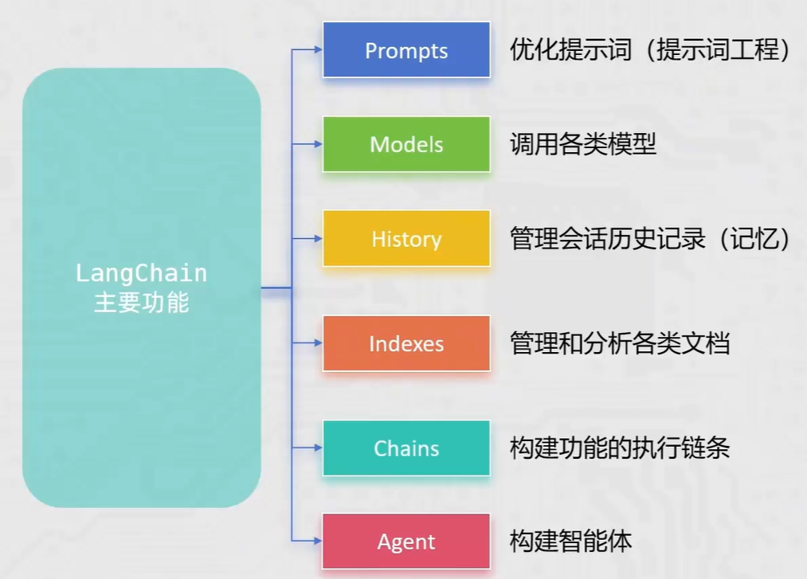

# agent

根据b站 《黑马程序员大模型RAG与Agent智能体项目实战教程，基于主流的LangChain技术从大模型提示词到实战项目》

https://www.bilibili.com/video/BV1yjz5BLEoY

pip install openai -i https://mirrors.aliyun.com/pypi/simple/

# 1.通过环境变量获取apikey

环境变量添加你在阿里大模型服务平台注册的key

DASHSCOPE_API_KEY =“xxxxxx"

OPENAI_API_KEY="xxxxxx"

# 2. open ai库的基础使用

获取客户端

```python
client = OpenAI(
    # 如果没有配置环境变量，请用阿里云百炼API Key替换：api_key="sk-xxx"
    api_key = "your api key"
    # 不同的模型服务商
    base_url="https://dashscope.aliyuncs.com/compatible-mode/v1",
)
```

调用模型

```python
#system:设定助手的整体行为，角色，规则，为对话提供上下文，影响后续所有交互
#assistant：代表ai助手回答
#user：代表用户发送问题和需求
messages = [{"role": "system", "content": "你是一个python编程专家"},
           {"role":"assistant","content":"我是一个python专家，请问有什么可以帮助你的"},
           {"role":"user","content":"你能干什么？"}]
completion = client.chat.completions.create(
    # 选择不同的模型
    model="qwen3.6-plus",  # 您可以按需更换为其它深度思考模型
    # 提供给模型的消息：list类型，可以包含多个字典
    #每个字典包含2个key role:角色，content：内容
    messages=messages,
    extra_body={"enable_thinking": True},
    stream=True
)
```

response变量就是ChatCompletion对象

```python
#输出模型给出的回答
for chunk in completion:
    delta = chunk.choices[0].delta
    if hasattr(delta, "reasoning_content") and delta.reasoning_content is not None:
        if not is_answering:
            print(delta.reasoning_content, end="", flush=True)
    if hasattr(delta, "content") and delta.content:
        if not is_answering:
            print("\n" + "=" * 20 + "完整回复" + "=" * 20)
            is_answering = True
        print(delta.content, end="", flush=True)
```



```python
from openai import OpenAI

#1.获取client对象
client = OpenAI(
    base_url="https://dashscope.aliyuncs.com/compatible-mode/v1"
)
#2.调用模型
response = client.chat.completions.create(
    model="qwen3.6-plus",
    messages=[{"role":"system","content":"你是一个java专家说话简洁干练"},
              {"role":"assistant","content":"我是java编程专家你有任何关于java的问题都可以问我"},
              {"role":"user","content":"java反射机制"}]
)
#处理结果
print(response.choices[0].message.content)
```

# 3. openai流式输出

可以设定结果输出为 stream 模式（流式输出），获得更好的使用体验。

开启流式输出主要就 2 步：

1. 在 client.chat.completions.create () 调用模型的时候设定参数：stream=True
2. for 循环 response 对象，并在循环内输出内容

```python
from openai import OpenAI

# 1.获取client对象
client = OpenAI(
    base_url="https://dashscope.aliyuncs.com/compatible-mode/v1"
)

# 2.调用模型
response = client.chat.completions.create(
    model="qwen3.6-plus",
    messages=[
        {"role":"system","content":"你是一个java专家说话简洁干练"},
        {"role":"assistant","content":"我是java编程专家你有任何关于java的问题都可以问我"},
        {"role":"user","content":"java之父是谁？"}
    ],
    stream=True  # 开启流式输出
)

# 3.处理流式结果（完美防错版）
for chunk in response:
    try:
        # 安全获取内容
        content = chunk.choices[0].delta.content
        if content:  # 有内容才输出
            print(content, end="", flush=True)
    except:
        # 忽略空包、错误包
        pass
```

# 4. 附带历史消息调用模型

调用模型传入的message，要求是list对象，基于此将历史消息传入，让模型知道上下文

```python
from openai import OpenAI

# 1.获取client对象
client = OpenAI(
    base_url="https://dashscope.aliyuncs.com/compatible-mode/v1"
)

# 2.调用模型
response = client.chat.completions.create(
    model="qwen3.6-plus",
    messages=[
        {"role":"system","content":"你是一个ai助理回答很简洁"},
        {"role":"user","content":"一个数学问题：本金20买的肉，卖价30"},
        {"role":"assistant","content":"好的"},
        {"role":"user","content":"假如我给你50元假币，你亏了多少钱？"}
    ],
    stream=True  # 开启流式输出
)

# 3.处理流式结果（完美防错版）
for chunk in response:
    try:
        # 安全获取内容
        content = chunk.choices[0].delta.content
        if content:  # 有内容才输出
            print(content, end="", flush=True)
    except:
        # 忽略空包、错误包
        pass
```

# 5. 提示词prompt工程指南

提示工程（Prompt Engineering），也称为 In-Context Prompting，是指在不更新模型权重的情况下如何与大模型交互以引导其行为以获得所需结果的方法。

**相当于需求文档**

技巧1：详细的描述

技巧2：让模型充当角色

技巧3：使用分割符标明输入的不同部分：用中括号，xml，三引号等分隔符帮助区别对待的文本，帮助模型更好理解文本内容

​	例如：用20个字符总结由三引号包含的文本。""" java之父 """

技巧4：对任务指定步骤：拆分任务指定其一些列步骤

技巧5：给例子

技巧6：基于文本文档，辅助模型回答，降低模型”幻觉“（一本正经的胡说八道）。让大模型使用我们提供的信息来组成答案

# 6. 提示词实战

当前金融领域信息化发展的时代，金融数据大量激增，许多投资者和研究者试图通过对这些数据进行深度分析而获得一些有效的决策和帮助，尽可能减少决策失误带来的损失。

所以，针对金融数据的分析方法研究是目前十分有益且热门的话题。

当前案例主要有三大业务场景实现：

- 基于大模型完成：金融文本分类
- 基于大模型完成：金融文本信息抽取
- 基于大模型完成：金融文本匹配

大模型选择：Qwen 在线大模型（阿里云通义千问 qwen3-max）

采用方法：基于 Few-Shot + Zero-Shot 的思想，设计 prompt（提示词），进而应用大模型完成相应的任务

**Zero-shot** 学习（Zero-shot Learning）是指在训练阶段不存在与测试阶段完全相同的类别，但是模型可以使用训练过的知识来推广到测试集中的新类别上。

这种能力被称为 “零样本” 学习，因为模型在训练时从未见过测试集中的新类别，在模型训练和提示词优化中均有体现。

模型对这个东西没见过，但是它可以根据已知见过的去识别

**Zero-shot **：“判断这句话的情感倾向，输出‘正面 / 负面 / 中性’。文本：‘今天天气真好！’”

**Few-shot**：给少量的样本学习，当模型在学习了一定类别的大量数据后，对于新类别只需要少量样本就能快速学习

# 7. 提示词实战案例

LLM文本分类任务介绍

根据喂的资料分析

```python
from openai import OpenAI


client = OpenAI(
    base_url="https://dashscope.aliyuncs.com/compatible-mode/v1"
)
examples_data = {  # 示例数据
    '新闻报道': '今日，股市经历了一轮震荡，受到宏观经济数据和全球贸易紧张局势的影响。投资者密切关注美联储可能的政策调整，以适应市场的不确定性。',
    '财务报告': '本公司年度财务报告显示，去年公司实现了稳步增长的盈利，同时资产负债表呈现强劲的状况。经济环境的稳定和管理层的有效战略执行为公司的健康发',
    '公司公告': '本公司高兴地宣布成功完成最新一轮并购交易，收购了一家在人工智能领域领先的公司。这一战略举措将有助于扩大我们的业务领域，提高市场竞争力',
    '分析师报告': '最新的行业分析报告指出，科技公司的创新将成为未来增长的主要推动力。云计算、人工智能和数字化转型被认为是引领行业发展的关键因素，投资'
}

# 分类列表
examples_types = ['新闻报道', '财务报道', '公司公告', '分析师报告']
# 提问数据
questions = [
    "今日，央行发布公告宣布降低利率，以刺激经济增长。这一降息举措将影响贷款利率，并在未来几个季度内对金融市场产生影响。",
    "ABC公司今日发布公告称，已成功完成对XYZ公司股权的收购交易。本次交易是ABC公司在扩大业务范围、加强市场竞争力方面的重要举措。据悉，此次收购将进一步",
    "公司资产负债表显示，公司偿债能力强劲，现金流充足，为未来投资和扩张提供了坚实的财务基础。",
    "最新的分析报告指出，可再生能源行业预计将在未来几年经历持续增长，投资者应该关注这一领域的投资机会",
    "小明喜欢小新哟"
]
messages = [{"role":"system","content":"你是一个金融专家,将文本分类为['新闻播报','财务报告','公司公告','分析师公告'],不清楚的分类为不清楚"}]

for key,value in examples_data.items():
    messages.append({"role":"user","content":value})
    messages.append({"role":"assistant","content":key})

for q in questions:
    response = client.chat.completions.create(
        model="qwen3.6-plus",
        #f = format，格式化字符串 作用：把变量塞进字符串里
        messages=messages + [{"role":"user","content":f"按照事例回答这段文本分类类别:{q}"}]
    )
    print(response.choices[0].message.content)
```

# 8.json数据格式

json.dumps(字典或列表,ensure_ascii=False) 将字典或列表转为json字符串  ensure_ascii确保中文正常显示

json.loads(json字符串)json转为字典或列表

# 9. LLM信息抽取

LLMs 是 **Large Language Models（大语言模型）** 的缩写，也就是我们常说的 “大模型”

prompt设计

```python
from openai import OpenAI
import json

client = OpenAI(
    base_url="https://dashscope.aliyuncs.com/compatible-mode/v1"
)
schema = ['日期', '股票名称', '开盘价', '收盘价', '成交量']
examples_data = [    # 示例数据
    {
        "content": "2023-01-10，股市震荡。股票强大科技A股今日开盘价100人民币，一度飙升至105人民币，随后回落至98人民币，最终以102人民币收盘，成交量达到520000。",
        "answers": {
            "日期": "2023-01-10",
            "股票名称": "强大科技A股",
            "开盘价": "100人民币",
            "收盘价": "102人民币",
            "成交量": "520000"
        }
    },
    {
        "content": "2024-05-16，股市利好。股票英伟达美股今日开盘价105美元，一度飙升至109美元，随后回落至100美元，最终以116美元收盘，成交量达到3560000。",
        "answers": {
            "日期": "2024-05-16",
            "股票名称": "英伟达美股",
            "开盘价": "105美元",
            "收盘价": "116美元",
            "成交量": "3560000"
        }
    }
]

messages=[{"role":"system","content":f"你帮我完成信息抽取{schema}信息，按json格式输出，不存在的用'原文本不存在'表示"}]
questions = [    # 提问问题
    "2025-06-16，股市利好。股票传智教育A股今日开盘价66人民币，一度飙升至70人民币，随后回落至65人民币，最终以68人民币收盘，成交量达到123000。",
    "2025-06-06，股市利好。股票黑马程序员A股今日开盘价200人民币，一度飙升至211人民币，随后回落至201人民币，最终以206人民币收盘。"
]
for example in examples_data:
    messages.append({"role":"user","content":example["content"]})
    messages.append({"role":"assistant","content": json.dumps(example["answers"],ensure_ascii=False)})

for q in questions:
    resonse = client.chat.completions.create(
        model="qwen3.6-plus",
        messages=messages + [{"role":"user","content":f"按照上述的例子，现在抽取这个句子信息{q}"}]
    )
    print(resonse.choices[0].message.content)
```

# 10. langchain

pip install langchain langchain-community dashscope chromadb -i https://mirrors.aliyun.com/pypi/simple/ --trusted-host mirrors.aliyun.com

LangChain 自身并不开发 LLMs，它的核心理念是为各种 LLMs 实现通用的接口，把 LLMs 相关的组件 “链接” 在一起，简化 LLMs 应用的开发难度，方便开发者快速地开发复杂的 LLMs 应用。



pip install Langchain langchain-community Langchain-ollama dashscope chromadb

langchain: 核心包

langchain-community: 社区支持包，提供了更多的第三方模型调用（我们用的阿里云千问模型就需要这个包）

langchain-ollama: Ollama 支持包，支持调用 Ollama 托管部署的本地模型

dashscope: 阿里云通义千问的 Python SDK

chromadb: 轻量向量数据库（后续使用）

# 11. RAG 介绍

RAG：检索增强生成技术，利用检索外部文档提升生成结果质量

通用的基础大模型存在一些问题：

- LLM 的知识不是实时的，模型训练好后不具备自动更新知识的能力，会导致部分信息滞后
- LLM 领域知识是缺乏的，大模型的知识来源于训练数据，这些数据主要来自公开的互联网和开源数据集，无法覆盖特定领域或高度专业化的内部知识
- 幻觉问题，LLM 有时会在回答中生成看似合理但实际上是错误的信息

RAG 标准流程由索引（Indexing）、检索（Retriever）和生成（Generation）三个核心阶段组成。

- **索引阶段**，通过处理多种来源多种格式的文档提取其中文本，将其切分为标准长度的文本块（chunk），并进行嵌入向量化（embedding），向量存储在向量数据库（vector database）中。
  - 加载文件
  - 内容提取
  - 文本分割，形成 chunk
  - 文本向量化
  - 存向量数据库
- **检索阶段**，用户输入的查询（query）被转化为向量表示，通过相似度匹配从向量数据库中检索出最相关的文本块。
  - query 向量化
  - 在文本向量中匹配出与问句向量相似的 top_k 个
- **生成阶段**，检索到的相关文本与原始查询共同构成提示词（Prompt），输入大语言模型（LLM），生成精确且具备上下文关联的回答。
  - 匹配出的文本作为上下文和问题一起添加到 prompt 中
  - 提交给 LLM 生成答案：

# 12. 向量的基础概念

向量：文本的”数学身份证“

它把一段文字的语义信息，转换成一串固定长度的数字列表，让计算机能 “看懂” 文字的含义并做相似度计算。

- 向量的计算（文本嵌入过程），可借助文本嵌入模型实现，如 text-embedding-v1
- 向量的匹配通过算法实现，如余弦相似度
- 向量的维度表示一段文本在多个抽象语义特征方面的强度
  - 维度数代表模型用多少个抽象语义特征来描述文本
  - 维度越多，做语义匹配越精准
  - 但性能压力也会增大

```python
import numpy as np
#余弦相似算法

def get_dot(vec_a,vec_b):
    if len(vec_a) != len(vec_b):
        raise ValueError("2向量必须维度相同！")
    dot_sum = 0
    for a,b in zip(vec_a,vec_b):
        dot_sum += a*b
    return dot_sum

def get_norm(vec):
    sum_square = 0
    for v in vec:
        sum_square += v*v

    return np.sqrt(sum_square)
def cosine_similarity(a,b):
    result = get_dot(a,b) / (get_norm(a)*get_norm(b))
    return result

if __name__ == "__main__":
    vec_a = [0.5,0.5]
    vec_b = [0.7,0.7]
    vec_c = [0.7,0.5]
    vec_d = [-0.6,-0.5]
    print("ab",cosine_similarity(vec_a,vec_b))
    print("cd",cosine_similarity(vec_a,vec_d))
```

**两个向量的余弦相似度结果越接近 1 → 代表这两段文字的语义越相似。**

- 接近 **1**：**意思几乎一样**（最相关）
- 接近 **0**：**完全不相关**
- 接近 **-1**：**意思相反**

放到 RAG 里就是这么工作的

1. 你上传的**知识库文档** → 变成向量
2. 用户提的**问题（Prompt）** → 也变成向量
3. 计算**问题向量**和**每一段文档向量**的**余弦相似度**
4. 把 ** 分数最高（最接近 1）** 的几段文字找出来，丢给 AI
5. AI 只根据这些**最相关的内容**回答你

# 13. langchain调用大语言模型

```python
from langchain_community.llms.tongyi import Tongyi
#不用qwen3-max，因为qwen3-max是聊天模型，qwen-max是大语言模型
model = Tongyi(model = "qwen-max")
#向模型提问
res = model.invoke(input="你是谁？")
print(res)
```

```python
#流式输出
from langchain_community.llms.tongyi import Tongyi
#不用qwen3-max，因为qwen3-max是聊天模型，qwen-max是大语言模型
model = Tongyi(model = "qwen-max")
#向模型提问
res = model.stream(input="你是谁？")
for r in res:
    print(r,end="",flush=True)
```

# 14. chatModle 聊天模型

聊天消息包含下面几种类型，使用时需要按照约定传入合适的值：

- **AIMessage**：就是 AI 输出的消息，可以是针对问题的回答。（OpenAI 库中的`assistant`角色）
- **HumanMessage**：人类消息就是用户信息，由人给出的信息发送给 LLMs 的提示信息，比如 “实现一个快速排序方法”。（OpenAI 库中的`user`角色）
- **SystemMessage**：可以用于指定模型具体所处的环境和背景，如角色扮演等。你可以在这里给出具体的指示，比如 “作为一个代码专家”，或者 “返回 json 格式”。（OpenAI 库中的`system`角色）

```python
from langchain_community.chat_models import ChatTongyi
from langchain_core.messages import SystemMessage, HumanMessage, AIMessage

chat = ChatTongyi(model="qwen3-max")
messages = [
    SystemMessage(content="你是一名诗人"),
    HumanMessage(content="写一首诗"),
    AIMessage("大漠孤烟直，长河落日圆"),
    HumanMessage("再来一首和上面一样主题的诗")
]
for chunk in chat.stream(input=messages):
    print(chunk.content,end="",flush=True)
```

# 15.models：消息的简写形式

```python
chat = ChatTongyi(model="qwen3-max")
messages = [
    ("system","你是一名诗人"),
    ("human","写一首诗")
]
for chunk in chat.stream(input=messages):
    print(chunk.content,end="",flush=True)
```