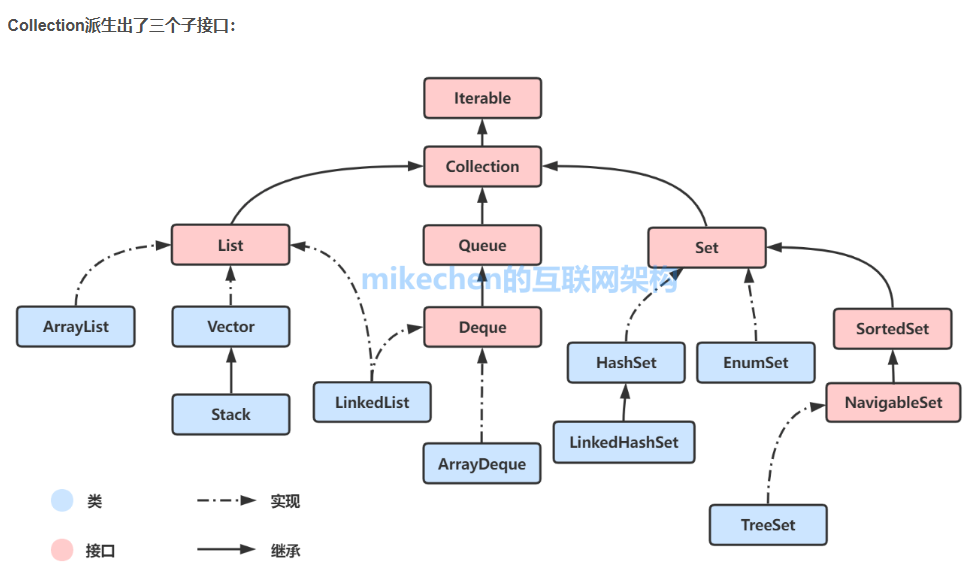
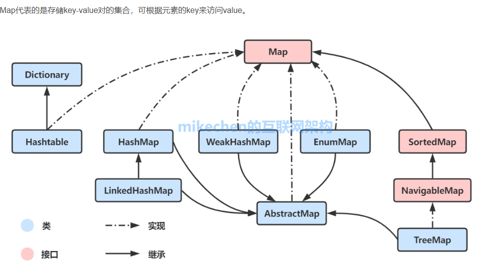

# java 基础

# 1.集合 

## 1.1collection



### 1.1.1 List

LinkedList 和 ArrayList 最核心区别？

ArrayList：数组，随机访问快，中间增删慢；

LinkedList：双向链表，随机查找慢，首尾增删快。

#### ArrayList

排列有序可重复，底层是数组，查询快，增删慢，允许存入多个 null。

Object 动态数组，支持随机访问，线程不安全

默认长度是10，容量不够时扩容机制当前容量*1.5+1

JDK7：直接创建长度 10 数组

JDK8：初始空数组，**第一次 add 才初始化容量 10**，懒加载省内存。

为什么扩容不设计成 2 倍而是 1.5 倍？

​	1.5 倍增长更平缓，内存浪费少

​	2 倍容易出现内存翻倍闲置，大数据量容易堆溢出

当数组大小不满足时需要将旧数组复制到新数组中，从数组中间插入删除需要复制，移动

```java
public class arraylistTest {
    public static void main(String[] args) {
        List<Integer> list = new ArrayList<>();
        //添加元素
        list.add(1);
        list.add(1);
        list.add(2);
        list.add(3);
        list.add(4);
        //替换元素将2号位换成元素5
        list.set(2,5);
        List<Integer> list2= new ArrayList<>();
        //添加元素
        list2.add(6);
        list2.add(7);
        list2.add(8);
        //给定list集合中的所有元素添加到list2
        list2.addAll(list);
        //迭代器
        ListIterator<Integer> listIterator = list2.listIterator();
        while (listIterator.hasNext()){
            System.out.print(listIterator.next()+",");
        }
        System.out.println("\n");
        //判断是否包含
        System.out.println("8 is include "+list2.contains(8));
        System.out.println("get index 1 element:"+list2.get(1)+";first element:"+list2.getFirst()+";last element:"+list2.getLast());
        //返回 list2 中元素的索引值
        System.out.println("return index about element:"+list2.indexOf(3));
    }
}
```


#### LinkedList

底层双向链表

有序、元素可重复、支持存入 null；

**线程不安全**，迭代器 fail-fast；

LinkedList 没有扩容机制，链表不需要预先分配连续内存，新增节点直接 new Node，不存在数组拷贝、扩容。

为什么 Java 中不推荐用 LinkedList？

绝大多数场景查询多于增删；即使需要队列，ArrayDeque 性能全面碾压它；链表节点指针带来额外内存损耗，缓存不友好（非连续内存，无法利用 CPU 缓存）。

CPU 缓存角度分析 ArrayList 更快的原因

ArrayList 数组连续内存，缓存行一次性加载多个元素，缓存命中率高；LinkedList 节点分散堆中，每次寻址都要新内存，缓存失效频繁。

```java
public class linkedlistTest {
    public static void main(String[] args) {

        List<Integer> list = new LinkedList<>();
        //头部插入
        list.addFirst(66);
        //默认尾部插入
        list.add(1);
        list.add(2);
        list.add(3);
        list.add(4);
        Iterator<Integer> integerIterator = list.iterator();
        while (integerIterator.hasNext()){
            System.out.print(integerIterator.next()+",");
        }
    }
}
```


### 1.1.2 set

#### HashSet 

基于 HashMap 来实现的，是一个不允许有重复元素的集合。

允许有 null 值。

是无序的，即不会记录插入的顺序。

不是线程安全的， 如果多个线程尝试同时修改 HashSet，则最终结果是不确定的。

允许存入 **1 个 null**

无索引，不支持 get (index)、不能通过下标遍历

无独立扩容逻辑，完全复用 HashMap 的扩容规则：

- 默认初始容量 16，负载因子 0.75
- 容量达到 `容量*0.75` 触发扩容，容量翻倍

```java
public class hashSet {
    public static void main(String[] args) {
        Set<Integer> set = new HashSet();
        set.add(1);
        set.add(1);
        set.add(2);
        set.add(3);
        set.add(4);
        set.add(null);
        set.add(null);
        System.out.println(set); //1,2,3,4
        System.out.println("element 3 include:"+set.contains(3));
        System.out.println(set.remove(5));  // 删除元素，删除成功返回 true，否则为 false
    }
}
```

一、Java 官方约定（必须背）

1. **equals 相等的两个对象，hashCode 必须相等**
2. hashCode 相等，equals 不一定相等（哈希冲突）
3. 只重写 equals 不重写 hashCode：违反约定，HashSet/HashMap 去重失效
4. 只重写 hashCode 不重写 equals：同哈希值不同对象会被判定重复

往 HashSet 放自定义对象，为什么去重失效？

原因：

自定义类没有重写 `hashCode()` 和 `equals()`，会使用 Object 原生方法：

```java
public class Student{
    String name;
    int age;

    public Student(String name,int age) {
        this.name = name;
        this.age = age;
    }

    public String getName() {
        return name;
    }

    public void setName(String name) {
        this.name = name;
    }

    public int getAge() {
        return age;
    }

    public void setAge(int age) {
        this.age = age;
    }

    @Override
    public String toString() {
        return "Student{" +
                "name='" + name + '\'' +
                ", age=" + age +
                '}';
    }
    @Override
    public int hashCode() {
        return Objects.hash(name,age);
    }

    @Override
    public boolean equals(Object obj) {
        if (obj==this)return true;
        if (obj == null || getClass() != obj.getClass()) return false;
        Student student = (Student) obj;
        return Objects.equals(name,student.name) && Objects.equals(age,student.age);
    }
}
```

```java
public class hashSet {
    public static void main(String[] args) {
        Set<Student> studentSet = new HashSet<>();
        Student student1 = new Student("zs",12);
        Student student2 = new Student("ls",23);
        Student student3 = new Student("zs",12);
        studentSet.add(student1);
        studentSet.add(student2);
        studentSet.add(student3);
        for (Student student : studentSet) {
            System.out.println(student);
        }
    }
}
```

#### LinkedHashSet

有序，不重复，无索引

有序指保证存取元素顺序一致性

底层依然是hash表，额外添加了双链表机制，记录存储顺序

#### TreeSet

底层基于 **TreeMap**（红黑树，自平衡二叉查找树）

**元素有序**：自动按**自然顺序 / 自定义比较器**升序排列，遍历有序；

**元素不可重复**；

**不能存 null**，添加 null 直接抛 `NullPointerException`；

线程不安全

无下标，不支持根据索引获取元素。

元素怎么实现排序？两种方式

方式 1：自然排序（Comparable）

实体类实现 `Comparable<E>`，重写 `compareTo()`

```java
public class Student implements Comparable<Student>{
    String name;
    int age;

    public Student(String name,int age) {
        this.name = name;
        this.age = age;
    }

    public String getName() {
        return name;
    }

    public void setName(String name) {
        this.name = name;
    }

    public int getAge() {
        return age;
    }

    public void setAge(int age) {
        this.age = age;
    }

    @Override
    public String toString() {
        return "Student{" +
                "name='" + name + '\'' +
                ", age=" + age +
                '}';
    }
    //treeMap添加自定义对象时要实现compareTo方法，实现添加排序
    @Override
    public int compareTo(Student o) {
        //this:表示要添加的元素
        //o表示已经在红黑树中添加的元素
        //按照学生年龄进行比较
        int i =this.age - o.age;
        //如果年龄一样，则和名字进行比较，名字由ASCII码进行比较
        i= i==0?this.getName().compareTo(o.getName()):i;
        return i;
    }

    @Override
    public int hashCode() {
        return Objects.hash(name,age);
    }

    @Override
    public boolean equals(Object obj) {
        if (obj==this)return true;
        if (obj == null || getClass() != obj.getClass()) return false;
        Student student = (Student) obj;
        return Objects.equals(name,student.name) && Objects.equals(age,student.age);
    }
}
```

方式 2：定制排序（Comparator 外部比较器）

不修改实体类，创建 TreeSet 时传入比较器，灵活切换多种排序规则：

```java
// 按年龄降序，同年龄姓名升序
TreeSet<Student> set = new TreeSet<>((s1,s2)->{
    int i = s2.age - s1.age;
    return i == 0 ? s1.name.compareTo(s2.name) : i;
});
```

优先级：Comparator > Comparable，同时存在以外部比较器为准。

TreeSet **完全不依赖 hashCode ()、equals ()**，只根据比较方法返回值判断重复：

```java
public class treeSet {
    public static void main(String[] args) {
        TreeSet<Student> treeSet = new TreeSet<>();
        Student stu = new Student("zl",12);
        treeSet.add(new Student("zs",23));
        treeSet.add(new Student("ls",22));
        //不允许为null    treeSet.add(null);
        treeSet.add(new Student("zs",23));
        treeSet.add(stu);
        treeSet.remove(stu);
        Iterator<Student> iterate = treeSet.iterator();
        while (iterate.hasNext()){
            System.out.println(iterate.next());
        }
    }
}
```


### 1.1.3Queue

Queue 是 Java 集合**单列集合顶级子接口**，代表**队列**，遵循 **FIFO 先进先出** 原则。

#### ArrayDeque

**可扩容循环数组**，默认容量 16，2 倍扩容


#### PriorityQueue

底层：**最小堆（数组实现完全二叉树）**

特性：**不遵循 FIFO**，自动按优先级排序，队首永远是最小元素

不能存 null，会空指针，线程不安全；遍历无序，只有出队有序

遍历 PriorityQueue 为什么无序？

底层数组只是满足堆结构，不是全局有序；只有不断 `poll()` 弹出堆顶，才能从小到大依次取出。

```java
PriorityQueue<Integer> q = new PriorityQueue<>();
q.addAll(Arrays.asList(3,1,2));
System.out.println(q); // 输出 [1,3,2] 数组看起来乱序
// 依次poll才有序：1,2,3
```

```java
public class priorityQueue {
    public static void main(String[] args) {
        var pq = new PriorityQueue<Student>();
        pq.add(new Student("zs",13));
        pq.add(new Student("ls",45));
        pq.add(new Student("pp",45));
        pq.add(new Student("ls",45));

        Iterator<Student> iterable =  pq.iterator();
        while (iterable.hasNext()){
            System.out.println(iterable.next());
        }
        PriorityQueue<Integer> priorityQueue = new PriorityQueue<>();
        //最小堆
        //任意一个父节点的值 ≤ 左右两个子节点的值
        priorityQueue.add(5);
        priorityQueue.add(1);
        priorityQueue.add(3);
        //peek() = 1 最小元素在堆顶
        System.out.println(priorityQueue.peek());
    }
}
```


#### ArrayDeque

**可扩容循环数组**，默认容量 16，2 倍扩容

双端队列，推荐替代 LinkedList 做队列 / 栈

连续内存，CPU 缓存友好，速度远超 LinkedList；无链表指针开销

**不允许存入 null**，存 null 抛空指针

1. ArrayDeque vs LinkedList（必问）

1. 底层：循环数组 / 双向链表
2. 速度：ArrayDeque 更快（连续内存、缓存命中、无指针）
3. null：ArrayDeque 禁止 null；LinkedList 允许 null
4. 内存：LinkedList 每个节点多 prev/next，开销大
5. 结论：日常做队列 / 栈**一律优先 ArrayDeque**，淘汰 LinkedList

```java
public class arrayDeque {
    public static void main(String[] args) {
        // ArrayDeque模拟栈
        Deque<Integer> stack = new ArrayDeque<>();

        stack.push(1);
        // push 等价 addFirst()：把元素放到队列头部
        // 集合内部：[1]

        stack.push(2);
        // push(2) → addFirst(2)，头部插入
        // 集合内部：[2, 1]

        stack.add(2);
        // add 等价 offerLast()：尾部追加元素，不是栈压栈操作！
        // 集合内部：[2, 1, 2]
        
        System.out.println(stack.pop());     // 弹栈
        System.out.println(stack.peek());    // 栈顶
    }
}
```


## 1.2 Map



### 1.2.1 HashMap

1. HashMap 底层结构（JDK8 标准）

**数组 + 链表 + 红黑树**

1. 数组：`Node<K,V>[] table`，存放哈希桶；
2. 链表：哈希冲突元素挂单向链表；
3. 红黑树：链表长度≥8，数组长度≥64，链表转红黑树；链表≤6 退回链表。

- JDK7：只有数组 + 链表，头插法；JDK8 尾插法。

**初始容量 DEFAULT_INITIAL_CAPACITY = 16**，必须是 2 的幂；

**负载因子 DEFAULT_LOAD_FACTOR = 0.75**；

扩容阈值 `threshold = 容量 * 负载因子`，元素数量超过阈值触发扩容；

无序；

key 唯一，value 可重复；

key 允许**一个 null**，value 允许多个 null；

线程不安全；

正确 put 定位 + 冲突处理完整流程

1. 计算扰动哈希 `hash = h ^ h >>> 16`

2. 计算桶下标：`index = (table.length - 1) & hash`

3. 判断桶下标位置是否为空：

   - 空：直接新建 Node 放入该桶，结束

   - 已有节点（哈希冲突）：

     

     ① 桶头节点 hash 相同 && key.equals () → 覆盖原有 value

     

     ② 不相等，向下遍历链表：

     - 中途找到 hash+equals 相同 key，覆盖 value
     - 遍历到链表末尾都无重复 key，尾部追加新节点

4. 追加后检查当前链表长度：

   - 链表节点数 == 8：
     - 数组长度 < 64：触发扩容 resize
     - 数组长度 ≥ 64：链表转为红黑树 TreeNode

5. 插入完成后 size 自增，判断 size > threshold，触发扩容

```java
public class hashMap {
    public static void main(String[] args) {
        Map<Integer,String> map = new HashMap<>();
        map.put(1,"zs");
        map.put(2,"ww");
        map.put(3,"ls");
        map.forEach((Integer k, String v) -> {
            System.out.println("key=" + k + " , value=" + v);
        });
        System.out.println(map);
    }
}
```


### 1.2.2 LinkedHashMap

继承 `HashMap`，底层依旧：**数组 + 链表 + 红黑树**；

额外新增一条**双向链表**，把所有 entry 串联起来，记录元素顺序。

有序：插入有序 / 访问有序；HashMap 无序

key 唯一，允许一个 null key，value 可 null；

线程不安全，迭代器 fail-fast；

增删查性能略低于 HashMap，需要维护双向链表指针。

```java
public class linkedHashMap {
    public static void main(String[] args) {
        LinkedHashMap<Integer,String> map = new LinkedHashMap<>();
        map.put(1,"zs");
        map.put(2,"ls");
        map.put(3,"ww");

    }
}
```


### 1.2.3 TreeMap

底层**红黑树（自平衡二叉查找树）**，不存在数组、链表，没有扩容机制。

由键决定，不重复，无索引，可排序

默认从小到大排序

**key 不允许 null**，

四、红黑树相关面试追问

1. 为什么用红黑树不用普通二叉搜索树？

   

   普通二叉树极端退化成链表 O (n)；红黑树通过平衡规则，树高稳定 logn，查询效率稳定。

2. 红黑树五大特性（加分）

- 根节点黑色；
- 叶子节点（空节点）都是黑色；
- 红色节点的子节点一定是黑色；
- 任意节点到其所有叶子，黑色节点数量相同；
- 根到叶子路径不能出现连续两个红色节点。

1. 平衡手段：变色、左旋、右旋。

### 1.2.4 CurrentHashMap

线程安全的 HashMap

key/value 都**不允许 null**

默认 16 个分段，最多支持 16 个线程同时写

扩容条件：`size > 容量 * 0.75`；

新数组容量翻倍


# 2.多线程

线程：是程序中的执行线程。java虚拟机运行并发运行多个线程

创建线程的3种方式

```java
//继承thread类
public class ThreadDemo extends Thread{

    @Override
    public void run() {
        for (int i = 0; i < 50; i++) {
            System.out.println(this.getName()+":thread Demo");
        }
    }


    public static void main(String[] args) {
        ThreadDemo threadDemo = new ThreadDemo();
        threadDemo.setName("t1");
        ThreadDemo threadDemo2 = new ThreadDemo();
        threadDemo2.setName("t2");
        threadDemo.start();
        threadDemo2.start();
    }

}
```


```java
//实现runnable接口
public class ThreadDemo2 implements Runnable{
    @Override
    public void run() {
        for (int i = 0; i < 50; i++) {
            System.out.println(Thread.currentThread().getName()+":threadDemo2");
        }
    }

    public static void main(String[] args) {
        ThreadDemo2 threadDemo2 = new ThreadDemo2();

        Thread thread = new Thread(threadDemo2,"t1");
        Thread thread2= new Thread(threadDemo2,"t2");
        thread.start();
        thread2.start();
    }
}

```


```java
//配合FutureTask
//实现
public class ThreadDemo3 implements Callable<Integer> {

    @Override
    public Integer call() throws Exception {
        int sum = 0;
        for (int i = 0; i < 50; i++) {
            sum +=i;
            System.out.println(Thread.currentThread().getName()+":threadDemo03");
        }
        return sum;
    }

    public static void main(String[] args) throws ExecutionException, InterruptedException {
        ThreadDemo3 threadDemo3 = new ThreadDemo3();
        //FutureTask 内部有状态标记
        //任务第一次执行完毕后，状态变为完成；
        //后续再交给其他线程执行时，会直接判断任务已完成，不会再次执行 call ()
        //需求如果想让 t1、t2 各自独立执行一遍循环，需要建立2个FutureTask
        FutureTask<Integer> futureTask = new FutureTask<>(threadDemo3);
        FutureTask<Integer> futureTask2 = new FutureTask<>(threadDemo3);
        Thread thread = new Thread(futureTask,"t1");
        Thread thread2= new Thread(futureTask2,"t2");

        thread.start();
        Integer result = futureTask.get();
        System.out.println(result);

        thread2.start();
        Integer resul2 = futureTask.get();
        System.out.println(resul2);
    }
}

```

Thread 只能接收 **Runnable** 类型任务，**完全不支持 Callable**。Callable 接口和 Runnable 是两套独立接口，没有继承关系：

Runnable：`void run()` 无返回值

Callable：`V call() throws Exception` 有返回值、能抛异常

所以必须有一个**中间转换器**，把 Callable 包装成 Runnable，这个转换器就是 `FutureTask`。

Callable 的核心优势是**有返回值、可抛异常**，这部分功能全靠 Future 接口提供：


# 3.注解

注解在代码运行时可以被反射读取并进行相应操作

元注解：java内置注解，注解的注解，标明使用范围，生命周期

@Retetion @Target @Document @Inherited @Repeatble

标准注解：java提供的基础注解，标明过期元素、父类复写的方法、标明抑制警告

自定义注解：第三方注解，含义和功能第三方定义


@Target

| 值              | 说明                              |
| --------------- | --------------------------------- |
| TYPE            | 类、接口、注解、枚举              |
| FIELD           | 属性                              |
| METHOD          | 方法                              |
| PARAMETER       | 方法参数                          |
| CONSTRUCTOR     | 构造函数                          |
| LOCAL_VARIABLE  | 局部变量 (如循环变量、catch 参数) |
| ANNOTATION_TYPE | 注解                              |
| PACKAGE         | 包                                |
| TYPE_PARAMETER  | 泛型参数 jdk1.8                   |
| TYPE_USE        | 任何元素 jdk1.8                   |

 

@Inherited

是否可以被标注类的子类继承。被@Inherited修饰的注解是具有继承性的，在自定义的注解标注到某个类时，该类的子类会继承这个自定义注解。这里需要注意的是只有当子类继承父类的时候，注解才会被继承，类实现接口，或者接口继承接口，都是无法获得接口上的注解声明的。正确的示例如下(通过反射获取注解)

注解内部定义的是**属性方法**，有强制语法约束：

1. 返回值只能是以下类型：
   - 基本数据类型：`byte/short/int/long/float/double/char/boolean`
   - `String`、`Class`、枚举、其他注解
   - 以上类型的一维数组（如 `String[]`、`int[]`）
2. **不允许返回 `void`**，也不能返回自定义对象、集合等；

```java
//java运行周期 源文件(Resource)->class文件(class)->运行时数据(Runtime),反射时获取信息
@Retention(RetentionPolicy.RUNTIME)
//自定义注解的使用范围
@Target(ElementType.METHOD)
public @interface myAnnotation {
     String test() default "test";
}
```

```java
public class annotation {

    @myAnnotation
    public void test(){
        System.out.println("test01");
    }
    public static void main(String[] args) throws NoSuchMethodException {
        annotation an = new annotation();
        an.test();
        //通过反射获取被注解标注的方法
        Method test = annotation.class.getDeclaredMethod("test");
        //获取注解内的属性值
        myAnnotation annotation = test.getAnnotation(myAnnotation.class);
        String test1 = annotation.test();
        System.out.println(test1);
    }
}
```

