# mysql

推荐b站视频《MySQL数据库入门到大牛，mysql安装到优化，百科全书级，全网天花板》https://www.bilibili.com/video/BV1iq4y1u7vj

【MySQL上篇：基础篇】 

【第1子篇：数据库概述与MySQL安装篇】 p01-p11 

学习建议：零基础同学必看，涉及理解和Windows系统下MySQL安装 

【第2子篇：SQL之SELECT使用篇】 p12-p48 

学习建议：学习SQL的重点，必须重点掌握，建议课后练习多写 

【第3子篇：SQL之DDL、DML、DCL使用篇】 p49-p73 

学习建议：学习SQL的重点，难度较SELECT低，练习写写就能掌握 

【第4子篇：其它数据库对象篇】 p74-p93

 学习建议：对于希望早点学完MySQL基础，开始后续内容的同学，这个子篇可以略过。 在工作中，根据公司需要进行学习即可。 

【第5子篇：MySQL8新特性篇】 p94-p95 

学习建议：对于希望早点学完MySQL基础，开始后续内容的同学，这个子篇可以略过。 在工作中，根据公司需要进行学习即可。 

【MySQL下篇：高级篇】 

【第1子篇：MySQL架构篇】 p96-p114 

学习建议：涉及Linux平台安装及一些基本问题，基础不牢固同学需要学习 

**【第2子篇：索引及调优篇】 p115-p160 **

学习建议：面试和开发的重点，也是重灾区，需要全面细致的学习和掌握 

**【第3子篇：事务篇】 p161-p186 **

学习建议：面试和开发的重点，需要全面细致的学习和掌握 

【第4子篇：日志与备份篇】 p187-p199 

学习建议：根据实际开发需要，进行相应内容的学习


# 第六章 索引的数据结构 

## 1. 为什么要用索引

索引是存储引擎用于快速找到数据记录的一种数据结构，就好比一本教课书的目录部分，通过目录中找到对应文章的页码，便可快速定位到需要的文章。MySQL 中也是一样的道理，进行数据查找时，首先查看查询条件是否命中某条索引，符合则 **通过索引查找** 相关数据，如果不符合则需要 **全表扫描**，即需要一条一条地查找记录，直到找到与条件符合的记录。

其目的是**减少IO的次数，加快查询速率**

优点：

1. 降低io成本
2. 保证数据的唯一性
3. 加速表与表之间的连接
4. 减少查询中分组与排序的时间

缺点：

1. 创建索引和维护索引需要耗费时间
2. 索引占据磁盘空间
3. 降低更新表的速度，增删改操作时索引也要动态维护

## 2. 索引的优缺点

索引定义：索引是帮助mysql高效获取数据的数据结构，本质是数据结构，在存储引擎中实现的

## 3. 索引的推演（innodb）

### 第一次迭代

索引之前的查找

```mysql
select * from tableName where coluom = xxx
```

<ul>在一个页中查找
    <li>以主键为搜索条件 二分法 </li>
    <li>以其他列为搜索条件：从最小记录一次遍历</li>
</ul>

<ul>在多页中查找
    <li>定位所在页</li>
    <li>在所在页查找相关数据记录</li>
</ul>

设计索引

```mysq
create table Table index_demo(
	c1 int,
	c2 int,
	c3 char(1),
	primary key (c1),
)row_format = compact
```


 使用compact行格式来实际存储记录

record_type:表示记录的类型，0普通记录，2表示最小记录，3表示最大记录，1暂时还没用过

next_record:表示下一条地址相对与本地址的偏移量

把一些记录放到页里的示意图是

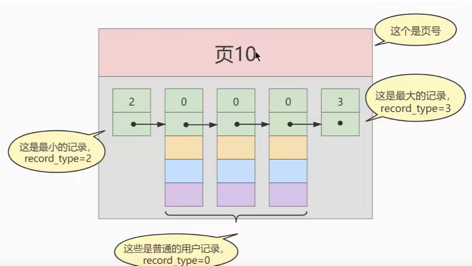

按主键大小排序

此时我们插入一些数据

```mysql
insert into index_demo values(1,4,'u'),(3,9,'d'),(5,3,'y');
```

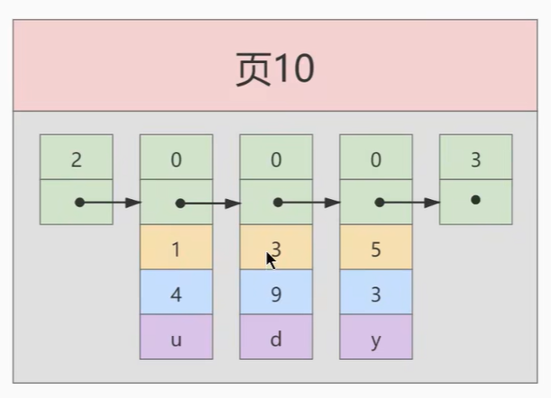

此时我再增加一条记录

```mysql
insert into index_demo values(4,4,'a');
```

假如因为页10最大插入3条，此时再插入一条数据需要在分配一个新页

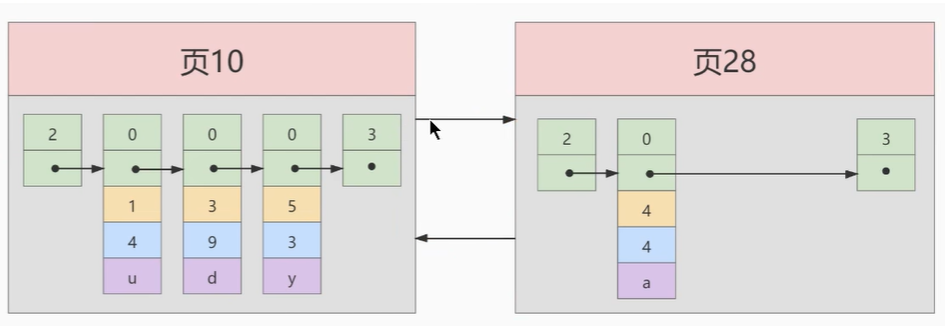

当插入后因为主键4<5,所以需要进行移动

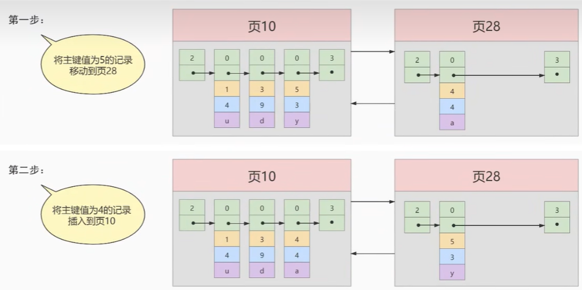

下一页的主键必须大于上一页的主键，移动的过程叫**叶分裂**

由于页号不连续所以数据多了之后会成为这样

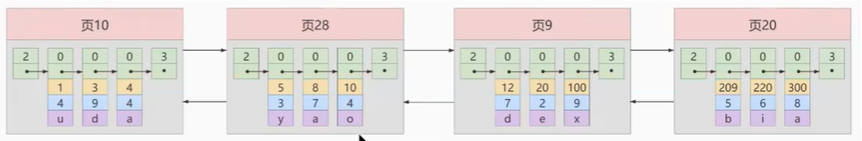

当我们需要快速查找数据时就需要目录，所以我们要给所有的页建一个目录项

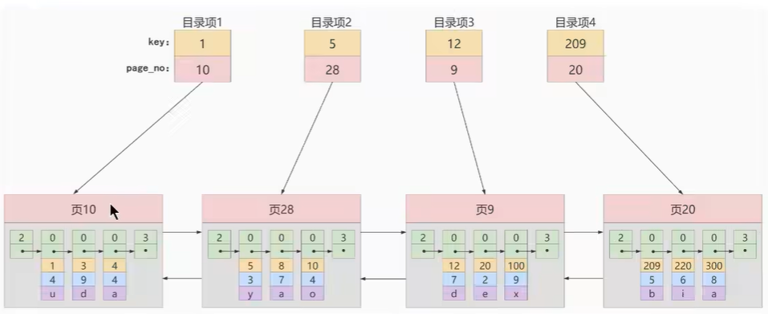

取每一页的最小主键用key表示，页号用page_no表示

由于目录项是连续存储的，所以当进行插入和删除数据时需要进行移动目录项

所以我们可以把目录项也用链表的方式串联起来，逻辑上是连续的，所以创造了目录页

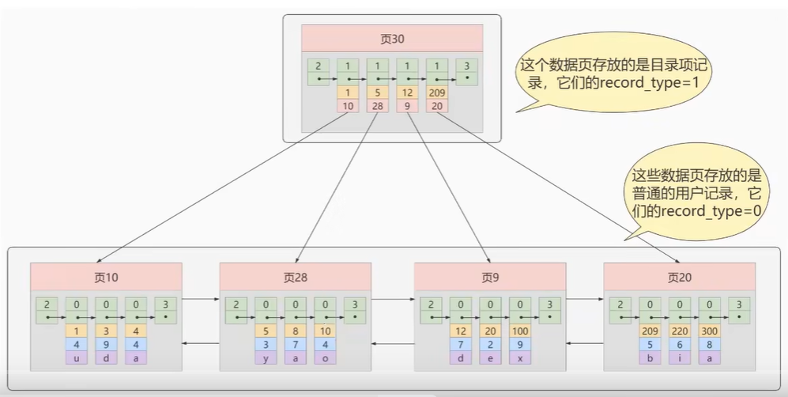

那么如何区分一条记录是普通的用户记录还是目录项记录？ record_type

0 普通用户记录，1 目录项记录，2 最小记录，3 最大记录

### 第二次迭代

多个目录项记录的页

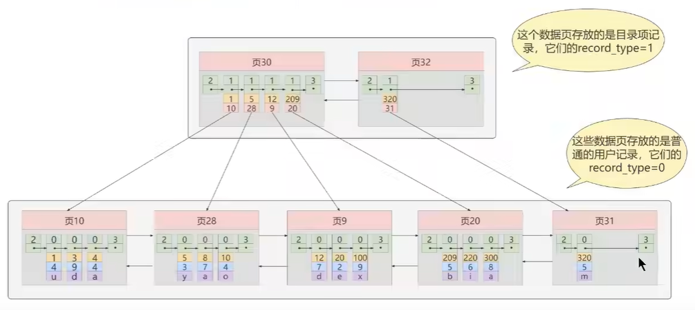

随着我们数据页的不断增加，目录项也在不断的增加，当目录页装不下的时候，就会创建新的目录页，彼此之间用双向链表连接

### 第三次迭代

目录项记录的页

在上述的方式进行查找时，因为**页是不连续的**，当我们的表中的数据越来越多的时候，会产生很多**存储目录项记录的页**，那如何快速定位一个存储目录项记录的页呢？那么就在生成一个**更高级的目录**

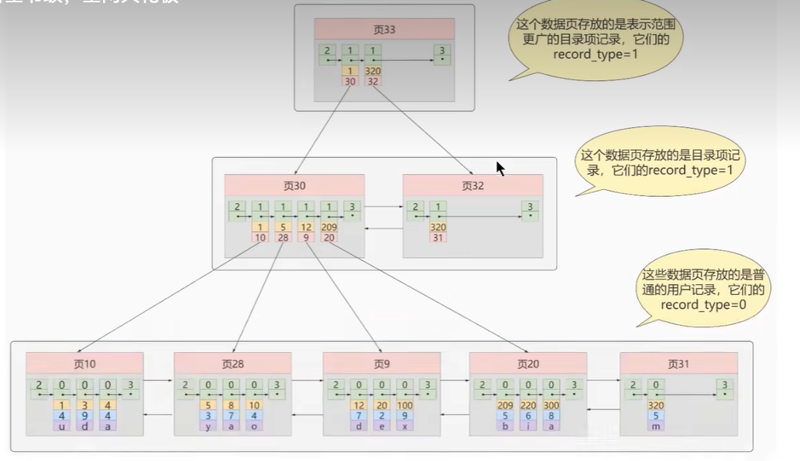

那么这个结构就是B+数

### B+tree

数据页称为节点，实际数据存放在B+数的最底层也被称为叶子节点，其余用来存放目录项的节点称为非叶子节点或内节点，最上边的节点为根节点

问：为什么B+数通常不会超过四层是为什么？

答：树的层次越低io越少

## 4. 常见的索引概念

索引分2种：聚簇索引，非聚簇索引

### 4.1 聚簇索引

是一种数据的存储方式，也就是索引即数据，数据即索引

innodb的数据文件.idb，即数据和索引在一个文件中

聚簇：表示数据行和相邻的键值聚簇的存储在一起

非聚簇：表示结构中不保存数据

**特点**

1. 页内记录按照主键大小排序，单项链表连接
2. 存放**用户数据的页**按照主键大小顺序排成一个双向链表
3. 存放**目录项记录的页**分为不同层次，同一层次也按照主键大小进行排序排成一个双向链表
4. B+树的叶子节点存储完整的用户记录

**优点**：数据访问更快，排序查找和范围查找很快，节省了io操作

**缺点**：插入速度依赖于插入顺序，更新主键代价高，二级索引访问需要2次索引查找

### 4.2 二级索引（辅助索引，非聚簇索引）

如果我们借助非主键的数据进行查找，那么就需要二级索引

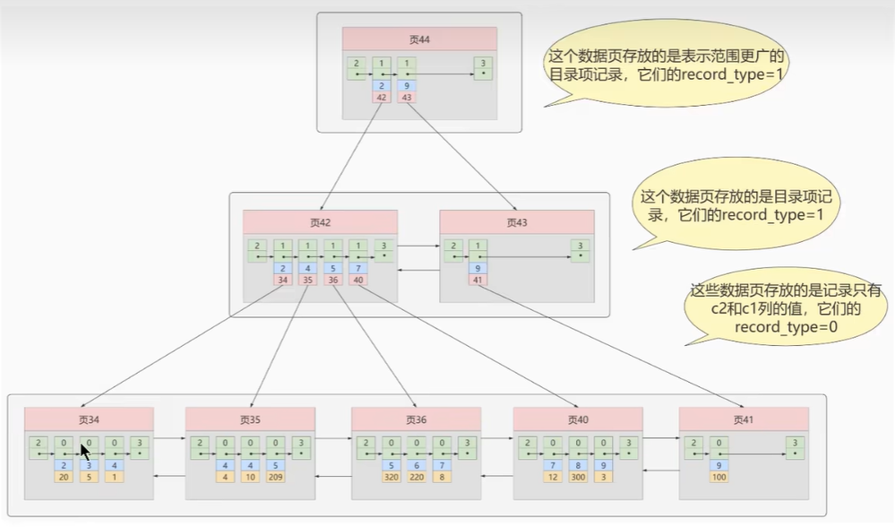

举例：上述例子拿C2当做索引构建的B+树，叶子节点**不会保存完整行数据**，只存：`索引列的值 + 主键ID`；

回表：我们根据C2列大小排序的B+树只能确定我们要查找的主键值，如果我们想根据C2值查找完整的用户记录，需要到聚簇索引中再查一遍，称为**回表**，也就是需要2颗B+树

问：为什么还需要回表操作？直接把数据存到叶子节点不就好了吗？

答：确实不用回表了，但是太占地方，相当于每建立一个B+树就要把所有用户数据都copy一遍，太浪费空间了

一张表可以有多个非聚簇索引

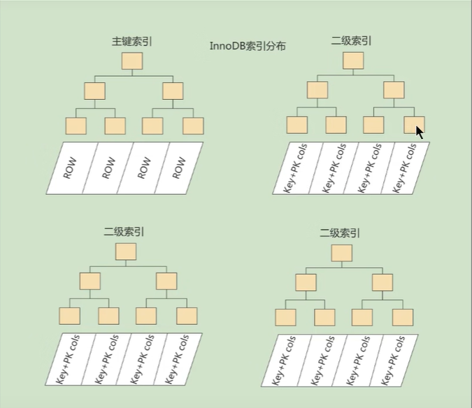

### 4.3 联合索引

可以同时以多个列的大小作为排序规则，同时为多个列建立索引，比如我想让B+树按照C2，C3列的大小进行排序

### 4.4 innodb的B+树索引的注意事项

根页面位置万年不动

内节点中的目录项记录的唯一性

一个页面最少存储2条记录

### 4.5 使用索引的代价

空间代价：一个页默认16kb大小，一颗B+树由很多的页组成，就是很大的一片空间

时间代价：每次对表进行增删改操作时需要修改树的结构，所以需要额外的时间进行移动，回收，记录

## 5. mysql 数据结构选则的合理性

数据库索引是存储在外部磁盘上的

### 5.1 全表检索

### 5.2 Hash结构

是一种确定算法，相同输入永远得到相同的输出，效率来讲hash比B+树更快，但是范围查找会退化成o（n），，索引重复值比较多的时候，效率就会降低

### 5.3 二叉树结构

为了提高查询效率，就需要减少io次数，降低数的高度

### 5.4 AVL树（平衡二叉树）

每访问一次节点就需要进行一次io操作，虽然查询效率高了，但是树的深度也深了，所以我们可以把二叉树变为m叉树

### 5.5 B tree（多路平衡查找树）

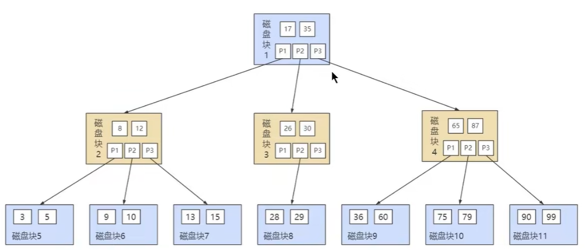

B树在插入和删除节点的时候会导致树不平衡，通过调节节点位置保持平衡

关键字集分布在整颗树中，即叶子节点和非叶子节点都有数据

### 5.6 B+树

B树和B+树的区别

1. 有k个孩子的节点就有k个关键字，孩子数量=关键字数量；B树是孩子数量=关键字数+1
2. 非叶子节点的关键字（主键）也会同时存在子节点中，并且是在子节点中所有关键字的最大（或最小）
3. 非叶子节点仅用于索引，不保存数据记录，所有记录都在叶子节点中；B树是非叶子节点既保存索引又保存数据记录
4. 所有的关键字都在叶子节点中出现，叶子节点构成了一个有序链表，而且叶子节点本身按照关键字大小排序

B+树中间节点不存数据，因为查询效率更稳定，只有访问到叶子节点才能访问到数据，其次查询效率更高，层数更少io次数也少，范围上B+树效率比B树高

# 第七章索引的创建与设计原则

## 1. 索引的使用

### 1.1 索引的分类

普通索引，唯一性索引，全文索引，单列索引，多列索引，空间索引

**普通索引**

不附加任何条件，只用于查询效率，可以创建在任何一个数据类型中

**唯一性索引**

UNIQUE参数设置为唯一性索引，限制索引的值必须唯一，允许为null，一张表里可以有多个唯一索引

**主键索引**

特殊的唯一性索引，不能为null，一张表里最多只有一个主键索引

**单列索引**

在表中的单个字段上创建索引，只根据字段进行索引，一个表可以有多个单列索引

**多列索引**

在表的多个字段组合上创建的索引，使用组合索引时遵循最左前缀原则

**全文索引**

使用FULLTEXT设置，允许重复null值，只能创建在char，text，varchar上，查询数据量较大的字符串字段时，可以提高检索速度

### 1.2 创建索引

创建表时

```mysql
create table dept(
	dept_id int primary key,
    dept_name varchar(20)
);
create table emp(
	emp_id int primary key auto_increment,
    emp_name cahrchar(20) unique,
    dept_id int,
    constant emp_dept_id_fk forgeign key(dept_id) refences dept(dept_id)
);
```

但是，如果显式创建表时创建索引的话，基本语法格式如下：

```mysql
CREATE TABLE table_name [col_name data_type]
[UNIQUE | FULLTEXT | SPATIAL] [INDEX | KEY] [index_name] (col_name [length]) [ASC | DESC]
```

`UNIQUE`、`FULLTEXT` 和 `SPATIAL` 为可选参数，分别表示唯一索引、全文索引和空间索引；

`INDEX` 与 `KEY` 为同义词，两者的作用相同，用来指定创建索引；

`index_name` 指定索引的名称，为可选参数，如果不指定，那么 MySQL 默认 col_name 为索引名；

`col_name` 为需要创建索引的字段列，该列必须从数据表中定义的多个列中选择；

`length` 为可选参数，表示索引的长度，只有字符串类型的字段才能指定索引长度；

`ASC` 或 `DESC` 指定升序或者降序的索引值存储。

```mysql
# 普通索引
create table book(
	book_id int,
    book_name varchar(100),
    info varchar(100),
    comment varchar(100),
    year_publication year,
    #声明索引
    index idx_name(book_name)
);
#通过命令查看 法1
show create table book;
#法2
show index from book;
#性能分析
explain select * from book where book_name ='xxxx'

#唯一索引
create table book(
	book_id int,
    book_name varchar(100),
    info varchar(100),
    comment varchar(100),
    year_publication year,
    #声明索引
    unique index idx_ cmt( )
);

#全文索引
create table test4(
	id int not null,
    age int not null,
    name varchar(20) not null,
    info varchar(200),
    fulltext index futxt_idx_info(info)
)engine=innodb
#全文检索查询方式
select * from test4 where match(name,age) against('查询的字符串');

#表已经存在的时候添加索引
create table dept(
	dept_id int primary key,
    dept_name varchar(20)
);
#方式1
alter table dept add index idx_name(dept_name);
alter table dept add unique uk_name(dept_name);
#方式2
create index idx_name on dept(dept_name);
craete unique index uk_name on dept(dept_name);
```

### 1.3 索引删除

```mysql
#方式1
alter table dept
drop index idx_name;
#添加auto_increment约束字段的唯一索引不能删除
#方式2
drop index idx_name on dept;

```


## 2. 索引的新特性

## 3. 索引的设计原则


# 第八章数据库设计规范

## 1. 为什么需要数据库设计

良好的数据库设计有以下优点

节省数据的存储空间

保证数据完整性

方便进行数据库应用系统的开发

## 2. 范式

### 2.1 范式简介

在关系型数据库中，关于数据库表设计的基本原则，规则就是范式（NF）

### 2.2 范式有那些

 第一范式，第二范式，第三范式，巴斯科德范式（BCNF），第四范式，第五范式

设计越高冗余度越低，高阶范式满足低阶范式要求，有时候我们还需要破坏范式规则，叫**反规范化**

### 2.3 键和相关属性的概念

范式的定义会使用到主键和候选键，数据库中的key由一个或多个属性组成数据表中常用的几种键和属性定义

超键：能唯一标示元组的属性集（主键包含其他键）

候选键：如果超键不包括多余属性，那么这个超键就是候选键（最小的超键）

主键：用户可以从候选键中选则一个作为主键

外键：如果一个R1表中的某属性不是该表主键，而是R2表中的主键，那么就是外键

主属性：包含任一候选键中的属性称为主属性（后选键）

非主属性：与主属性相对，指的是不包含在任何一个候选键中的属性（不是候选键）

### 3.4 1NF

第一范式确保数据表中每个字段值必须具有**原子性**，每个字段不可拆分的最小数据单元

### 3.5 2NF

在满足第一范式的基础上，满足数据表中的每一条记录，都是可唯一标示的，而且所有非主键必选完全依赖主键，不能只依赖主键的一部分

### 3.5 3NF

在第二范式的基础上，确保数据表中的每一个非主键字段和主键字段直接相关，即 要求数据表中的所有非主键字段不能依赖于其他非主键字段，必选相互独立

 **小结**

1NF确保**原子性**，2NF确保每列和**主键完全依赖**，3NF确保每列和主键列**直接相关**

优点：数据标准化有助于数据的冗余，3NF被认为在性能，扩展性和数据完整性达到了最好的平衡

缺点：范式的使用可能会降低查询的效率，数据表越多，越精细，进行数据查询的时候需要多表关联，也可能使索引无效

### 3.6 反范式化

**概念**：有时候不能完全按照范式要求设计，这时我们要求**业务优先**原则

拿空间换时间，提升查询效率

**使用场景**

冗余信息有价值或者能大幅提高查询效率的时候

### 3.7 BCNF

若一个关系达到了第三范式，并且只有一个后选键，或者每个候选键都是单属性，则关系自然达到BC范式

### 3.8 第四范式

多值依赖：属性之间的一对多关系，计为K->->A

函数依赖：事实上是单值依赖，不能表达属性之间的一对多关系

平凡的多值依赖：全集U=K+A，一个K对应多个A，K->->A，此时整个表是一组一对多关系

非平凡的多值依赖：全集U=K+A+B，一个K可以对应于多个A，也可以对应与多个B，A与B相互独立，即K->->A,K->->B

第四范式在BCNF基础上，**消除了非平凡且非函数的多值依赖（即把表中的多对多关系消除）**

### 3.9 第五范式

在第四范式的基础上，消除不是由候选键所蕴含的连接依赖，如果关系模式R中的每一个连接依赖均有R的后选键所隐含

## 3. 数据库表的设计原则

三少一多

1. 数据表的个数越少越好
2. 数据表中的字段个数越少越好
3. 数据表中的联合主键的字段个数越少越好
4. 使用主键和外键越多越好