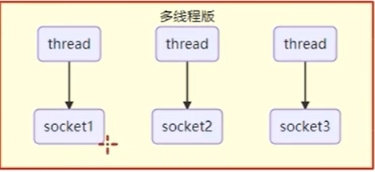
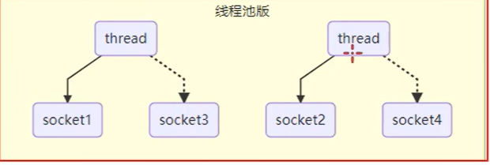
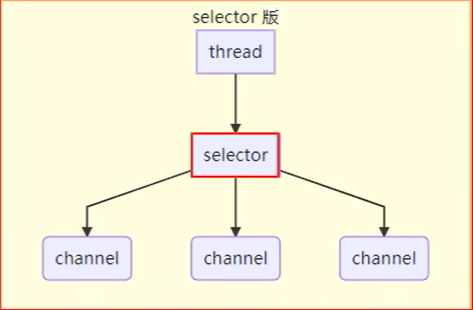
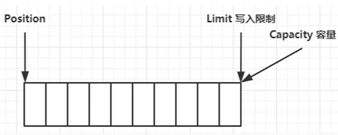
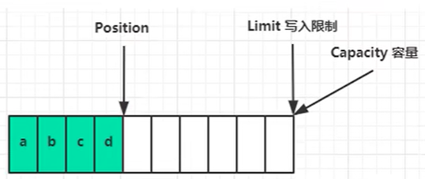
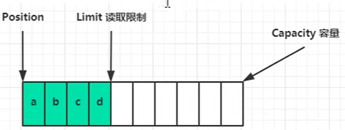
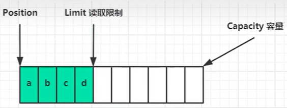
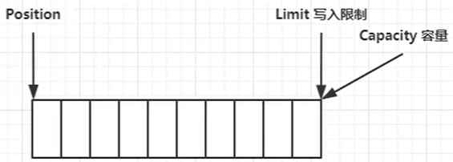
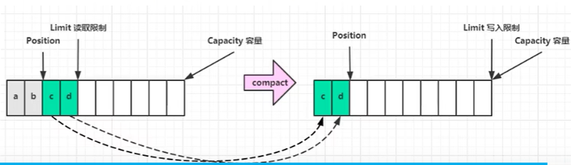

# NIO基础

<small> **non-blocking io非阻塞io**</small>

建议配合b站《黑马程序员Netty全套教程， netty深入浅出Java网络编程教程》学习

https://www.bilibili.com/video/BV1py4y1E7oA/

## 1. 三大组件

### 1.1 Channel& Buffer

channel类似stream，是读写的**双向通道**，可以从Channel将数据读入/写入buffer,stream只能单项输入或输出

<ul> 常见的Channel有
    <li> FileChannel</li>
    <li>DatagramChannel</li>
    <li>SocketChannel</li>
    <li>ServerSocketChannel</li>
</ul>

buffer则用来缓冲io数据，常见的有

<ul>
    <li>ByteBuffer
    	<ul>
            <li>MappedByteBuffer</li>
            <li>DirectByteBuffer</li>
            <li>HeapByteBuffer</li>
        </ul>
    </li>
    <li>ShortBuffer</li>
    <li>IntBuffer</li>
    <li>LongBuffer</li>
    <li>FloatBuffer</li>
    <li>DoubleBuffer</li>
    <CharBuffer></CharBuffer>
</ul>

### 1.2 Selector

我们结合服务器设计演化理解

#### 多线程版设计



一个线程专门管理一个连接

<ul>缺点
	<li>连接多了线程是有限的，线程占用内存过多</li>
    <li>线程上下文切换成本太高</li>
    <li>只适合连接数少的场景</li>
</ul>

#### 线程池版设计




<ul> 缺点
	<li>阻塞模式下，线程仅处理一个socket连接</li>
    <li>仅适合短连接场景</li>
</ul>

#### selector版设计

配合一个线程管理**多个channel**，这些Channel工作在非阻塞模式下，不会让线程吊死在一个Channel上，适合连接数多的，但流量低的场景



调用selector的select()会阻塞直到Channel发生io事件，一旦发生select()会反回这些事件交给thread处理

## 2. ByteBuffer

### 2.1 ByteBuffer使用

pom.xml

```xml
<project xmlns="http://maven.apache.org/POM/4.0.0" xmlns:xsi="http://www.w3.org/2001/XMLSchema-instance"
  xsi:schemaLocation="http://maven.apache.org/POM/4.0.0 http://maven.apache.org/xsd/maven-4.0.0.xsd">
  <modelVersion>4.0.0</modelVersion>

  <groupId>org.example</groupId>
  <artifactId>javase06</artifactId>
  <version>1.0-SNAPSHOT</version>
  <packaging>jar</packaging>

  <name>javase06</name>
  <url>http://maven.apache.org</url>

  <properties>
    <project.build.sourceEncoding>UTF-8</project.build.sourceEncoding>
  </properties>
  <dependencies>
    <dependency>
      <groupId>junit</groupId>
      <artifactId>junit</artifactId>
      <version>3.8.1</version>
      <scope>test</scope>
    </dependency>

    <dependency>
      <groupId>io.netty</groupId>
      <artifactId>netty-all</artifactId>
      <version>4.1.123.Final</version>
    </dependency>

    <dependency>
      <groupId>org.projectlombok</groupId>
      <artifactId>lombok</artifactId>
      <version>1.18.44</version>
    </dependency>
    <dependency>
      <groupId>org.slf4j</groupId>
      <artifactId>slf4j-api</artifactId>
      <version>2.0.9</version>
    </dependency>
    <dependency>
      <groupId>ch.qos.logback</groupId>
      <artifactId>logback-classic</artifactId>
      <version>1.4.11</version>
    </dependency>
    <dependency>
      <groupId>com.google.code.gson</groupId>
      <artifactId>gson</artifactId>
      <version>2.8.5</version>
    </dependency>
  </dependencies>
</project>
```

logback.xml

```xml
<?xml version="1.0" encoding="UTF-8"?>
<configuration
        xmlns="http://ch.qos.logback/xml/ns/logback"
        xmlns:xsi="http://www.w3.org/2001/XMLSchema-instance"
        xsi:schemaLocation="http://ch.qos.logback/xml/ns/logback logback.xsd">

    <!-- 输出控制，格式控制-->
    <appender name="STDOUT" class="ch.qos.logback.core.ConsoleAppender">
        <encoder>
            <pattern>%date{HH:mm:ss} [%-5level] [%thread] %logger{17} - %m%n </pattern>
        </encoder>
    </appender>

    <appender name="FILE" class="ch.qos.logback.core.rolling.RollingFileAppender">
        <!-- 日志文件名称 -->
        <file>logFile.log</file>
        <rollingPolicy class="ch.qos.logback.core.rolling.TimeBasedRollingPolicy">
            <!-- 每天产生一个新的日志文件 -->
            <fileNamePattern>logFile.%d{yyyy-MM-dd}.log</fileNamePattern>
            <!-- 保留 15 天的日志 -->
            <maxHistory>15</maxHistory>
        </rollingPolicy>
        <encoder>
            <pattern>%date{HH:mm:ss} [%-5level] [%thread] %logger{17} - %m%n </pattern>
        </encoder>
    </appender>
    <logger name="netty.c1" level="DEBUG" additivity="false">
        <appender-ref ref="STDOUT"/>
    </logger>

    <root level="ERROR">
        <appender-ref ref="STDOUT"/>
    </root>
</configuration>
```

byteBuffer.java

```java
public static void byteBuffer02(){
    //fileChannel
    //1.输入输出流 2.randomAccessFile
        try (FileChannel fileChannel = FileChannel.open(Path.of("src/main/java/netty/c1/test02.txt"), StandardOpenOption.READ)) {
             //创建缓冲区
            ByteBuffer byteBuffer = ByteBuffer.allocate(256);
            while (true){
                 //从channnel读,向buffer写入
                int len = fileChannel.read(byteBuffer);
                log.debug("读取到的字节{}",len);
                if (len == -1){
                    break;
                }
                 //切换到读模式
                byteBuffer.flip();
                while (byteBuffer.hasRemaining()){
                    byte b = byteBuffer.get();
                    log.debug("实际字节{}",(char)b);
                }
                //切换到写模式
                byteBuffer.clear();
            }
        } catch (IOException e) {
            e.printStackTrace();
}
```

### 2.2 ByteBuffer结构

<ul>byteBuffer有一下重要属性
    <li>capacity 容量</li>
    <li>position 位置</li>
    <li>limit 限制</li>
</ul>



写模式下，postion是写入位置，limit等于容量，下图表示4字节后的状态



切换为写模式flip()后，postion为读取位置，limit为读取限制



读取4字节后的状态



clear()后状态



compact(),把未读完的部分向前压缩，然后切换到写模式



调试工具类 ByteBufferUtil.java

```java
package com.wang.c1;

import io.netty.util.internal.StringUtil;

import java.nio.ByteBuffer;

import static io.netty.util.internal.MathUtil.isOutOfBounds;
import static io.netty.util.internal.StringUtil.NEWLINE;

public class ByteBufferUtil {
    private static final char[] BYTE2CHAR = new char[256];
    private static final char[] HEXDUMP_TABLE = new char[256 * 4];
    private static final String[] HEXPADDING = new String[16];
    private static final String[] HEXDUMP_ROWPREFIXES = new String[65536 >>> 4];
    private static final String[] BYTE2HEX = new String[256];
    private static final String[] BYTEPADDING = new String[16];

    static {
        final char[] DIGITS = "0123456789abcdef".toCharArray();
        for (int i = 0; i < 256; i++) {
            HEXDUMP_TABLE[i << 1] = DIGITS[i >>> 4 & 0x0F];
            HEXDUMP_TABLE[(i << 1) + 1] = DIGITS[i & 0x0F];
        }

        int i;

        // Generate the lookup table for hex dump paddings
        for (i = 0; i < HEXPADDING.length; i++) {
            int padding = HEXPADDING.length - i;
            StringBuilder buf = new StringBuilder(padding * 3);
            for (int j = 0; j < padding; j++) {
                buf.append("   ");
            }
            HEXPADDING[i] = buf.toString();
        }

        // Generate the lookup table for the start-offset header in each row (up to 64KiB).
        for (i = 0; i < HEXDUMP_ROWPREFIXES.length; i++) {
            StringBuilder buf = new StringBuilder(12);
            buf.append(NEWLINE);
            buf.append(Long.toHexString(i << 4 & 0xFFFFFFFFL | 0x100000000L));
            buf.setCharAt(buf.length() - 9, '|');
            buf.append('|');
            HEXDUMP_ROWPREFIXES[i] = buf.toString();
        }

        // Generate the lookup table for byte-to-hex-dump conversion
        for (i = 0; i < BYTE2HEX.length; i++) {
            BYTE2HEX[i] = ' ' + StringUtil.byteToHexStringPadded(i);
        }

        // Generate the lookup table for byte dump paddings
        for (i = 0; i < BYTEPADDING.length; i++) {
            int padding = BYTEPADDING.length - i;
            StringBuilder buf = new StringBuilder(padding);
            for (int j = 0; j < padding; j++) {
                buf.append(' ');
            }
            BYTEPADDING[i] = buf.toString();
        }

        // Generate the lookup table for byte-to-char conversion
        for (i = 0; i < BYTE2CHAR.length; i++) {
            if (i <= 0x1f || i >= 0x7f) {
                BYTE2CHAR[i] = '.';
            } else {
                BYTE2CHAR[i] = (char) i;
            }
        }
    }

    /**
     * 打印所有内容
     * @param buffer
     */
    public static void debugAll(ByteBuffer buffer) {
        int oldlimit = buffer.limit();
        buffer.limit(buffer.capacity());
        StringBuilder origin = new StringBuilder(256);
        appendPrettyHexDump(origin, buffer, 0, buffer.capacity());
        System.out.println("+--------+-------------------- all ------------------------+----------------+");
        System.out.printf("position: [%d], limit: [%d]\n", buffer.position(), oldlimit);
        System.out.println(origin);
        buffer.limit(oldlimit);
    }

    /**
     * 打印可读取内容
     * @param buffer
     */
    public static void debugRead(ByteBuffer buffer) {
        StringBuilder builder = new StringBuilder(256);
        appendPrettyHexDump(builder, buffer, buffer.position(), buffer.limit() - buffer.position());
        System.out.println("+--------+-------------------- read -----------------------+----------------+");
        System.out.printf("position: [%d], limit: [%d]\n", buffer.position(), buffer.limit());
        System.out.println(builder);
    }

    private static void appendPrettyHexDump(StringBuilder dump, ByteBuffer buf, int offset, int length) {
        if (isOutOfBounds(offset, length, buf.capacity())) {
            throw new IndexOutOfBoundsException(
                    "expected: " + "0 <= offset(" + offset + ") <= offset + length(" + length
                            + ") <= " + "buf.capacity(" + buf.capacity() + ')');
        }
        if (length == 0) {
            return;
        }
        dump.append(
                "         +-------------------------------------------------+" +
                        NEWLINE + "         |  0  1  2  3  4  5  6  7  8  9  a  b  c  d  e  f |" +
                        NEWLINE + "+--------+-------------------------------------------------+----------------+");

        final int startIndex = offset;
        final int fullRows = length >>> 4;
        final int remainder = length & 0xF;

        // Dump the rows which have 16 bytes.
        for (int row = 0; row < fullRows; row++) {
            int rowStartIndex = (row << 4) + startIndex;

            // Per-row prefix.
            appendHexDumpRowPrefix(dump, row, rowStartIndex);

            // Hex dump
            int rowEndIndex = rowStartIndex + 16;
            for (int j = rowStartIndex; j < rowEndIndex; j++) {
                dump.append(BYTE2HEX[getUnsignedByte(buf, j)]);
            }
            dump.append(" |");

            // ASCII dump
            for (int j = rowStartIndex; j < rowEndIndex; j++) {
                dump.append(BYTE2CHAR[getUnsignedByte(buf, j)]);
            }
            dump.append('|');
        }

        // Dump the last row which has less than 16 bytes.
        if (remainder != 0) {
            int rowStartIndex = (fullRows << 4) + startIndex;
            appendHexDumpRowPrefix(dump, fullRows, rowStartIndex);

            // Hex dump
            int rowEndIndex = rowStartIndex + remainder;
            for (int j = rowStartIndex; j < rowEndIndex; j++) {
                dump.append(BYTE2HEX[getUnsignedByte(buf, j)]);
            }
            dump.append(HEXPADDING[remainder]);
            dump.append(" |");

            // Ascii dump
            for (int j = rowStartIndex; j < rowEndIndex; j++) {
                dump.append(BYTE2CHAR[getUnsignedByte(buf, j)]);
            }
            dump.append(BYTEPADDING[remainder]);
            dump.append('|');
        }

        dump.append(NEWLINE +
                "+--------+-------------------------------------------------+----------------+");
    }

    private static void appendHexDumpRowPrefix(StringBuilder dump, int row, int rowStartIndex) {
        if (row < HEXDUMP_ROWPREFIXES.length) {
            dump.append(HEXDUMP_ROWPREFIXES[row]);
        } else {
            dump.append(NEWLINE);
            dump.append(Long.toHexString(rowStartIndex & 0xFFFFFFFFL | 0x100000000L));
            dump.setCharAt(dump.length() - 9, '|');
            dump.append('|');
        }
    }

    public static short getUnsignedByte(ByteBuffer buffer, int index) {
        return (short) (buffer.get(index) & 0xFF);
    }
}
```

TestByteBufferReadWrite.java

```java
public class TestByteBufferReadWrite {
    public static void main(String[] args) {
        ByteBuffer buffer = ByteBuffer.allocate(10);
        buffer.put(new byte[]{0x61,0x62,0x63,0x64});
        debugAll(buffer);
        buffer.flip();
        byte b = buffer.get(); // 假设这里拿到 0x61
        System.out.printf("16转10进制,16进制0x%x,10进制%d%n", b, b);
        //clear () = 清空数据，把指针归位到开头
        //compact () = 压缩未读数据，把剩余内容前移，指针也归位到开头
        buffer.compact();
        debugAll(buffer);
        buffer.put(new byte[]{0x65,0x66,0x67});
        debugAll(buffer);
    }
}
```

### 2.3 ByteBuffer常见方法

**分配空间  allocate()**

```java
		//堆内存，读写效率低，受gc影响（数据迁移就要发生拷贝）
        System.out.println(ByteBuffer.allocate(16).getClass());
        //直接内存 ，读写效率高（少一次数据拷贝）不受gc影响，缺点：分配内存效率低（要调底层os操作），使用不当会内存泄露
        System.out.println(ByteBuffer.allocateDirect(16).getClass());
```

**向buffer写入数据**

```java
//Channel的read()
int readBytes = channel.read(buffer);
//bufer的put()
buffer.put((byte) 127);
```

**从buffer读取数据**

<ul>get()会让position读指针向后移动，如果要重复读取可以调用
    <li>rewind() 将position重置为0/</li>
    <li>get(int i) 获取索引i的内容但不会移动读指针</li>
</ul>

```java
int writeBytes = channel.write(buffer);
byte b = buffer.get()
```

```java
		ByteBuffer buffer = ByteBuffer.allocate(10);
        buffer.put(new byte[]{'a','b','c','d'});
        buffer.flip();
        //从头开始读
        buffer.get(new byte[]{'a','b','c','d'});
        debugAll(buffer);
        buffer.rewind();
        System.out.println((char) buffer.get());
```

<ul>
	<li>mark()记录当前position位置</li>
    <li>reset()将postion重置到mark的位置</li>
</ul>

``` java
	
		ByteBuffer buffer = ByteBuffer.allocate(10);
        buffer.put(new byte[]{'a','b','c','d'});
        buffer.flip();
		//mark：做标记，记录postion位置
        //reset：将postion重置到mark的位置
        System.out.println((char) buffer.get()); //a 61
        System.out.println((char) buffer.get());//b 62
        //此时position指向 c 63的位置
        buffer.mark(); //加标记到63的位置
        System.out.println((char) buffer.get()); //c 63
        System.out.println((char) buffer.get()); // d 64
        buffer.reset(); //将postion重置到c 63的位置
        System.out.println((char) buffer.get()); //c 63
```

**字符串与ByteBuffer互转**

```java
		//1.字符串转bytebuffer
        //转byte数组
        ByteBuffer buffer = ByteBuffer.allocate(16);
        buffer.put("hello".getBytes());
        debugAll(buffer);
        //2借助charset 自动切换到读模式
        ByteBuffer buffer2 = Charset.defaultCharset().encode("hello");
        System.out.println(buffer2);

        ByteBuffer buffer3 = StandardCharsets.UTF_8.encode("hello");
        System.out.println(buffer3);

        //3.wrap
        ByteBuffer buffer4 = ByteBuffer.wrap("hello".getBytes());
        System.out.println(buffer4);
        buffer.clear();
        String s = StandardCharsets.UTF_8.decode(buffer).toString();
        System.out.println(s);
```

### 2.4 Scattering Reads

分散读取有一个文本test03.txt

```txt
onetwothree
```

读取进来后以单词为单位进行拆分

```java
public class TestScatteringReads {
    public static void main(String[] args) {
        try (FileChannel channel = new RandomAccessFile("src/main/java/netty/c1/test03.txt", "r").getChannel()) {
            ByteBuffer b1 = ByteBuffer.allocate(3);
            ByteBuffer b2 = ByteBuffer.allocate(3);
            ByteBuffer b3 = ByteBuffer.allocate(5);
            channel.read(new ByteBuffer[]{b1,b2,b3});
            b1.flip();
            b2.flip();
            b3.flip();
            debugAll(b1);
            debugAll(b2);
            debugAll(b3);
        } catch (IOException e) {
            e.printStackTrace();
        };
    }
}
```

合并

```java
public class TestGatheringWrites {
    public static void main(String[] args) {
        //Charset.encode () 方法返回的 buffer 已经是 读模式,无需切换读写模式
        ByteBuffer b1 = StandardCharsets.UTF_8.encode("hello");
        ByteBuffer b2 = StandardCharsets.UTF_8.encode("world");
        ByteBuffer b3 = StandardCharsets.UTF_8.encode("你好java");
        try (FileChannel channel = new RandomAccessFile("src/main/java/netty/c1/test03.txt", "rw").getChannel()) {
            //postion定位到文末追加写
            channel.position(channel.size());
            channel.write(new ByteBuffer[]{b1,b2,b3});
        } catch (IOException e) {
            e.printStackTrace();
        }
    }
}
```

<a id="sec-2-5"></a> 

### 2.5练习

网络上有多条数据发送给服务器，数据间用\n分割，但是数据在接收时需要重新组合，原始数据为

```txt
hello,world \n
i'm zhangsan\n
how are you?\n
经过网络和缓冲器消息变为
hello,world\ni'm zhangsan\nho
w are you?\n
```

现在要求你按原始格式将错乱的数据恢复，按\n分割

粘包（消息粘在一起，打包一起发送）：hello,world\ni'm zhangsan\nho

半包（消息被截断了，缓冲区大小有限制只能接收这么多）：w are you?\n

```java
public class TestByteBufferExam {
    public static void main(String[] args) {
        ByteBuffer source = ByteBuffer.allocate(32);
        source.put("hello,world\ni'm zhangsan\nho".getBytes());
        split(source);
        source.put("w are you?\n".getBytes());
        split(source);
    }
    private static void split(ByteBuffer source){
        source.flip();
        for (int i = 0;i <source.limit();i++){
            if (source.get(i)=='\n'){
                //确定buffer大小 （i+1）:\n后一个字符,postion()初始位置
                int len = (i+1)-source.position();
                //把这条消息存入新的buffer
                ByteBuffer target = ByteBuffer.allocate(len);
                //从source读，target写
                for (int j=0;j<len;j++){
                    target.put(source.get());
                }
                debugAll(target);
            }
        }
        //compact()向前压缩
        source.compact();
    }
}
```

## 3. 文件编程

### 3.1FileChannel

！！！FileChannel只能工作在阻塞模式下

**获取**

<ul>不能直接打开FileChannel，必须通过FileInputStream，FileOutPutStream，RandomAccessFile获取FileChannel，都有getChannel()
    <li>FileInputStream获取的channel只能读</li>    
    <li>FileOutputStream获取的channel只能写</li> 
    <li>RandomAccessFile是否能读写根据构造RandomAccessFile时的读写模式决定</li>    
</ul>

**读取**

从Channel读取数据填充ByteBuffer，返回值表示多少字节-1表示末尾

```java
int readBytes = channel.read(buffer);
```

**写入**

```java
ByteBuffer buffer = ....;
buffer.put(....);
buffer.flip();
while(buffer.hasRemaining()){
    channel.write(buffer);
}
```

**关闭**

Channel必须关闭，不过调用FileInputStream，FileOutPutStream，RandomAccessFile的close()会间接的调用Channel的close()

**位置**

```java
//获取当前位置
long p = channel.postion();
//设置当期位置
long newPos = ...;
channel.postion(newPos)
```

**强制写入**

os出于性能考虑，会将数据缓存，不是立刻写入磁盘（关闭时写入），可以调用force(true)将文件内容和元数据立刻写入磁盘

### 3.2 两个Channel传输数据

准备2个txt

from.txt

```txt
hello world
```

to.txt

```txt
```

将from.txt内容传到to.txt

```java
public class TestFileChannelTransferTo {
    public static void main(String[] args) {
        try (
                FileChannel from = new FileInputStream("src/main/java/netty/c1/from.txt").getChannel();
                FileChannel to = new FileOutputStream("src/main/java/netty/c1/to.txt").getChannel();
        ) {
            long size = from.size();
            for (long left = from.size();left>0;){
                System.out.println("postion:"+(size-left)+"left:"+left);
                /*
                *效率高，底层利用os零拷贝进行优化，一次最多2g数据,0位置，传输大小,到哪
                * Returns:
                The number of bytes, possibly zero, that were actually transferred
                返回实际传输的字节数
                * */
                left -=from.transferTo((size-left),left,to);
            }
        } catch (IOException e) {
            e.printStackTrace();
        }
    }
}
```

### 3.3 Path

jdk7引入path和paths类

path表示文件路径

paths是工具类用来获取path实例

```java
Path source = Paths.get("1.txt"); //相对路径
Path source = Paths.get("d:\\1.txt"); //绝对路径 代表d:\1.txt
Path source = Paths.get("d:/1.txt"); //绝对路径 代表d:\1.txt
Path source = Paths.get("d:\\data","1.txt"); //两个路径进行拼接 代表d:\data\1.txt
```

### 3.4 Files

**检查文件是否存在**

```java
Path path = Paths.get("hello.txt");
System.out.print(Files.existe(path));
```

**创建一级目录**

文件目录存在或者一次性创建多级目录会抛异常

```java
Path path = Paths.get("data/hello.txt");
Files.createDirectory(path);
```

**创建多级目录**

即使不存在也会创建

```java
Path path = Paths.get("data/pro/hello.txt");
Files.createDirectory(path);
```

**拷贝文件**

文件已存在会抛异常

```java
Path source = Paths.get("hello.txt");
Path target = Paths.get("target.txt");
Files.copy(source,target);
```

如果希望覆盖target.txt需要用StandardCopyOption来控制

```java
Files.copy(source,target,StandardCopyOption.REPLACE_EXISTING);
```

**移动文件**

StandardCopyOption.ATOMIC_MOVE保证原子性

```java
Path source = Paths.get("data/hello.txt");
Path target = Paths.get("hello.txt");
Files.move(source,taget,StandardCopyOption.ATOMIC_MOVE);
```

**删除目录**

文件有内容无法删除

```java
Path source = Paths.get("data/hello.txt");
Files.delete(source);
```

**遍历文件夹** 

```java
public class TestFilesWalkFileTree {
    public static void main(String[] args) throws IOException {
        AtomicInteger dirCount = new AtomicInteger();
        AtomicInteger fileCount = new AtomicInteger();
        AtomicInteger txtCount = new AtomicInteger();
        int count = 0;
        Files.walkFileTree(Paths.get("src/main/java"),new SimpleFileVisitor<Path>(){
            @Override
            public FileVisitResult preVisitDirectory(Path dir, BasicFileAttributes attrs) throws IOException {
                //内部类使用外部变量，必须是 final 或 有效 final
                //Variable 'count' is accessed from within inner class, needs to be final or effectively final
                //count++;
                System.out.println("===>"+dir);
                dirCount.incrementAndGet();
                return super.preVisitDirectory(dir, attrs);
            }

            @Override
            public FileVisitResult visitFile(Path file, BasicFileAttributes attrs) throws IOException {
                System.out.println(file);
                fileCount.incrementAndGet();
                if (file.toString().endsWith(".txt")) txtCount.incrementAndGet();
                return super.visitFile(file, attrs);
            }
        });
        System.out.println(txtCount);
        System.out.println(dirCount);
        System.out.println(fileCount);
    }
}
```

## 4. 网络编程

**阻塞**

<ul>
    <li>在没有数据可读时，包括数据复制过程中，线程必须阻塞等待，不会占用 cpu，但线程相当于闲置</li>
    <li>32 位 jvm 一个线程 320k，64 位 jvm 一个线程 1024k，为了减少线程数，需要采用线程池技术</li>
    <li>但即便用了线程池，如果有很多连接建立，但长时间 inactive，会阻塞线程池中所有线程</li>
</ul>

**非阻塞**

<ul>
    <li>在某个 Channel 没有可读事件时，线程不必阻塞，它可以去处理其它有可读事件的 Channel</li>
    <li>数据复制过程中，线程实际还是阻塞的（AIO(Asynchronous I/O（异步非阻塞 I/O）) 改进的地方）</li>
    <li>写数据时，线程只是等待数据写入 Channel 即可，无需等 Channel 通过网络把数据发送出去</li>
</ul>

**多路复用**

<ul>
    线程必须配合 Selector 才能完成对多个 Channel 可读写事件的监控，这称之为多路复用
    <li>多路复用仅针对网络 IO、普通文件 IO 没法利用多路复用</li>
    <li>如果不用 Selector 的非阻塞模式，那么 Channel 读取到的字节很多时候都是 0，而 Selector 保证了有可读事件才去读取</li>
    <li>Channel 输入的数据一旦准备好，会触发 Selector 的可读事件</li>
</ul>

### 4.1 单线程BIO模式

创建服务器

```java
@Slf4j
public class Server {
    public static void main(String[] args) throws IOException {
        ByteBuffer byteBuffer = ByteBuffer.allocate(16);
        //使用nio理解阻塞
        //1.创建服务器
        ServerSocketChannel ssr = ServerSocketChannel.open();
        //2.绑定监听端口
        ssr.bind(new InetSocketAddress(8080));
        //建立连接集合
        List<SocketChannel> channels = new ArrayList<>();
        while (true){
            log.debug("connecting...");
            //3.建立与客户端的连接,socketchannel用来与客户端通信,accept()阻塞方法，等待客户端连接
            SocketChannel socketChannel = ssr.accept();
            log.debug("connected");
            channels.add(socketChannel);
            //接收客户端数据
            for (SocketChannel sc:channels){
                log.debug("before read...{}",sc);
                //read()阻塞方法等待客户端发信息
                sc.read(byteBuffer);
                byteBuffer.flip();
                debugRead(byteBuffer);
                byteBuffer.clear();
                log.debug("after read...{}",sc);
            }
        }

    }
}
```

创建客户端

```java
public class Client {
    public static void main(String[] args) throws IOException {
        SocketChannel socketChannel = SocketChannel.open();
        socketChannel.connect(new InetSocketAddress("localhost",8080));
        System.out.println("wating..."); //在这敲断点debug运行
    }
}
```

运行server类,debug运行client，之后在idea下方选择表达式


在 code fragment输入

```java
socketChannel.write(Charset.defaultCharset().encode("hello"));
```


右上角开启多个实例启动，再开一个client，发送消息


### 4.2 selector 模式

```java
@Slf4j
public class Server {
    public static void main(String[] args) throws IOException {
        ByteBuffer byteBuffer = ByteBuffer.allocate(16);
        //1.创建selector,管理多个Channel
        Selector selector = Selector.open();
        ServerSocketChannel ssc = ServerSocketChannel.open();
        ssc.configureBlocking(false);
        //2.通过注册将selector和Channel联系起来（注册）
        //selectorKey事件发生时通过它可以知道哪个Channel的事件
        SelectionKey sscKey = ssc.register(selector, 0, null);
        //key只关注连接事件accept事件
        sscKey.interestOps(SelectionKey.OP_ACCEPT);
        log.debug("registerKey:{}",sscKey);
        ssc.bind(new InetSocketAddress(8080));
        while (true){
            //如何知道有没有发生事件.没有事件发生线程阻塞
            //注意select()事件未处理时不会阻塞，事件发生后要么处理要么取消，不然会一直循环
            selector.select();
            //处理事件,拿到事件集合
            //selectedKeys();内部包含了所有发生事件
            //set集合，用迭代器循环不要用增强for，迭代器可以遍历删除
            Iterator<SelectionKey> iterator = selector.selectedKeys().iterator();
            while (iterator.hasNext()){
                //通过key选则
                SelectionKey key = iterator.next();
                log.debug("key:{}",key);
                ServerSocketChannel channel =(ServerSocketChannel) key.channel();
                channel.accept();  
                log.debug("{}",channel);
                iterator.remove();
            }
        }
    }
}
```

1创建selector，channel

2.变为非阻塞模式

3.通过register()将selector和channel进行关联，关联好后会返回一个channel的key，后期通过这个key进行channel的选则

4.让selector只关注连接事件(注册监听)

5.循环等待与selector下的serverSocketChannel连接

6.使用迭代器循环遍历每一个发生的事件key集合，通过key操作

### 4.3 NIO多路复用服务器

```java
//nio
@Slf4j
public class Server {
    public static void main(String[] args) throws IOException {
        //1.创建serversockteChannel
        ServerSocketChannel ssc = ServerSocketChannel.open();
        //2.切换为非阻塞模式
        ssc.configureBlocking(false);
        //3.创建selector
        Selector selector = Selector.open();
        //4.注册，将ssc与selector连接绑定,只关心accept操作,返回服务器的key
        SelectionKey registerKey = ssc.register(selector, SelectionKey.OP_ACCEPT);
        log.debug("registerKey==> {}",registerKey);
        //5.服务器端口
        ssc.bind(new InetSocketAddress(8080));
        while (true){
            //6.没有连接时阻塞
            selector.select();
            //7.当监听到连接后放入set集合中，通过里面的key去选则哪个channel
            Iterator<SelectionKey> iterator = selector.selectedKeys().iterator();
            while (iterator.hasNext()){
                    //8.获取key
                SelectionKey key = iterator.next();
                log.debug("key==>{}",key);
                // 必须先判断 key 是否有效！防止客户端断开后报错
                if (!key.isValid()) {
                    iterator.remove();
                    continue;
                }
                //9.如果key是连接事件则
                if (key.isAcceptable()){
                    //10.拿到当前与客户端的channel
                    ServerSocketChannel channel =(ServerSocketChannel) key.channel();
                    //等待客户端发起 TCP 连接 → 连接成功 → 返回这个客户端的专属通信通道
                    SocketChannel socketChannel = channel.accept();
                    socketChannel.configureBlocking(false);
                    //不先注册 OP_READ，Selector 根本就不会告诉你 “有读事件来了
                    //告诉 selector：我关心这个客户端的读事件
                    socketChannel.register(selector,SelectionKey.OP_READ);
                    log.debug("客户端连接成功{}",socketChannel);
                    //发生读事件
                    //  selector 告诉你：现在真的有数据可以读了
                } else if (key.isReadable()) {
                    SocketChannel channelKey =(SocketChannel) key.channel();
                    ByteBuffer buffer = ByteBuffer.allocate(16);
                    //往buffer里面读
                    int read = channelKey.read(buffer);
                    if (read==-1){
                        //通道关闭并移出
                        key.cancel();
                        channelKey.close();
                        log.debug("客户端断开连接....");
                    }else {
                        //切换为读模式
                        buffer.flip();
                        debugAll(buffer);
                    }
                }
                //操作完成删除
                iterator.remove();
            }
        }
    }
}
```

#### 处理消息的边界


<ul>
    <li>一种思路是固定长度消息，数据包大小一样，服务器按预定长度获取，缺点浪费带宽</li>
    <li>另一种按分隔符拆分，缺点效率低</li>
    <li>TLV格式：即Type类型，length长度，value数据，类型和长度已知的情况下，就可以方便的获取消息大小，分配适合的buffer，缺点是buffer需要提前分配，如果内容过大影响server吞吐量
        <ul>
        	<li>Http1.1是TLV格式</li>
        	<li>Http2.0是TLV格式</li>
        </ul>
    </li>
</ul>
在之前[2.5练习](#sec-2-5)的章节我们写了一个以 \n 分割数据的方法。现在我们引用这个方法并向服务器发送输入以下内容

```txt
0123456789abcdef333\n
```

我们会看到buffer里只有333\n，前面的数据全丢了

这是因为第一次读到fbuffer就读满了，之后的需要二次读，第二次读的时候会把前面读的丢掉


我们就想到将buffer放到外面，但是会将每个channel共用这一个buffer会导致混乱，这里我门会用到附件(attchment)，就是register()的第三个参数，让每个channel有独立的buffer

```java
@Slf4j
public class Server {
    public static void main(String[] args) throws IOException {
        //1.创建serverSocketChannel
        ServerSocketChannel ssc = ServerSocketChannel.open();
        //2.切换为非阻塞模式
        ssc.configureBlocking(false);
        //3.创建selector
        Selector selector = Selector.open();
        //4.注册，将ssc与selector连接绑定,只关心accept操作,返回服务器的key
        //register () 方法返回的永远是「当前调用 register 的这个通道」对应的 key
        //等待客户端主动连接我
        SelectionKey registerKey = ssc.register(selector, SelectionKey.OP_ACCEPT);
        log.debug("registerKey==> {}",registerKey);
        //5.服务器端口
        ssc.bind(new InetSocketAddress(8080));
        while (true){
            //6.没有连接时阻塞
            selector.select();
            //7.当监听到连接后放入set集合中，通过里面的key去选则哪个channel
            Iterator<SelectionKey> iterator = selector.selectedKeys().iterator();
            while (iterator.hasNext()){
                    //8.获取key
                SelectionKey key = iterator.next();
                log.debug("key==>{}",key);
                // 必须先判断 key 是否有效！防止客户端断开后报错
                if (!key.isValid()) {
                    iterator.remove();
                    continue;
                }
                //9.如果key是连接事件则
                if (key.isAcceptable()){
                    //10.连接来了，但客户端通道还不存在，必须先拿到服务器通道，才能调用 .accept() 拿到客户端
                    ServerSocketChannel channel =(ServerSocketChannel) key.channel();
                    //等待客户端发起 TCP 连接 → 连接成功 → 返回这个客户端的专属通信通道
                    SocketChannel socketChannel = channel.accept();
                    socketChannel.configureBlocking(false);
                    //将buffer作为附件关联到selectorKey上
                ==> ByteBuffer buffer = ByteBuffer.allocate(16);
                    //不先注册 OP_READ，Selector 根本就不会告诉你 “有读事件来了
                    //告诉 selector：我关心这个客户端的读事件
                ==> socketChannel.register(selector,SelectionKey.OP_READ,buffer);
                    log.debug("客户端连接成功{}",socketChannel);
                    InetSocketAddress remoteAddress =(InetSocketAddress) socketChannel.getRemoteAddress();
                    String hostName = remoteAddress.getHostString();
                    int port = remoteAddress.getPort();
                    log.debug("客户端ip==>{},客户端端口号==>{}",hostName,port);
                    //发生读事件
                    //  selector 告诉你：现在真的有数据可以读了
                } else if (key.isReadable()) {
                    SocketChannel channelKey =(SocketChannel) key.channel();
                    //获取独立的buffer
                ==> ByteBuffer buffer = (ByteBuffer) key.attachment();
                    //往buffer里面读
                    int read = channelKey.read(buffer);
                    if (read==-1){
                        //通道关闭并移出
                        key.cancel();
                        channelKey.close();
                        log.debug("客户端断开连接....");
                    }else {
                  ==>   TestByteBufferExam.split(buffer);
                        //切换为读模式
                        //buffer.flip();
                        //debugAll(buffer);
                  ==>   if (buffer.position() == buffer.limit()){
                            //满了扩容buffer
                            ByteBuffer buffer2 = ByteBuffer.allocate(buffer.limit()*2);
                            buffer.flip();
                            //将旧buffer拷贝到新buffer里
                            buffer2.put(buffer);
                            //将原有buffer替换
                            key.attach(buffer2);
                        }
                    }
                }
                //操作完成删除
                iterator.remove();
            }
        }
    }
}
```

#### byteBuffer大小分配

<ul>
    <li>每个 channel 都需要记录可能被切分的消息，因为 ByteBuffer 不能被多个channel共同使用，因此需要为每个 channel 维护一个独立的 ByteBuffer</li>
    <li>
        <ul>
            ByteBuffer 不能太大，比如一个 ByteBuffer 1Mb 的话，要支持百万连接就要 1Tb 内存，因此需要设计大小可变的 ByteBuffer
            <li>一种思路是首先分配一个较小的 buffer，例如 4k，如果发现数据不够，再分配 8k 的 buffer，将 4k buffer 内容拷贝至 8k buffer，优点是消息连续容易处理，缺点是数据拷贝耗费性能</li>
            <li>另一种思路是用多个数组组成 buffer，一个数组不够，把多出来的内容写入新的数组，与前面的区别是消息存储不连续解析复杂，优点是避免了拷贝引起的性能损耗</li>
        </ul>
    </li>
</ul>

服务器向客户端发送消息

```java
public class WriteServer {
    public static void main(String[] args) throws IOException {
        ServerSocketChannel ssc = ServerSocketChannel.open();
        ssc.configureBlocking(false);
        Selector selector = Selector.open();
        ssc.register(selector, SelectionKey.OP_ACCEPT);
        ssc.bind(new InetSocketAddress(8080));
        while (true){
            selector.select();
            Iterator<SelectionKey> iterator = selector.selectedKeys().iterator();
            while(iterator.hasNext()) {
                SelectionKey key = iterator.next();
                if (key.isAcceptable()) {
                    SocketChannel channel = ssc.accept();
                    channel.configureBlocking(false);
                    channel.register(selector,0);
                    //向客户端发大量数据
                    StringBuilder sb = new StringBuilder();
                    for (int i = 0;i<30;i++) {
                        sb.append("a");
                    }
                    ByteBuffer buffer = Charset.defaultCharset().encode(sb.toString());
                    key.attach(buffer);
                    while (buffer.hasRemaining()){
                        //返回值代表实际写入的字节数
                        int write = channel.write(buffer);
                    }
                }
                iterator.remove();
            }
        }
    }
}
```

```java
public class WriteClient {
    public static void main(String[] args) throws IOException {
        SocketChannel channel = SocketChannel.open();
        channel.connect(new InetSocketAddress("localhost",8080));
        int count = 0;
        //接收服务器的数据
        while(true){
            ByteBuffer buffer = ByteBuffer.allocate(64);
            count+= channel.read(buffer);
            System.out.println(count);
            debugAll(buffer);
            buffer.clear();
        }
    }
}
```

#### 处理可写事件

```java
public class WriteServer {
    public static void main(String[] args) throws IOException {
        ServerSocketChannel ssc = ServerSocketChannel.open();
        ssc.configureBlocking(false);
        Selector selector = Selector.open();
        ssc.register(selector, SelectionKey.OP_ACCEPT);
        ssc.bind(new InetSocketAddress(8080));

        while (true) {
            selector.select();
            Iterator<SelectionKey> iterator = selector.selectedKeys().iterator();
            while (iterator.hasNext()) {
                SelectionKey key = iterator.next();

                if (key.isAcceptable()) {
                    SocketChannel channel = ssc.accept();
                    channel.configureBlocking(false);

                    SelectionKey scKey = channel.register(selector, 0, null);
                    scKey.interestOps(SelectionKey.OP_READ);

                    // 构造数据
                    StringBuilder sb = new StringBuilder();
                    for (int i = 0; i < 30; i++) {
                        sb.append("a");
                    }
                    ByteBuffer buffer = Charset.defaultCharset().encode(sb.toString());

                    // 第一次尝试写入
                    int write = channel.write(buffer);
                    System.out.println("第一次写入：" + write);

                    // 如果没写完，注册写事件
                    if (buffer.hasRemaining()) {
                        scKey.interestOps(scKey.interestOps() | SelectionKey.OP_WRITE);
                        scKey.attach(buffer);
                    }
                }

                // ============= 处理写事件 =============
                else if (key.isWritable()) {
                    ByteBuffer buffer = (ByteBuffer) key.attachment();
                    SocketChannel sc = (SocketChannel) key.channel();

                    int write = sc.write(buffer);
                    System.out.println("写事件写入：" + write);

                    // ==============================
                    // 【关键】写完了就取消写事件
                    // ==============================
                    if (!buffer.hasRemaining()) {
                        System.out.println("=== 全部发送完成 ===");
                        //取消当前 key 的 OP_WRITE 监听（关掉写事件）  ~非，取反  &且
                        key.interestOps(key.interestOps() & ~SelectionKey.OP_WRITE);
                        key.attach(null); // 清空数据
                    }
                }

                iterator.remove();
            }
        }
    }
}
```

### 4.4 更近一步

**利用多线程优化**

现在都是多核cpu，我们要充分利用cpu资源

前面的只有一个selector，没有充分利用cpu，如何改进？

<ul>分2个selector
    <li>单线程配一个选择器，专门处理accept事件</li>
    <li>创建cpu核心数线程，每个线程配一个selector，轮流处理read事件</li>
</ul>

Boss,worker

Boss:只负责连接，不负责读写操作

worker:只负责读写

当有客户端来连接时需要boss接待，不能直接找worker，这就是 **主从 Reactor 模型**，也是 Netty 高并发的核心


## 5. NIO vs BIO

### 5.1 stream vs channel

<ul>
    <li>stream不会自动缓冲数据，channel会利用系统提供的发送缓冲区·接收缓冲区（更加底层）</li>
    <li>stream仅支持阻塞API，channel同时支持阻塞，非阻塞API，网络channel可配合selector实现多路复用</li>
    <li>两者均是全双工，即读写同时进行</li>
</ul>

### 5.2 IO模型

同步阻塞，同步非阻塞，异步阻塞，异步非阻塞，多路复用

当调用一次channel.read或stream.read后会切换至os内核态完成真正的读取，读取分两个阶段

<ul>
    <li>等待数据阶段</li>
    <li>复制数据阶段</li>
</ul>


<ul>
    <li>阻塞io：用户线程发起阻塞读时会立即阻塞挂起，内核异步等待网络数据并在数据到达后完成拷贝，拷贝结束再唤醒用户线程。</li>
    <li>非阻塞io：用户线程发起 read 后立刻返回，不会阻塞；数据没就绪时内核直接返回 “暂无数据”，由用户线程自己不断轮询内核，直到数据到位。因为频繁调用用户态与内核态所以影响os性能</li>
</ul>


在 BIO 单线程模型中，accept () 和 read () 都是阻塞方法，线程必须按顺序执行：先完成 accept () 才能处理 read ()。只要 accept () 没返回，即使 channel1 有数据，线程也不会去读，直到 channel2 连接建立让 accept () 结束。

```java
@Slf4j
public class BioServerProblem {
    public static void main(String[] args) throws IOException {
        ServerSocketChannel ssc = ServerSocketChannel.open();
        ssc.bind(new InetSocketAddress(8080));
        
        List<SocketChannel> channels = new ArrayList<>();

        while (true) {
            log.info("===== 主线程：等待新连接 accept() =====");
            
            // 1. 阻塞点1：等新客户端连接
            SocketChannel channel = ssc.accept(); 
            log.info("===== 新客户端连接成功：{} =====", channel);
            channels.add(channel);

            // 2. 遍历所有客户端，读取数据（也是阻塞！）
            for (SocketChannel sc : channels) {
                log.info("===== 开始读取客户端：{} =====", sc);
                
                ByteBuffer buffer = ByteBuffer.allocate(30);
                sc.read(buffer); // 阻塞点2：等客户端发数据
                buffer.flip();
                log.info("收到数据：{}", new String(buffer.array()));
            }
        }
    }
}
```

操作步骤（你跟着做，现象一模一样）

1. **启动服务器**

   打印：

   `===== 主线程：等待新连接 accept() =====`

   

2. **打开客户端 1 连接服务器**

   

   - 服务器打印：`新客户端连接成功`
   - 然后立刻进入 for 循环，**调用 channel1.read ()**
   - 线程阻塞在这里，**等客户端 1 发数据**

   

3. **客户端 1 发送：hello**

   

   - 服务器收到，打印：`收到数据：hello`
   - for 循环结束
   - **回到 while 循环开头！**

   

4. **关键现象来了！！！**

   服务器打印：

   `===== 主线程：等待新连接 accept() =====`

   → **线程又卡在 accept ()，等新连接！**

   

5. **此时：客户端 1 再次发送消息：world**

   → **服务器完全没反应！！！**

   → 线程根本不去读 channel1！

   

6. **你再打开客户端 2 连接服务器**

   → accept () 终于结束

   → 线程才**进入 for 循环，读取 channel1 的消息**

   → 打印：收到数据：world

   处理完 channel1 第一次数据 → 线程立刻回到 accept () 等新连接

   channel1 再发数据 → 线程完全不管只有等 channel2 连接来了 → 线程才会回头读 channel1


<ul>
    <li>多路复用：线程调用 select () 阻塞等待，内核监听所有通道；
当有一个或多个通道就绪时，select () 返回一批就绪的 SelectionKey，线程遍历这些 key，对每个就绪 key 调用 read () 同步完成数据复制。</li>
    <li>信号驱动</li>
    <li>异步io</li>
</ul>
# Netty 入门

## 1. 什么是netty？

基于事件驱动，异步的网络应用框架，用于高性能快速开发的网络服务器和客户端

netty vs nio

<ul>
    <li>需要自己构建协议</li>
    <li>解决TCP传输问题，如粘包，半包</li>
    <li>epoll空轮询导致消耗CPU</li>
    <li>对API的增强</li>
</ul>

## 2. Hello World

开发一个简单的客户端好服务器

<ul>
    <li>客户端向服务器发送hello world</li>
    <li>服务器仅接收不返回</li>
</ul>

```xml
<dependency>
      <groupId>io.netty</groupId>
      <artifactId>netty-all</artifactId>
      <version>4.1.123.Final</version>
</dependency>
```

```java
public class HelloClient {
    public static void main(String[] args) throws InterruptedException {
        //创建启动器
        new Bootstrap()
                //添加事件循环
                .group(new NioEventLoopGroup())
                //选则客户端channel实现
                .channel(NioSocketChannel.class)
                .handler(new ChannelInitializer<NioSocketChannel>() {
                    @Override
                    protected void initChannel(NioSocketChannel ch) throws Exception {
                        ch.pipeline().addLast(new StringEncoder());
                    }
                })
                .connect(new InetSocketAddress("localhost",8080))
            	//阻塞方法，等待连接建立，停下来，死等 TCP 三次握手完成
                .sync()
            	//代表连接对象获得与服务器的Channel
                .channel()
                .writeAndFlush("hello wolrd !");
    }
}
```

```java
public class HelloServer {
    public static void main(String[] args) {
        //服务器端的启动器，负责下面组件的组装，协调工作
        new ServerBootstrap()
                //添加组件 nioEventLoopGroup 包含：Netty 把 selector + 线程 + 轮询 全部藏进来
 accept()===>   .group(new NioEventLoopGroup())
                //选则服务器serverchannel实现
                .channel(NioServerSocketChannel.class)
                //childHandler：负责分工boss：负责连接，worker(child)：负责读写。执行什么操作（handler）
                //channel：代表和客户端进行读写的通道，initializer：初始化，负责添加别的handler
                .childHandler(new ChannelInitializer<NioSocketChannel>() {
                    @Override
                    //每当有客户端连接时自动执行一次 initChannel ()，给这条新连接的通道 安装编码器、解码器、业务处理器
                    protected void initChannel(NioSocketChannel ch) throws Exception {
                        //添加具体的handle，stringDecoder byte解码成字符串
                        ch.pipeline().addLast(new StringDecoder());
                        //自定义handler，InBound入站：数据进来时处理。OutBound出站：数据出来时的处理
                        ch.pipeline().addLast(new ChannelInboundHandlerAdapter(){
                            @Override
                            //读事件
                           public void channelRead(ChannelHandlerContext ctx, Object msg) throws Exception {
                                System.out.println(msg);
                            }
                        });
                    }
                }).bind(8080);
    }
}
```

一开始需要树立正确的观念

- 把 channel 理解为数据的通道
- 把 msg 理解为流动的数据，最开始输入是 ByteBuf，但经过 pipeline 的加工，会变成其它类型对象，最后输出又变成 ByteBuf
- 把 handler 理解为数据的处理工序
  - 工序有多道，合在一起就是 pipeline，pipeline 负责发布事件（读、读取完成…）传播给每个 handler，handler 对自己感兴趣的事件进行处理（重写了相应事件处理方法）
  - handler 分 Inbound 和 Outbound 两类
- 把 eventLoop 理解为处理数据的工人！
  - 工人可以管理多个 channel 的 io 操作，并且一旦工人负责了某个 channel，就要负责到底（绑定）
  - 工人既可以执行 io 操作，也可以进行任务处理，每位工人有任务队列，队列里可以堆放多个 channel 的待处理任务，任务分为普通任务、定时任务
  - 工人按照 pipeline 顺序，依次按照 handler 的规划（代码）处理数据，可以为每道工序指定不同的工人

## 3. 组件

### 3.1 EventLoop

EventLoop 本质是一个单线程执行器（同时维护了一个 Selector），里面有 run 方法处理 Channel 上源源不断的 io 事件。

它的继承关系比较复杂

- 一条线是继承自 j.u.c.ScheduledExecutorService 因此包含了线程池中所有的方法

- 另一条线是继承自 netty 自己的 OrderedEventExecutor，

  - 提供了 boolean inEventLoop (Thread thread) 方法判断一个线程是否属于此 EventLoop

  - 提供了 parent 方法来看看自己属于哪个 EventLoopGroup

    

EventLoopGroup 是一组 EventLoop，Channel 一般会调用 EventLoopGroup 的 register 方法来绑定其中一个 EventLoop，后续这个 Channel 上的 io 事件都由此 EventLoop 来处理（保证了 io 事件处理时的线程安全）

- 继承自 netty 自己的 EventExecutorGroup
  - 实现了 Iterable 接口提供遍历 EventLoop 的能力
  - 另有 next 方法获取集合中下一个 EventLoop

#### 1)  事件循环，事件循环组，定时任务

```java
@Slf4j
public class TestEventLoop {
    public static void main(String[] args) {
        //1.创建事件循环组
        //io,定时任务，普通任务
        //创建线程，底层数量根据你指定的数量，或者是计算机cpu核心数*2来算
        EventLoopGroup group = new NioEventLoopGroup();
        //定时任务，普通任务
        //EventLoopGroup group2= new DefaultEventLoop();
        //获取下一个事件循环对象
        System.out.println(group.next());
        System.out.println(group.next());
        System.out.println(group.next());
        System.out.println(group.next());

        //执行普通任务,向事件循环组提交事件循环对象,异步执行
        group.next().submit(()->{
            try {
                Thread.sleep(1000);
            } catch (InterruptedException e) {
                throw new RuntimeException(e);
            }
            log.debug("ok");
        });

        //执行定时任务, scheduleAtFixedRate(任务,多久执行,间隔时间,时间单位(前面的时间树按秒还是毫秒还是分钟算))
        group.next().scheduleAtFixedRate(()->{
            log.debug("ok");
        },2,2,TimeUnit.SECONDS);
        log.debug("main");
    }
}
```

#### 2) IO任务

```java
@Slf4j
public class EventLoopServer {
    public static void main(String[] args) {
        new ServerBootstrap()
                .group(new NioEventLoopGroup())
                .channel(NioServerSocketChannel.class)
                .childHandler(new ChannelInitializer<NioSocketChannel>() {
                    @Override
                    protected void initChannel(NioSocketChannel ch) throws Exception {
                        ch.pipeline().addLast(new ChannelInboundHandlerAdapter(){
                            @Override
                            public void channelRead(ChannelHandlerContext ctx, Object msg/*byteBuf*/) throws Exception {
                                 ByteBuf buf= (ByteBuf) msg;
                                 log.debug(buf.toString((StandardCharsets.UTF_8)));
                            }
                        });
                    }
                })
                .bind(8080);
    }
}
```

```java
public class EventLoopClient {
    public static void main(String[] args)throws InterruptedException {
        //创建启动器
        Channel channel = new Bootstrap()
                //添加事件循环
                .group(new NioEventLoopGroup())
                //选则客户端channel实现
                .channel(NioSocketChannel.class)
                .handler(new ChannelInitializer<NioSocketChannel>() {
                    @Override
                    protected void initChannel(NioSocketChannel ch) throws Exception {
                        ch.pipeline().addLast(new StringEncoder());
                    }
                })
                .connect(new InetSocketAddress("localhost", 8080))
                .sync()
                .channel();
  			        System.out.println(channel);
  idea debug启动==>  System.out.println("");
    }
}
```

因为idea的debug是阻塞netty的多线程所以当前线程直接发发补出去，当前线程停下来，所有线程都停下来了


启动多个客户端，执行表达式

```java
channel.writeAndFlush("1"); //获得Channel向服务器发送
```


可以看到2个工人轮流处理Channel，但每个工人只负责手下的Channel（绑定）


#### 3) 分工细化

如果所有操作都交给主线程操作当请求过多时会发生过多耗时，所以我们可以划分boss和worker进行分工操作，同时我们可以引入主线程组外的线程组，这样减少 IO 线程与业务线程的隔离，避免阻塞

```java
@Slf4j
public class EventLoopServer {
    public static void main(String[] args) {
        //detail division 2: create a EventLoopGroup independent
        //独立的非IO线程组，专门处理耗时业务逻辑
        //不处理 IO，只执行业务逻辑
        DefaultEventLoopGroup eventExecutors = new DefaultEventLoopGroup();
        new ServerBootstrap()
                //detail division 1:BOSS and WORKER
                //boss only focus on accept event in ServerSocketHChannel
                //worker only focus on read and write in SocketChannel(two worker)
                .group(new NioEventLoopGroup(),new NioEventLoopGroup(2))
                .channel(NioServerSocketChannel.class)
                .childHandler(new ChannelInitializer<NioSocketChannel>() {
                    @Override
                    protected void initChannel(NioSocketChannel ch) throws Exception {
                        ch.pipeline().addLast("handle1",new ChannelInboundHandlerAdapter(){
                            @Override
                            public void channelRead(ChannelHandlerContext ctx, Object msg/*byteBuf*/) throws Exception {
                                 ByteBuf buf= (ByteBuf) msg;
                                 log.debug(buf.toString((StandardCharsets.UTF_8)));
                                 ctx.fireChannelRead(msg); //传递消息给下一个handler
                            }
                            /** handler2：由 独立业务线程池 执行,由eventExecutors执行，
                             * 是主线程之外的线程操作，这样减少 IO 线程与业务线程的隔离，避免阻塞
                             **/
                             }).addLast(eventExecutors,"handle2",new ChannelInboundHandlerAdapter(){
                            @Override
                            public void channelRead(ChannelHandlerContext ctx, Object msg/*byteBuf*/) throws Exception {
                                ByteBuf buf= (ByteBuf) msg;
                                log.debug(buf.toString((StandardCharsets.UTF_8)));
                            }
                        });
                    }
                })
                .bind(8080);
    }
}
```

### 3.2 Channel

channel 的主要作用

- close() 可以用来关闭 channel

- closeFuture()

   用来处理 channel 的关闭

  - `sync` 方法作用是同步等待 channel 关闭
  - 而 `addListener` 方法是异步等待 channel 关闭

- `pipeline()` 方法添加处理器

- `write()` 方法将数据写入

- `writeAndFlush()` 方法将数据写入并刷出

```java
@Slf4j
public class HelloClient {
    public static void main(String[] args) throws InterruptedException {
        //带有Future,Promise的类型都是和异步方法配套调用，用来处理结果
        ChannelFuture channelFuture = new Bootstrap()
                .group(new NioEventLoopGroup())
                .channel(NioSocketChannel.class)
                .handler(new ChannelInitializer<NioSocketChannel>() {
                    @Override
                    protected void initChannel(NioSocketChannel ch) throws Exception {
                        ch.pipeline().addLast(new StringEncoder());
                    }
                })
            
                //connect()异步非阻塞方法
                //1.主线程发起调用，但是真正执行连接操作的不是他，连接服务器这个操作交给其他线程（nio线程）它不管不等待结果
                .connect(new InetSocketAddress("localhost", 8080));
        //方法1
        //所以要调用sync()
        channelFuture.sync();
        Channel channel = channelFuture.channel();
        log.debug("{}",channel);
        channel.writeAndFlush("hello wolrd !");
        
        //方法2
        //channelFuture.addListener(new ChannelFutureListener() {
        //nio线程连接建立好了之后，调用operationComplete()
            //@Override
            //public void operationComplete(ChannelFuture channelFuture) throws Exception {
                //Channel channel1 = channelFuture.channel();
                //log.debug("{}",channel1);
                //channel1.writeAndFlush("hello world");
            //}
       //});
    }
```

#### 1)channelFuture

需求记录控制台输入的信息发送给客户端按“q”退出

```java
@Slf4j
public class CloseFutureClient {
    public static void main(String[] args) throws InterruptedException {
        ChannelFuture channelFuture = new Bootstrap()
                .group(new NioEventLoopGroup())
                .channel(NioSocketChannel.class)
                .handler(new ChannelInitializer<SocketChannel>() {
                    @Override
                    protected void initChannel(SocketChannel ch) throws Exception {
                        ch.pipeline().addLast(new StringEncoder());
                    }
                })
                .connect("localhost", 8080);
                channelFuture.sync();
        Channel channel = channelFuture.channel();
        log.debug("{}",channel);
        new Thread(()->{
            Scanner scanner = new Scanner(System.in);
            while (true){
                String s = scanner.nextLine();
                if("q".equals(s)){
                    channel.close();
                    break;
                }
                channel.writeAndFlush(s);
            }
        },"input").start();
        log.debug("处理关闭之后的操作");
    }
}
```

```java
@Slf4j
public class EventLoopServer {
    public static void main(String[] args) {
        //detail division 2: create a EventLoopGroup independent
        //独立的非IO线程组，专门处理耗时业务逻辑
        //不处理 IO，只执行业务逻辑
        DefaultEventLoopGroup eventExecutors = new DefaultEventLoopGroup();
        new ServerBootstrap()
                //detail division 1:BOSS and WORKER
                //boss only focus on accept event in ServerSocketHChannel
                //worker only focus on read and write in SocketChannel(two worker)
                .group(new NioEventLoopGroup(),new NioEventLoopGroup(2))
                .channel(NioServerSocketChannel.class)
                .childHandler(new ChannelInitializer<NioSocketChannel>() {
                    @Override
                    protected void initChannel(NioSocketChannel ch) throws Exception {
                        ch.pipeline().addLast("handle1",new ChannelInboundHandlerAdapter(){
                            @Override
                            public void channelRead(ChannelHandlerContext ctx, Object msg/*byteBuf*/) throws Exception {
                                 ByteBuf buf= (ByteBuf) msg;
                                 log.debug(buf.toString((StandardCharsets.UTF_8)));
                                 ctx.fireChannelRead(msg); //传递消息给下一个handler
                            }
                            /** handler2：由 独立业务线程池 执行,由eventExecutors执行，
                             * 是主线程之外的线程操作，这样减少 IO 线程与业务线程的隔离，避免阻塞
                             **/
                             }).addLast(eventExecutors,"handle2",new ChannelInboundHandlerAdapter(){
                            @Override
                            public void channelRead(ChannelHandlerContext ctx, Object msg/*byteBuf*/) throws Exception {
                                ByteBuf buf= (ByteBuf) msg;
                                log.debug(buf.toString((StandardCharsets.UTF_8)));
                            }
                        });
                    }
                })
                .bind(8080);
    }
}
```

#### 2) 思考

为什么netty要异步的方式处理，如建立连接交给其他线程，不交给主线程？使用多线程效率就高吗？


4个医生给病人看病，医生一天工作8小时，看完一个病人要花费20分钟，而且医生以病人为单位，一个病人看完了才能看下一个病人，病人源源不断的来，那么4个医生下来看的病人数是4`*`8`*`3=96


但是，看病这个可以细分4个步骤，拆分后的步骤每个需要5分钟


那我们可以进行如下优化，一开始医生2,3,4分别要等5,10,15分钟开始执行，但是后续病人来了他们就能满负荷，并且处理病人的能力提高到4`*`8`*`12效率是原来的4倍，原来一个医生1小时才看3个病人，现在一个医生1小时可以看12个病人（netty的异步方式），提高的是单位时间内的吞吐量


要点

- 单线程没法异步提高效率，必须配合多线程、多核 cpu 才能发挥异步的优势
- 异步并没有缩短响应时间，反而有所增加
- 合理进行任务拆分，也是利用异步的关键

### 3.3 Future & Promise

在异步处理时，经常用到这两个接口

首先要说明 netty 中的 Future 与 jdk 中的 Future 同名，但是是两个接口，netty 的 Future 继承自 jdk 的 Future，而 Promise 又对 netty Future 进行了扩展

- jdk Future 只能同步等待任务结束（或成功、或失败）才能得到结果
- netty Future 可以同步等待任务结束得到结果，也可以异步方式得到结果，但都是要等任务结束
- netty Promise 不仅有 netty Future 的功能，而且脱离了任务独立存在，只作为两个线程间传递结果的容器

| 功能 / 名称 | jdk Future                     | netty Future                                                 | netty Promise |
| ----------- | ------------------------------ | ------------------------------------------------------------ | ------------- |
| cancel      | 取消任务                       | -                                                            | -             |
| isCanceled  | 任务是否取消                   | -                                                            | -             |
| isDone      | 任务是否完成，不能区分成功失败 | -                                                            | -             |
| get         | 获取任务结果，阻塞等待         | -                                                            | -             |
| getNow      | -                              | 获取任务结果，非阻塞，还未产生结果时返回 null                | -             |
| await       | -                              | 等待任务结束，如果任务失败，不会抛异常，而是通过 isSuccess 判断 | -             |
| sync        | -                              | 等待任务结束，如果任务失败，抛出异常                         | -             |
| isSuccess   | -                              | 判断任务是否成功                                             | -             |
| cause       | -                              | 获取失败信息，非阻塞，如果没有失败，返回 null                | -             |
| addListener | -                              | 添加回调，异步接收结果                                       | -             |
| setSuccess  | -                              | -                                                            | 设置成功结果  |
| setFailure  | -                              | -                                                            | 设置失败结果  |

```java
@Slf4j
public class TestJDkFuture {
    public static void main(String[] args) throws ExecutionException, InterruptedException {
        //1.线程池
        ExecutorService service = Executors.newFixedThreadPool(2);
        //2.提交任务
        Future<Integer> future = service.submit(new Callable<Integer>() {
            @Override
            public Integer call() throws Exception {
                log.debug("计算...");
                Thread.sleep(1000);
                return 50;
            }
        });
        log.debug("等待结果");
        //3.主线程通过futrue获取结果,get()阻塞方法，
        //future作为中间人交接结果
        log.debug("结果是{}",future.get());
    }
}
```

```java
@Slf4j
public class TestNettyFuture {
    public static void main(String[] args) throws ExecutionException, InterruptedException {
        //同步等待，等待另一个线程先计算
        //创建线程组
        NioEventLoopGroup gruo = new NioEventLoopGroup();
        //从组里面拿一个线程
        EventLoop next = gruo.next();
        //future的创建权不由我们操控
        Future<Integer> submit = next.submit(new Callable<Integer>() {
            @Override
            public Integer call() throws Exception {
                Thread.sleep(1000);
                log.debug("计算...");
                return 70;
            }
        });
        //main线程拿结果
        log.debug("等待结果");
        log.debug("结果是{}",submit.get());

        //异步执行,nioeventLoop拿结果
//        submit.addListener(new GenericFutureListener<Future<? super Integer>>() {
//            @Override
//            public void operationComplete(Future<? super Integer> future) throws Exception {
//                //getNow()立刻执行结果非阻塞
//                log.debug("接收结果{}",future.getNow());
//            }
//        });
    }
}
```

```java
@Slf4j
public class TestNettyPromise {
    public static void main(String[] args) throws ExecutionException, InterruptedException {
        EventLoop eventLoop = new NioEventLoopGroup().next();
        //可以主动创建promise对象(一个结果的容器)
        DefaultPromise<Integer> promise = new DefaultPromise<>(eventLoop);

        //任意一个线程计算结果再向promis传递结果
        new Thread(()-> {
            log.debug("开始计算...");
            Integer sum = 0;
            try {
                while (sum <10) {
                    Thread.sleep(1000);
                    sum ++;
                }

            } catch (InterruptedException e) {
                throw new RuntimeException(e);
            }
            //将结果装入promise
            promise.setSuccess(sum);
        }).start();
        //接收结果的线程
        log.debug("等待结果");
        log.debug("结果是{}",promise.get());
        new Thread(()->{

            log.debug("开始计算...");
            try {
                Thread.sleep(1000);
                Integer sum = 1/0;
                //将结果装入promise
                promise.setSuccess(sum);
            } catch (InterruptedException e) {
                e.printStackTrace();
                promise.setFailure(e);
            }

        }).start();

        //接收结果的线程
        log.debug("等待结果");
        log.debug("结果是{}",promise.get());
    }
}

```

### 3.4 handler & pipeline

ChannelHandler 用来处理 Channel 上的各种事件，分为入站、出站两种。所有 ChannelHandler 被连成一串，就是 Pipeline

- 入站处理器通常是 ChannelInboundHandlerAdapter 的子类，主要用来读取客户端数据，写回结果
- 出站处理器通常是 ChannelOutboundHandlerAdapter 的子类，主要对写回结果进行加工

打个比喻，每个 Channel 是一个产品的加工车间，Pipeline 是车间中的流水线，ChannelHandler 就是流水线上的各道工序，而后面要讲的 ByteBuf 是原材料，经过很多工序的加工：先经过一道道入站工序，再经过一道道出站工序最终变成产品


先搞清楚顺序，服务端

它的处理操作顺序是head->h1->h2->h3->h4->tail。出站的顺序按后到前的顺序来

```java
@Slf4j
public class TestPipeLine {
    public static void main(String[] args) {
        new ServerBootstrap()
                .group(new NioEventLoopGroup())
                .channel(NioServerSocketChannel.class)
                .childHandler(new ChannelInitializer<NioSocketChannel>() {
                    @Override
                    protected void initChannel(NioSocketChannel ch) throws Exception {
                        //通过channel拿到pipeline
                        //添加处理器 head -> h1 -> h2 -> h3 -> h4 -> tail
                        ch.pipeline().addLast("handler1",new ChannelInboundHandlerAdapter(){
                            @Override
                            public void channelRead(ChannelHandlerContext ctx, Object msg) throws Exception {
                                log.debug("入站1");
                                //交给下一个入站处理器
                                 ByteBuf msg1 =(ByteBuf) msg;
                                 log.debug("{}",msg1.toString(Charset.defaultCharset()));
                                super.channelRead(ctx, msg);
                            }
                        });
                        ch.pipeline().addLast("handler2",new ChannelInboundHandlerAdapter(){
                            @Override
                            public void channelRead(ChannelHandlerContext ctx, Object msg) throws Exception {
                                log.debug("入站2");
                                super.channelRead(ctx, msg);
                            }
                        });
                        ch.pipeline().addLast("handler3",new ChannelInboundHandlerAdapter(){
                            @Override
                            public void channelRead(ChannelHandlerContext ctx, Object msg) throws Exception {
                                log.debug("入站3");
                                //2选1，不调用流水线就断了，将数据传递给下一个handler
//                                super.channelRead(ctx, msg);
                                ctx.fireChannelRead(msg);
                                ch.writeAndFlush(ctx.alloc().buffer().writeBytes("出站".getBytes()));
                            }
                        });
                        //只有向channel写入数据才会触发
                        ch.pipeline().addLast("handler4",new ChannelOutboundHandlerAdapter(){
                            @Override
                            public void write(ChannelHandlerContext ctx, Object msg, ChannelPromise promise) throws Exception {
                                log.debug("出站4");
                                super.write(ctx, msg, promise);
                            }
                        });
                        ch.pipeline().addLast("handler5",new ChannelOutboundHandlerAdapter(){
                            @Override
                            public void write(ChannelHandlerContext ctx, Object msg, ChannelPromise promise) throws Exception {
                                log.debug("出站5");
                                super.write(ctx, msg, promise);
                            }
                        });
                        ch.pipeline().addLast("handler6",new ChannelOutboundHandlerAdapter(){
                            @Override
                            public void write(ChannelHandlerContext ctx, Object msg, ChannelPromise promise) throws Exception {
                                log.debug("出站6");
                                super.write(ctx, msg, promise);
                            }
                        });
                    }
                })
                .bind(8081);
    }
}
```

```java
@Slf4j
public class CloseFutureClient {
    public static void main(String[] args) throws InterruptedException {
        NioEventLoopGroup group = new NioEventLoopGroup();
        ChannelFuture channelFuture = new Bootstrap()
                .group(group)
                .channel(NioSocketChannel.class)
                .handler(new ChannelInitializer<SocketChannel>() {
                    @Override
                    protected void initChannel(SocketChannel ch) throws Exception {
                        //ch.pipeline().addLast(new LoggingHandler(LogLevel.DEBUG));
                        ch.pipeline().addLast(new StringEncoder());
                        ch.pipeline().addLast(new StringDecoder());
                        ch.pipeline().addLast(new ChannelInboundHandlerAdapter(){
                            @Override
                            public void channelRead(ChannelHandlerContext ctx, Object msg) throws Exception {

                                log.debug("服务器发来的消息：{}",msg);
                                super.channelRead(ctx, msg);
                            }
                        });
                    }
                })
                .connect("localhost", 8081);
                channelFuture.sync();
        Channel channel = channelFuture.channel();
        log.debug("{}",channel);
        new Thread(()->{
            Scanner scanner = new Scanner(System.in);
            while (true){
                String s = scanner.nextLine();
                if("q".equals(s)){
                    channel.close();
                    break;
                }
                channel.writeAndFlush(s);
            }
        },"input").start();
        //结束后
        ChannelFuture channelFuture1 = channel.closeFuture();
        channelFuture1.addListener(new ChannelFutureListener() {
            @Override
            public void operationComplete(ChannelFuture channelFuture) throws Exception {
                System.out.println("close...");
                //nio主线程停下来
                group.shutdownGracefully();
            }
        });
    }
}
```

### 3.5 ByteBuf

ByteBuf是对ByteBuffer的增强


#### 1) ByteBuf的创建

```java
public class TestByteBuf {
    public static void main(String[] args) {
        //动态扩容
        ByteBuf byteBuf = ByteBufAllocator.DEFAULT.buffer();
        log(byteBuf);
        StringBuilder stringBuilder = new StringBuilder();
        for (int i=0;i<32;i++){
            stringBuilder.append("a");
        }
        byteBuf.writeBytes(stringBuilder.toString().getBytes());
        log(byteBuf);
    }

    private static void log(ByteBuf buffer) {
        int length = buffer.readableBytes();
        int rows = length / 16 + (length % 15 == 0 ? 0 : 1) + 4;
        StringBuilder buf = new StringBuilder(rows * 80 * 2)
                .append("read index:").append(buffer.readerIndex())
                .append(" write index:").append(buffer.writerIndex())
                .append(" capacity:").append(buffer.capacity())
                .append(NEWLINE);
        appendPrettyHexDump(buf, buffer);
        System.out.println(buf.toString());
    }
}
```


#### 2）直接内存 vs 堆内存

可以使用下面的代码来创建池化基于堆的 ByteBuf

```java
ByteBuf buffer = ByteBufAllocator.DEFAULT.heapBuffer(10);
```

也可以使用下面的代码来创建池化基于直接内存的 ByteBuf

```java
ByteBuf buffer = ByteBufAllocator.DEFAULT.directBuffer(10);
```

<ul>
    <li>直接内存创建和销毁的代价昂贵，但读写性能高（少一次内存复制），适合配合池化功能一起用</li>
    <li>直接内存对 GC 压力小，因为这部分内存不受 JVM 垃圾回收的管理，但也要注意及时主动释放</li>
</ul>


#### 3）池化 vs 非池化

池化的最大意义在于可以重用 ByteBuf，优点有：

- 没有池化，则每次都得创建新的 ByteBuf 实例，这个操作对直接内存代价昂贵，就算是堆内存，也会增加 GC 压力
- 有了池化，则可以重用池中 ByteBuf 实例，并且采用了与 jemalloc 类似的内存分配算法提升分配效率
- 高并发时，池化功能更节约内存，减少内存溢出的可能

池化功能是否开启，可以通过下面的系统环境变量来设置：

```java
-Dio.netty.allocator.type={unpooled|pooled}
```

<ul>
    <li>4.1 以后，非 Android 平台默认启用池化实现，Android 平台启用非池化实现</li>
    <li>4.1 之前，池化功能还不成熟，默认是非池化实现</li>
</ul>

```java
public class TestByteBuf {
    public static void main(String[] args) {
        //动态扩容
        ByteBuf byteBuf = ByteBufAllocator.DEFAULT.buffer();
        System.out.println("池化+直接内存："+byteBuf.getClass());
        ByteBuf byteBuf2 = ByteBufAllocator.DEFAULT.heapBuffer();
        System.out.println("池化+堆内存："+byteBuf2.getClass());

        log(byteBuf);
        StringBuilder stringBuilder = new StringBuilder();
        for (int i=0;i<32;i++){
            stringBuilder.append("a");
        }
        byteBuf.writeBytes(stringBuilder.toString().getBytes());
        log(byteBuf);
    }

    private static void log(ByteBuf buffer) {
        int length = buffer.readableBytes();
        int rows = length / 16 + (length % 15 == 0 ? 0 : 1) + 4;
        StringBuilder buf = new StringBuilder(rows * 80 * 2)
                .append("read index:").append(buffer.readerIndex())
                .append(" write index:").append(buffer.writerIndex())
                .append(" capacity:").append(buffer.capacity())
                .append(NEWLINE);
        appendPrettyHexDump(buf, buffer);
        System.out.println(buf.toString());
    }
}
```


#### 4) 组成


ByteBuf由4部分组成

最开始的读写指针都在0的位置，最大容量是整数的最大值`Integer.MAX_VALUE`，也就是 **2147483647**，容量和最大容量的空间称为可扩容的容量


#### 5）写入

| 方法签名                                                    |         含义          | 备注                                            |
| ----------------------------------------------------------- | :-------------------: | ----------------------------------------------- |
| `writeBoolean(boolean value)`                               |    写入 boolean 值    | 用一字节 `01` / `00` 代表 `true` / `false`      |
| `writeByte(int value)`                                      |     写入 byte 值      |                                                 |
| `writeShort(int value)`                                     |     写入 short 值     |                                                 |
| `writeInt(int value)`                                       |      写入 int 值      | Big Endian，即 `0x250`，写入后 `00 00 02 50`    |
| `writeIntLE(int value)`                                     |      写入 int 值      | Little Endian，即 `0x250`，写入后 `50 02 00 00` |
| `writeLong(long value)`                                     |     写入 long 值      |                                                 |
| `writeChar(int value)`                                      |     写入 char 值      |                                                 |
| `writeFloat(float value)`                                   |     写入 float 值     |                                                 |
| `writeDouble(double value)`                                 |    写入 double 值     |                                                 |
| `writeBytes(ByteBuf src)`                                   | 写入 netty 的 ByteBuf |                                                 |
| `writeBytes(byte[] src)`                                    |      写入 byte[]      |                                                 |
| `writeBtyes(ByteBuffer src)`                                |  写入nio的ByteBuffer  |                                                 |
| `int writeCharSquence(CharSquence squence,Charset charset)` |      写入字符串       |                                                 |

注意 

- 这些方法的未指明返回值的，其返回值都是 ByteBuf，意味着可以链式调用
-  网络传输，默认习惯是 Big Endian


#### 6)扩容

再写入一个int整数时，容量不够了（初始容量10）这时会引发扩容

```java
buffer.writerInt(6);
log(buffer);
```

扩容规则是

- 如果写入后数据大小未超过 512，则选择下一个 16 的整数倍，例如写入后大小为 12，则扩容后 capacity 是 16
- 如果写入后数据大小超过 512，则选择下一个 2n，例如写入后大小为 513，则扩容后 capacity 是 210=1024（29=512 已经不够了）
- 扩容不能超过 max capacity，否则会报错


#### 7) 读取

```java
//读一个字节，读过的就属于废弃部分，再读只能读未读的
System.out.println(buffer.readByte());
```

如果需要重复读取某个位置的数据

```java
buffer.markReaderIndex();
System.out.println(buffer.readInt());
```

要重复读取的话，重置到标记位置reset

```java
buffer.resetReaderIndex();
log(buffer);
```


#### 8) retain & release

由于 Netty 中有堆外内存的 ByteBuf 实现，堆外内存最好是手动来释放，而不是等 GC 垃圾回收。

- UnpooledHeapByteBuf 使用的是 JVM 内存，只需等 GC 回收内存即可

- UnpooledDirectByteBuf 使用的就是直接内存了，需要特殊的方法来回收内存

- PooledByteBuf 和它的子类使用了池化机制，需要更复杂的规则来回收内存

  

Netty 这里采用了引用计数法来控制回收内存，每个 ByteBuf 都实现了 ReferenceCounted 接口

- 每个 ByteBuf 对象的初始计数为 1
- 调用 release 方法计数减 1，如果计数为 0，ByteBuf 内存被回收
- 调用 retain 方法计数加 1，表示调用者没用完之前，其它 handler 即使调用了 release 也不会造成回收
- 当计数为 0 时，底层内存会被回收，这时即使 ByteBuf 对象还在，其各个方法均无法正常使用

因为pipeLine的存在，需要将bytebuf传递给下一个channelHandler，如果在finally释放了，就失去了传递性

**规定谁最后使用，谁最后释放**


#### 9) slice

【零拷贝】的体现之一，对原始 ByteBuf 进行切片成多个 ByteBuf，切片后的 ByteBuf 并没有发生内存复制，还是使用原始 ByteBuf 的内存，切片后的 ByteBuf 维护独立的 read, write 指针


```java
@Slf4j
public class TestSlice {
    public static void main(String[] args) {
        ByteBuf buf = ByteBufAllocator.DEFAULT.buffer(10);
        buf.writeBytes(new byte[]{'a','b','c','d','f','g','h','i','j','k'});
        log(buf);
        //切片：零拷贝！只是创建视图，不复制内存
        ByteBuf f1 = buf.slice(0,5);
        ByteBuf f2 = buf.slice(5,5);
        log(f1);
        log(f2);
    }
}
```


#### 10）duplicate

【零拷贝】的体现之一，就好比截取了原始 ByteBuf 所有内容，并且没有 max capacity 的限制，也是与原始 ByteBuf 使用同一块底层内存，只是读写指针是独立的


#### 11) copy

会将底层数据进行深拷贝，因此无论读写都与ByteBuf无关


#### 12）vs ByteBuffer

组合多个byteBuf

```java
@Slf4j
public class TestSlice {
    public static void main(String[] args) {
        ByteBuf buf = ByteBufAllocator.DEFAULT.buffer(10);
        buf.writeBytes(new byte[]{'a','b','c','d','f','g','h','i','j','k'});
        log(buf);
        //切片：零拷贝！只是创建视图，不复制内存
        ByteBuf f1 = buf.slice(0,5);
        ByteBuf f2 = buf.slice(5,5);
        log(f1);
        log(f2);
        System.out.println("========组合==========");

        ByteBuf buf1 = ByteBufAllocator.DEFAULT.buffer();
        buf1.writeBytes(new byte[]{'a','b','c','d','f'});
        ByteBuf buf2 = ByteBufAllocator.DEFAULT.buffer();
        buf2.writeBytes(new byte[]{'1','2','3','4','5'});
        // 创建一个 CompositeByteBuf（组合 ByteBuf，零拷贝核心）
        CompositeByteBuf byteBufs = ByteBufAllocator.DEFAULT.compositeBuffer();
        //true 的唯一作用 = 自动帮你挪动写指针（writerIndex）
        byteBufs.addComponents(true,buf1,buf2);
        log(byteBufs);
    }
}
```


#### ByteBuf优势

- 池化 - 可以重用池中 ByteBuf 实例，更节约内存，减少内存溢出的可能

- 读写指针分离，不需要像 ByteBuffer 一样切换读写模式

- 可以自动扩容

- 支持链式调用，使用更流畅

- 很多地方体现零拷贝，例如 slice、duplicate、CompositeByteBuf

  

## 4. 双向通信

练习：写一个回声服务器，当客户端发送消息给服务器时，服务器把客户端发的消息再发回去

```java
@Slf4j
public class EchoServer {
    public static void main(String[] args) {
        new ServerBootstrap()
                .group(new NioEventLoopGroup())
                .channel(NioServerSocketChannel.class)
                .childHandler(new ChannelInitializer<SocketChannel>() {
                    @Override
                    protected void initChannel(SocketChannel ch) throws Exception {
                        ch.pipeline().addLast(new StringEncoder());
                        ch.pipeline().addLast(new StringDecoder());
                        ch.pipeline().addLast(new ChannelInboundHandlerAdapter(){
                            @Override
                            public void channelRead(ChannelHandlerContext ctx, Object msg) throws Exception {
                                String message = (String) msg;
                                log.debug("收到客户端发送的消息 ：{}",message);
                                String response = "服务端发送的消息"+message;
                                ch.writeAndFlush(response);
                                super.channelRead(ctx, msg);
                            }
                        });
                    }
                })
                .bind("localhost",8080);
    }

}
```

```java
@Slf4j
public class EchoClient {
    public static void main(String[] args) throws InterruptedException {
        ChannelFuture channelFuture = new Bootstrap()
                                        .group(new NioEventLoopGroup())
                                        .channel(NioSocketChannel.class)
                                        .handler(new ChannelInitializer<SocketChannel>() {
                                            @Override
                                            protected void initChannel(SocketChannel ch) throws Exception {
                                                ch.pipeline()
                                                        .addLast(new StringEncoder())
                                                        .addLast(new StringDecoder())
                                                        .addLast(new ChannelInboundHandlerAdapter(){
                                                            @Override
                                                            public void channelRead(ChannelHandlerContext ctx, Object msg) throws Exception {

                                                                log.debug("服务器发来的消息：{}",msg);
                                                                super.channelRead(ctx, msg);
                                                            }
                                                        });
                                            }
                                        })
                                        .connect(new InetSocketAddress(8080))
                                        .sync();
        Channel channel = channelFuture.channel();
        new Thread(()->{
            Scanner scanner = new Scanner(System.in);
            while(true){
                String s = scanner.nextLine();
                if (s.equals("q")){
                    channel.close();
                    break;
                }
                channel.writeAndFlush(s);
            }
        }).start();
    }
}
```


# netty进阶

## 1. 粘包与半包

```java
public class Server {
    public static void main(String[] args) throws InterruptedException {
        NioEventLoopGroup boss  = new NioEventLoopGroup();
        NioEventLoopGroup worker = new NioEventLoopGroup();
        try {
            ServerBootstrap serverBootstrap = new ServerBootstrap();
            serverBootstrap.channel(NioServerSocketChannel.class);
            //设置接收缓冲区
            serverBootstrap.option(ChannelOption.SO_RCVBUF,10);
            serverBootstrap.group(boss, worker);
            serverBootstrap.childHandler(new ChannelInitializer<SocketChannel>() {
                @Override
                protected void initChannel(SocketChannel socketChannel) throws Exception {
                    socketChannel.pipeline().addLast(new LoggingHandler(LogLevel.DEBUG));
                }
            });

            ChannelFuture channelFuture = serverBootstrap.bind(8080).sync();
            channelFuture.channel().closeFuture().sync();
        }catch (InterruptedException e){
            boss.shutdownGracefully();
            worker.shutdownGracefully();
        }
    }
}
```

```java
@Slf4j
public class Client {
    public static void main(String[] args) {
        NioEventLoopGroup worker = new NioEventLoopGroup();
        try {
            Bootstrap bootstrap = new Bootstrap();
            bootstrap.channel(NioSocketChannel.class);
            bootstrap.group(worker);
            bootstrap.handler(new ChannelInitializer<SocketChannel>() {
                @Override
                protected void initChannel(SocketChannel socketChannel) throws Exception {
                    socketChannel.pipeline().addLast(new ChannelInboundHandlerAdapter(){
                        @Override
                        //在连接建立好了之后触发active事件
                        public void channelActive(ChannelHandlerContext ctx) throws Exception {
                            for (int i = 0; i < 10; i++) {
                                ByteBuf byteBuf = ctx.alloc().buffer(16);
                                byteBuf.writeBytes(new byte[]{1,2,3,4,5,6,7,8,9,10,11,12,13,14,15});
                                ctx.writeAndFlush(byteBuf);
                            }
                        }
                    });
                }
            });
            ChannelFuture channelFuture = bootstrap.connect("127.0.0.1",8080).sync();
            channelFuture.channel().closeFuture().sync();
        }catch (InterruptedException e){
            log.error("client error",e);
        }finally {
            worker.shutdownGracefully();
        }
    }
}
```


### 1.2 滑动窗口

- TCP 以一个段（segment）为单位，每发送一个段就需要进行一次确认应答（ack）处理，但如果这么做，缺点是包的往返时间越长性能就越差


<ul>
    <li> 为了解决这个问题引入了窗口的概念，窗口大小决定了无需等待应答而可以继续发送的最大值</li>
    <ul>
    窗口实际就起到一个缓冲区的作用，同时也能起到流量控制的作用
        <li>图中深色的部分即要发送的数据，高亮的部分即窗口</li>
        <li>窗口内的数据才允许被发送，当应答未到达前，窗口必须停止滑动</li>
        <li>如果 1001~2000 这个段的数据 ack 回来了，窗口就可以向前滑动</li>
        <li>接收方也会维护一个窗口，只有落在窗口内的数据才能允许接收</li>
    </ul>
</ul>


### 1.3 现象分析

粘包

- 现象：发送 abc def，接收 abcdef

- 原因

  - 应用层：接收方 ByteBuf 设置太大（Netty 默认 1024）
  - 滑动窗口：假设发送方 256 bytes 表示一个完整报文，但由于接收方处理不及时且窗口大小足够大，这 256 bytes 字节就会缓冲在接收方的滑动窗口中，当滑动窗口中缓冲了多个报文就会粘包
  - Nagle 算法：会造成粘包

  

半包

- 现象：发送 abcdef，接收 abc def
- 原因
  - 应用层：接收方 ByteBuf 小于实际发送数据量
  - 滑动窗口：假设接收方的窗口只剩了 128 bytes，发送方的报文大小是 256 bytes，这时放不下了，只能先发送前 128 bytes，等待 ack 后才能发送剩余部分，这就造成了半包
  - MSS 限制：当发送的数据超过 MSS 限制后，会将数据切分发送，就会造成半包

本质是因为 TCP 是流式协议，消息无边界


### 1.4 解决方法1：短链接

客户端发起链接发送消息完断开消息，服务器读到的数据就以-1断开，但是不能解决半包问题

```java
public class Server {
    public static void main(String[] args) throws InterruptedException {
        NioEventLoopGroup boss  = new NioEventLoopGroup();
        NioEventLoopGroup worker = new NioEventLoopGroup();
        try {
            ServerBootstrap serverBootstrap = new ServerBootstrap();
            serverBootstrap.channel(NioServerSocketChannel.class);
            //设置接收缓冲区(滑动窗口)，全局option
//            serverBootstrap.option(ChannelOption.SO_RCVBUF,10);
            //调整netty的接收缓冲区大小childOPtion是channel的设置
            serverBootstrap.childOption(ChannelOption.RCVBUF_ALLOCATOR,new AdaptiveRecvByteBufAllocator(16,16,16));
            serverBootstrap.group(boss, worker);
            serverBootstrap.childHandler(new ChannelInitializer<SocketChannel>() {
                @Override
                protected void initChannel(SocketChannel socketChannel) throws Exception {
                    socketChannel.pipeline().addLast(new LoggingHandler(LogLevel.DEBUG));
                }
            });

            ChannelFuture channelFuture = serverBootstrap.bind(8080).sync();
            channelFuture.channel().closeFuture().sync();
        }catch (InterruptedException e){
            boss.shutdownGracefully();
            worker.shutdownGracefully();
        }
    }
}
```

```java
@Slf4j
public class Client {

    public static void main(String[] args) {
        for (int i = 0;i<=10;i++){
            send();
        }
        log.debug("发送完毕");
    }

    private static void send() {
        NioEventLoopGroup worker = new NioEventLoopGroup();
        try {
            Bootstrap bootstrap = new Bootstrap();
            bootstrap.channel(NioSocketChannel.class);
            bootstrap.group(worker);
            bootstrap.handler(new ChannelInitializer<SocketChannel>() {
                @Override
                protected void initChannel(SocketChannel socketChannel) throws Exception {
                    socketChannel.pipeline().addLast(new ChannelInboundHandlerAdapter(){
                        @Override
                        //在连接建立好了之后触发active事件
                        public void channelActive(ChannelHandlerContext ctx) throws Exception {
                                ByteBuf byteBuf = ctx.alloc().buffer(16);
                                byteBuf.writeBytes(new byte[]{0,1,2,3,4,5,6,7,8,9,10,11,12,13,14,15});
                                ctx.writeAndFlush(byteBuf);
                                //短链接
                                ctx.channel().close();
                        }
                    });
                }
            });
            ChannelFuture channelFuture = bootstrap.connect("127.0.0.1",8080).sync();
            channelFuture.channel().closeFuture().sync();
        }catch (InterruptedException e){
            log.error("client error",e);
        }finally {
            worker.shutdownGracefully();
        }
    }
}
```


### 1.5 解决方法2：定长解码器

FixedLengthFrameDecoder

定长解码器：规定每条消息固定占用 N 个字节，不管 TCP 怎么粘包、怎么半包，我只按「固定长度」切分数据。

攒够指定长度，就拆出一条消息；不够就继续等；多出来的留着下次用。缺点：占用过多位置

```java
@Slf4j
public class Client {

    public static void main(String[] args) {
        send();
        log.debug("发送完毕");
    }

    //产生内容为c的len长字节数组
    private static byte[] fillBytes(char c,int len){
        byte[] bytes = new byte[10];
        for (int i = 0; i < 10; i++) {
            if(i<len){
                bytes[i] = (byte)c;
            }else {
                bytes[i] = '_';
            }
        }
        System.out.println(new String(bytes));
        return bytes;
    }

    private static void send() {
        NioEventLoopGroup worker = new NioEventLoopGroup();
        try {
            Bootstrap bootstrap = new Bootstrap();
            bootstrap.channel(NioSocketChannel.class);
            bootstrap.group(worker);
            bootstrap.handler(new ChannelInitializer<SocketChannel>() {
                @Override
                protected void initChannel(SocketChannel socketChannel) throws Exception {
                    socketChannel.pipeline().addLast(new LoggingHandler(LogLevel.DEBUG));
                    socketChannel.pipeline().addLast(new ChannelInboundHandlerAdapter(){
                        @Override
                        //在连接建立好了之后触发active事件
                        public void channelActive(ChannelHandlerContext ctx) throws Exception {
                            ByteBuf byteBuf = ctx.alloc().buffer();
                            char c = '0';
                            Random r = new Random();
                            for (int i = 0; i < 10; i++) {
                                byte[] bytes = fillBytes(c, r.nextInt(10) + 1);
                                c++;
                                byteBuf.writeBytes(bytes);
                            }
                            ctx.writeAndFlush(byteBuf);
                        }
                    });
                }
            });
            ChannelFuture channelFuture = bootstrap.connect("127.0.0.1",8080).sync();
            channelFuture.channel().closeFuture().sync();
        }catch (InterruptedException e){
            log.error("client error",e);
        }finally {
            worker.shutdownGracefully();
        }
    }
}
```

```java
public class Server {
    public static void main(String[] args) throws InterruptedException {
        NioEventLoopGroup boss  = new NioEventLoopGroup();
        NioEventLoopGroup worker = new NioEventLoopGroup();
        try {
            ServerBootstrap serverBootstrap = new ServerBootstrap();
            serverBootstrap.channel(NioServerSocketChannel.class);
            //设置接收缓冲区(滑动窗口)，全局option
//            serverBootstrap.option(ChannelOption.SO_RCVBUF,10);
            //调整netty的接收缓冲区大小childOPtion是channel的设置
            serverBootstrap.childOption(ChannelOption.RCVBUF_ALLOCATOR,new AdaptiveRecvByteBufAllocator(16,16,16));
            serverBootstrap.group(boss, worker);
            serverBootstrap.childHandler(new ChannelInitializer<SocketChannel>() {
                @Override
                protected void initChannel(SocketChannel socketChannel) throws Exception {
                    //定长解码器
                    socketChannel.pipeline().addLast(new FixedLengthFrameDecoder(10));
                    socketChannel.pipeline().addLast(new LoggingHandler(LogLevel.DEBUG));

                }
            });

            ChannelFuture channelFuture = serverBootstrap.bind(8080).sync();
            channelFuture.channel().closeFuture().sync();
        }catch (InterruptedException e){
            boss.shutdownGracefully();
            worker.shutdownGracefully();
        }
    }
}
```


### 1.6 解决方法3：分隔符界定解码器

LineBasedFrameDecoder, DelimiterBasedFrameDecoder

以特殊字符为界分割消息

LineBasedFrameDecoder：以换行符为界 \n,\r,在使用构造函数时要指定长度len，到了len还没找到换行符会抛异常

DelimiterBasedFrameDecoder：指定byteBuf类型的分隔符，也要指定长度

```java
public class Server {
    public static void main(String[] args) throws InterruptedException {
        NioEventLoopGroup boss  = new NioEventLoopGroup();
        NioEventLoopGroup worker = new NioEventLoopGroup();
        try {
            ServerBootstrap serverBootstrap = new ServerBootstrap();
            serverBootstrap.channel(NioServerSocketChannel.class);
            //设置接收缓冲区(滑动窗口)，全局option
//            serverBootstrap.option(ChannelOption.SO_RCVBUF,10);
            //调整netty的接收缓冲区大小childOPtion是channel的设置
            serverBootstrap.childOption(ChannelOption.RCVBUF_ALLOCATOR,new AdaptiveRecvByteBufAllocator(16,16,16));
            serverBootstrap.group(boss, worker);
            serverBootstrap.childHandler(new ChannelInitializer<SocketChannel>() {
                @Override
                protected void initChannel(SocketChannel socketChannel) throws Exception {
                    //定长解码器以\n分割
                    socketChannel.pipeline().addLast(new LineBasedFrameDecoder(1024));
                    socketChannel.pipeline().addLast(new LoggingHandler(LogLevel.DEBUG));

                }
            });

            ChannelFuture channelFuture = serverBootstrap.bind(8080).sync();
            channelFuture.channel().closeFuture().sync();
        }catch (InterruptedException e){
            boss.shutdownGracefully();
            worker.shutdownGracefully();
        }
    }
}
```

```java
@Slf4j
public class Client {

    public static void main(String[] args) {
        send();
        log.debug("发送完毕");
    }
    //创建一个以\n为界的字符串
    private static StringBuilder makeString(char c,int len){
        StringBuilder sb = new StringBuilder(len+2);
        for (int i = 0; i < len; i++) {
            sb.append(c);
        }
        sb.append("\n");
        return sb;
    }
    private static void send() {
        NioEventLoopGroup worker = new NioEventLoopGroup();
        try {
            Bootstrap bootstrap = new Bootstrap();
            bootstrap.channel(NioSocketChannel.class);
            bootstrap.group(worker);
            bootstrap.handler(new ChannelInitializer<SocketChannel>() {
                @Override
                protected void initChannel(SocketChannel socketChannel) throws Exception {
                    socketChannel.pipeline().addLast(new LoggingHandler(LogLevel.DEBUG));
                    socketChannel.pipeline().addLast(new ChannelInboundHandlerAdapter(){
                        @Override
                        //在连接建立好了之后触发active事件
                        public void channelActive(ChannelHandlerContext ctx) throws Exception {
                            ByteBuf byteBuf = ctx.alloc().buffer();
                            char c = '0';
                            Random r = new Random();
                            for (int i = 0; i < 10; i++) {
                                StringBuilder sb = makeString(c, r.nextInt(256) + 1);
                                c++;
                                byteBuf.writeBytes(sb.toString().getBytes());
                            }
                            ctx.writeAndFlush(byteBuf);
                        }
                    });
                }
            });
            ChannelFuture channelFuture = bootstrap.connect("127.0.0.1",8080).sync();
            channelFuture.channel().closeFuture().sync();
        }catch (InterruptedException e){
            log.error("client error",e);
        }finally {
            worker.shutdownGracefully();
        }
    }
}
```


### 1.7 解决方法4：LTC解码器

LengthFieldBasedFrameDecoder 基于长度字段的解码器

\[length][content]   在头部标注该消息长度，让服务器先读前len个长度的字节，解析该消息长度

<ul>LengthFieldBasedFrameDecoder 参数<br>
    <li>lengthFieldOffset：长度字段偏移量;长度字段从第几个字节开始？</li>
    <li>lengthFieldLength：长度字段长度;长度字段占几个字节？</li>
    <li>lengthAdjustment：长度字段基准，还有几个字节是内容 ;长度字段算完后，还要调整多少才是真正数据开始？</li>
    <li>initialBytesToStrip：从头剥离几个字节 ;给业务 handler 前，删掉前面几个字节？</li>
</ul>


## 2. 协议设计与解析

### 2.1 redis协议

用 Netty 手动拼一段文字，发给 Redis 服务器，让它执行一条命令

```java
@Slf4j
public class TestRedis {
    public static void main(String[] args) {
        final byte[] LINE = {13,10};
        NioEventLoopGroup worker = new NioEventLoopGroup();
        try{
            Bootstrap bootstrap = new Bootstrap();
            bootstrap.channel(NioSocketChannel.class);
            bootstrap.group(worker);
            bootstrap.handler(new ChannelInitializer<SocketChannel>() {
                @Override
                protected void initChannel(SocketChannel ch) throws Exception {
                    ch.pipeline().addLast(new LoggingHandler());
                    ch.pipeline().addLast(new ChannelInboundHandlerAdapter(){
                        @Override
                        public void channelActive(ChannelHandlerContext ctx) throws Exception {
                            ByteBuf byteBuf = ctx.alloc().buffer();
                            byteBuf.writeBytes("*3".getBytes());
                            byteBuf.writeBytes(LINE);
                            byteBuf.writeBytes("$3".getBytes());
                            byteBuf.writeBytes(LINE);
                            byteBuf.writeBytes("set".getBytes());
                            byteBuf.writeBytes(LINE);
                            byteBuf.writeBytes("$4".getBytes());
                            byteBuf.writeBytes(LINE);
                            byteBuf.writeBytes("name".getBytes());
                            byteBuf.writeBytes(LINE);
                            byteBuf.writeBytes("$8".getBytes());
                            byteBuf.writeBytes(LINE);
                            byteBuf.writeBytes("zhangsan".getBytes());
                            byteBuf.writeBytes(LINE);
                            ctx.writeAndFlush(byteBuf);
                        }

                        @Override
                        public void channelRead(ChannelHandlerContext ctx, Object msg) throws Exception {
                            ByteBuf byteBuf =(ByteBuf) msg;
                            System.out.println(byteBuf.toString(Charset.defaultCharset()));

                        }
                    });
                }
            });
            ChannelFuture channelFuture = bootstrap.connect("localhost", 6380).sync();
            channelFuture.channel().closeFuture().sync();
        }catch (InterruptedException e){
            log.error("client error",e);
        }
    }
}
```


### 2.2 http协议

```java
@Slf4j
public class TestHttp {
    public static void main(String[] args) {
        NioEventLoopGroup boss = new NioEventLoopGroup();
        NioEventLoopGroup worker = new NioEventLoopGroup();
        try{
            ServerBootstrap serverBootstrap = new ServerBootstrap();
            serverBootstrap.channel(NioServerSocketChannel.class);
            serverBootstrap.group(boss,worker);
            serverBootstrap.childHandler(new ChannelInitializer<SocketChannel>() {
                @Override
                protected void initChannel(SocketChannel ch) throws Exception {
                    ch.pipeline().addLast(new LoggingHandler(LogLevel.DEBUG));
                    //组装了：HttpRequestDecoder, HttpResponseEncoder，编解码器的结合
                    ch.pipeline().addLast(new HttpServerCodec());
                    //方法2：根据消息的类型<HttpRequest>，选则处理只关心httpRequest请求
                    ch.pipeline().addLast(new SimpleChannelInboundHandler<HttpRequest>() {

                        @Override
                        protected void channelRead0(ChannelHandlerContext ctx, HttpRequest msg) throws Exception {
                            //获取请求
                            log.debug("{}",msg.uri());
                            //返回响应
                            DefaultFullHttpResponse response = new DefaultFullHttpResponse(msg.protocolVersion(), HttpResponseStatus.OK);
                            byte[] bytes = "<h1>hello world!</h1>".getBytes();
                            //浏览器不知道你要返回多少数据，它会一直等你发完，等不到就超时、转圈、失败。浏览器收到指定长度后，立刻展示页面，不再等待
                            response.headers().setInt(CONTENT_LENGTH,bytes.length);
                            response.content().writeBytes(bytes);
                            ctx.writeAndFlush(response);
                            ctx.writeAndFlush(response);
                        }
                    });
                    //方法1：
//                    ch.pipeline().addLast(new ChannelInboundHandlerAdapter(){
//                        @Override
//                        public void channelRead(ChannelHandlerContext ctx, Object msg) throws Exception {
//                            log.debug("{}",msg.getClass());
//                            if(msg instanceof HttpRequest){
//                                //请求行，请求头
//
//                            } else if (msg instanceof HttpContent) {
//                                //请求体
//                            }
//                        }
//                    });
                }
            });
            ChannelFuture channelFuture = serverBootstrap.bind(8080).sync();
            channelFuture.channel().closeFuture().sync();
        }catch (InterruptedException e){
            log.error("client error",e);
        }finally {
            boss.shutdownGracefully();
            worker.shutdownGracefully();
        }
    }
}
```

在浏览器输入http://localhost:8080/


### 2.3 自定义协议

<ul>
    <li>魔数，用来在第一时间判定是否是无效数据包</li>
    <li>版本号，可以支持协议的升级</li>
    <li>序列化算法，消息正文到底采用哪种序列化反序列化方式，可以由此扩展，例如：json、protobuf、hessian、jdk</li>
    <li>指令类型，是登录、注册、单聊、群聊… 跟业务相关</li>
</ul>


