# redis

笔记配合b站《黑马程序员Redis入门到实战教程》https://www.bilibili.com/video/BV1cr4y1671t

介绍：**redis**:   remote dictionary server 远程字典服务器，基于内存的kv型noSql数据库

特征：

1.kv性，v支持多种不同数据结构

2.单线程，每个命令具备原子性

3.低延迟，速度快（基于内存，IO多路复用）

4.支持数据持久化

5.支持主从集群，分片集群

# 基础篇

## 1. redis安装

redis基于linux，官方没有window版的

```bash
#1. 启动linux虚拟机（centos8版），finalshell连接后输入命令：
wget http://download.redis.io/releases/redis-5.0.5.tar.gz
```


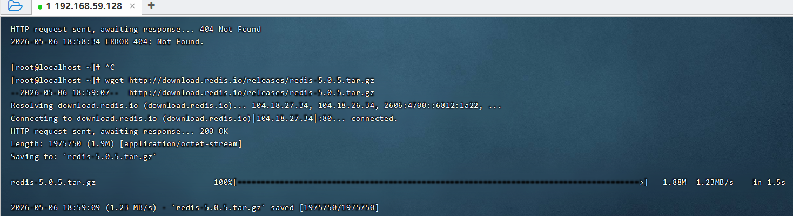

```bash
#2. 下载好后解压 
tar -xzvf redis-5.0.5.tar.gz
#3. 进入redis文件夹 
cd cd redis-5.0.5
#4. 安装编译依赖
yum install -y gcc make
#5. 编译
make
#6. 再执行一次安装
make install
```

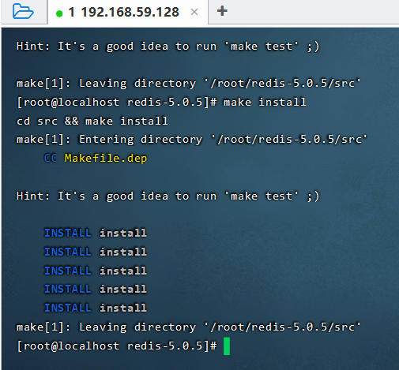

显示 INSTALL install安装成功

Redis 5.0.5 编译安装后的 **默认路径（全在这里）**

你执行完 `make install` 后，文件**自动分散**到系统这 3 个地方：

1. **可执行文件（redis-server、redis-cli）**

👉 **路径：`/usr/local/bin/`**

里面会有这些：

- redis-server
- redis-cli
- redis-benchmark
- redis-check-rdb
- redis-check-aof

所以你才能**直接在任何目录敲命令运行**。


2. **你刚才解压的源码目录（最关键）**

👉 **路径：`/root/redis-5.0.5/`**

这里面有：

- redis.conf（配置文件）
- 所有源码
- 启动脚本


3. **数据文件默认存放位置**

👉 **当前你所在的目录**（比如 `/root/`）

dump.rdb 会自动生成在你**启动 redis-server 时的目录**。

```bash
#启动redis（已添加环境变量，任意目录即可）
redis-server
```

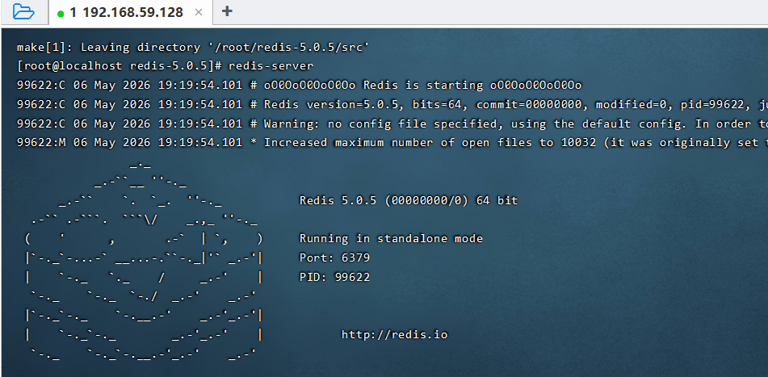

端口：6379，当前窗口如果关闭redis也会关闭

如果我们要想redis后台启动需要修改redis配置文件，在/root/redis-5.0.5/redis.conf下

```bash
#当前目录输入
vi /root/redis-5.0.5/redis.conf
#键盘按“i”进入输入模式
```

```bash
#监听地址默认127.0.0.1导致只能本地访问，修改为0.0.0.0可以任意ip访问，
#生产环境不要这么做，如果你的服务器直接暴露在公网，又把 bind 改成监听所有地址，会被全世界都能访问，有被挖矿、入侵的风险。
bind 0.0.0.0
```

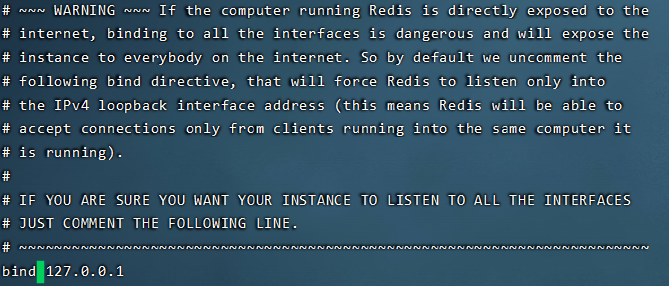

```bash
#守护进程修改为yes即可后台运行
daemonize yes
```

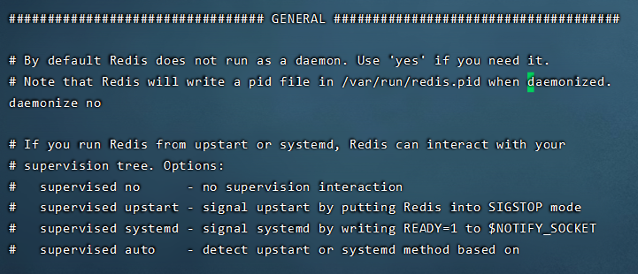

```bash
#密码：访问redis需输入密码
#将requirepass foobared注释解开，在后面输入你的密码
requirepass 789987
```

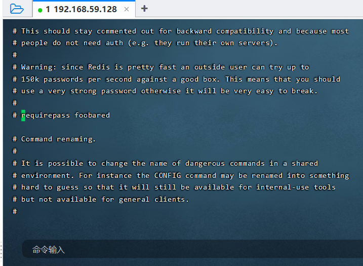

```bash
#其他配置（可选）
#监听端口(默认6379)
port 6379
#工作目录，默认当前目录，也就是运行redis-server命令的目录，日志，持久化文件也会保存在这
dir . 
#日志文件，默认为空，不记录日志，可以指定文件名
logfile "redsi.log"
```

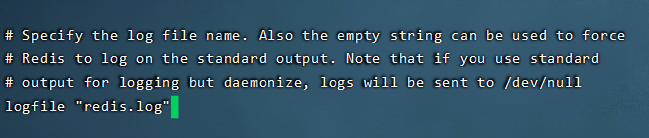

```bash
#修改好了后输入esc退出，输入:wq保存文件
:wq
#启动
redis-server redis.conf
#启动在后台运行不显示输入一下指令查看
ps -ef | grep redis
```

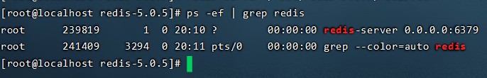

```bash
#关掉当前端口 kill -9(强制关闭) 进程id号
kil -9 239819
```

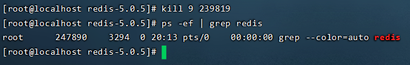

```bash
#启动redis
 redis-server redis.conf
#打开redis
redis-cli
...
#关闭链接操作
#输入密码
auth 789987
#关闭链接
shutdown
#退出redis
quit
```

## 2. 图形化客户端安装

在windows环境下安装Another Redis Desktop Manager

1. newConnection
2. host：输入你虚拟机的ip地址，端口号，redis登录密码，点击ok

```bash
#3.在finalshell关闭防火墙
[root@localhost redis-5.0.5] systemctl stop firewalld
[root@localhost redis-5.0.5] systemctl disable firewalld
#4.redis下保护模式关掉（否则外部连不上）
127.0.0.1:6379> CONFIG SET protected-mode no
#5.重启redis
[root@localhost redis-5.0.5] redis-server redis.conf
#6.测试端口通不通（虚拟机里执行）要提示安装选y
[root@localhost redis-5.0.5] telnet 192.168.59.128 6379
```

连接成功

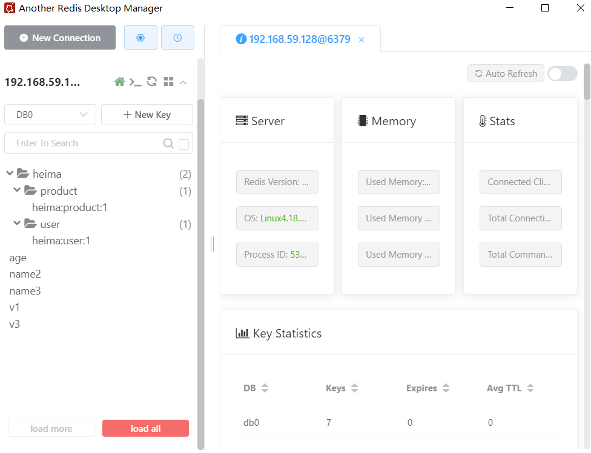

## 3. redis数据结构

redis是k:v的数据库，key一般是string，v的类型多种多样

**string : hello world**

**Hash: {name:"jack",age:21}**

**List: [a->b->c]**

**Set:{a,b,c}**

**SortedSet:{A:1,B:2}**

**GEO:{A:(120.3,30.5)}**

**BitMap:0101010101**

**HyperLog:01010101**

操作不同的命令在官网https://redis.io/commands 查看不同指令


## 4.redis通用命令

```bash
#查看符合模板的key
keys 

127.0.0.1:6379> keys *
1) "name"
127.0.0.1:6379> 

#删除指定的key或者批量删除 
del 

127.0.0.1:6379> del name
(integer) 1
127.0.0.1:6379> keys *
(empty list or set)
127.0.0.1:6379> 

#判断一个key是否存在
exists 

127.0.0.1:6379> del name
(integer) 1
127.0.0.1:6379> keys *
(empty list or set)
127.0.0.1:6379> 

#设置key的有效期，到期自动删除 （秒） -1永久有效
expire
#查看一个key的有效期
ttl

127.0.0.1:6379> set name allen
OK
127.0.0.1:6379> expire name 20
(integer) 1
127.0.0.1:6379> ttl name
(integer) 14
127.0.0.1:6379> ttl name
(integer) -2
127.0.0.1:6379> keys *
(empty list or set)
127.0.0.1:6379> 

```


## 5. String 类型


String 类型，也就是字符串类型，是 Redis 中最简单的存储类型。

其 value 是字符串，不过根据字符串的格式不同，又可以分为 3 类：

- string：普通字符串
- int：整数类型，可以做自增、自减操作
- float：浮点类型，可以做自增、自减操作

不管哪种方式底层都是字节数组存储字符串类型最大不超过512m

|  key  | value       |
| :---: | ----------- |
|  msg  | hello world |
|  num  | 10          |
| score | 92.5        |

String 的常见命令有：

- **SET**：添加或者修改已经存在的一个 String 类型的键值对
- **GET**：根据 key 获取 String 类型的 value
- **MSET**：批量添加多个 String 类型的键值对
- **MGET**：根据多个 key 获取多个 String 类型的 value
- **INCR**：让一个整型的 key 自增 1
- **INCRBY**：让一个整型的 key 自增并指定步长，例如：`incrby num 2` 让 num 值自增 2
- **INCRBYFLOAT**：让一个浮点类型的数字自增并指定步长
- **SETNX**：添加一个 String 类型的键值对，前提是这个 key 不存在，否则不执行
- **SETEX**：添加一个 String 类型的键值对，并且指定有效期

```bash
127.0.0.1:6379> mset v1 v2 v3 v4
OK
127.0.0.1:6379> mget v1 v3
1) "v2"
2) "v4"
127.0.0.1:6379> set age 18
OK
127.0.0.1:6379> incr age
(integer) 19
127.0.0.1:6379> incr age
(integer) 20
127.0.0.1:6379> incrby age 2
(integer) 22
127.0.0.1:6379> incrby age 2
(integer) 24
127.0.0.1:6379> incrby age -1
(integer) 23
127.0.0.1:6379> setnx name2 kiki
(integer) 1
#set name3 mana nx 等价与 setnx name3 mana
127.0.0.1:6379> set name3 mana nx
OK
127.0.0.1:6379> keys *
1) "name3"
2) "age"
3) "v3"
4) "name2"
5) "v1"
127.0.0.1:6379> get name3
"mana"
127.0.0.1:6379> 
```


## 6. key的层级格式

redis没有mysql一样的table该怎么区分不同类型的key？

假如我要存储用户和商品信息，用户id是1，商品id也是1

**redis允许有多个单词形成层级结构，多个单词以“ : ”隔开**

```bash
#项目名:业务名:类型:id
#假如我有个项目叫heima，有user，product2种类型数据
#user相关的
heima:user:1
#product相关的
heima:product:1
```

如果value是一个java对象例如user，则可以将对象转为json后存储

|       key       |                 value                 |
| :-------------: | :-----------------------------------: |
|  heima:user:1   |    {"id":1,"name":"kiki","age":20}    |
| heima:product:1 | {"id":1,"name":"iphone","price":4999} |

```bash
127.0.0.1:6379> set heima:user:1 '{"id":1,"name":"kiki","age":20}'
OK
127.0.0.1:6379> set heima:product:1 '{"id":1,"name":"iphone","price":4999}'
OK
127.0.0.1:6379> 
```


## 7. hash类型

hash类型，也叫散列，value是无序字典，类似hashmap

string类型是json字符串后存储，需要修改很不方便

<table>   <thead>     <tr>       <th rowspan="2">KEY</th>       <th colspan="2">VALUE</th>     </tr>     <tr>       <th>field</th>       <th>value</th>     </tr>   </thead>   <tbody>     <tr>       <td rowspan="2">heima:user:1</td>       <td>name</td>       <td>Jack</td>     </tr>     <tr>       <td>age</td>       <td>21</td>     </tr>     <tr>       <td rowspan="2">heima:user:2</td>       <td>name</td>       <td>Rose</td>     </tr>     <tr>       <td>age</td>       <td>18</td>     </tr>   </tbody> </table>

Hash 的常见命令有：

- **HSET key field value**：添加或者修改 hash 类型 key 的 field 的值
- **HGET key field**：获取一个 hash 类型 key 的 field 的值
- **HMSET**：批量添加多个 hash 类型 key 的 field 的值
- **HMGET**：批量获取多个 hash 类型 key 的 field 的值
- **HGETALL**：获取一个 hash 类型的 key 中的所有的 field 和 value
- **HKEYS**：获取一个 hash 类型的 key 中的所有的 field
- **HVALS**：获取一个 hash 类型的 key 中的所有的 value
- **HINCRBY**：让一个 hash 类型 key 的字段值自增并指定步长
- **HSETNX**：添加一个 hash 类型的 key 的 field 值，前提是这个 field 不存在，否则不执行

```bash
127.0.0.1:6379> hset heima:user:2 name lucy
(integer) 1
127.0.0.1:6379> hset heima:user:2 age 18
(integer) 1
127.0.0.1:6379> hset heima:user:2 age 88
(integer) 0
127.0.0.1:6379> hmset heima:user:3 name lisi age 46 sex man
OK
127.0.0.1:6379> 
```

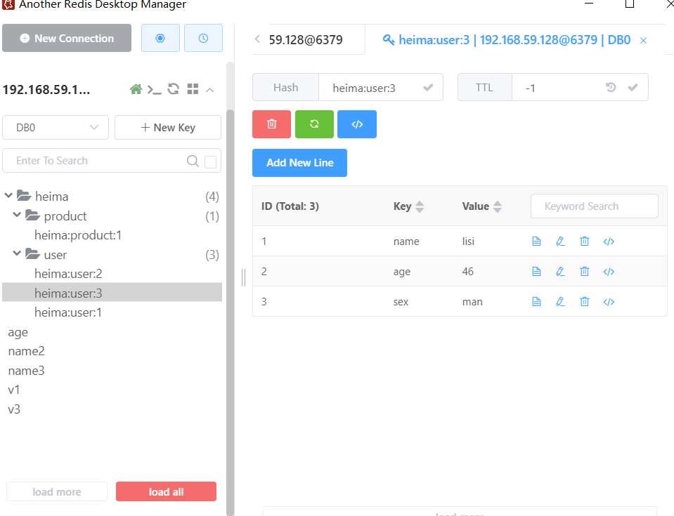


## 8. List 类型

与LinkedList类似，可以看做双向链表支持正反向检索

List 的常见命令有：

- LPUSH key element ...：向列表左侧插入一个或多个元素
- LPOP key：移除并返回列表左侧的第一个元素，没有则返回 nil
- RPUSH key element ...：向列表右侧插入一个或多个元素
- RPOP key：移除并返回列表右侧的第一个元素
- LRANGE key start end：返回一段角标范围内的所有元素
- BLPOP 和 BRPOP：与 LPOP 和 RPOP 类似，只不过在没有元素时等待指定时间，而不是直接返回 nil

```bash
127.0.0.1:6379> LPUSH users 1 2 3
(integer) 3
127.0.0.1:6379> RPUSH 4 5 6
(integer) 2
127.0.0.1:6379> del 4
(integer) 1
127.0.0.1:6379> RPUSH users 4 5 6
(integer) 6
127.0.0.1:6379> lpop users 2
1) "3"
2) "2"
127.0.0.1:6379> rpop users 1
1) "6"
127.0.0.1:6379> lrange users 1
(error) ERR wrong number of arguments for 'lrange' command
127.0.0.1:6379> lrange users 4
(error) ERR wrong number of arguments for 'lrange' command
127.0.0.1:6379> LRANGE users 1
(error) ERR wrong number of arguments for 'lrange' command
127.0.0.1:6379> LRANGE users 1 1
1) "4"
127.0.0.1:6379> 
```


## 9. Set类型

与hashset类似，可以看做value为null的hashmap

特征：无序，不重复，查找快，支持交并差集合

Redis Set 常见命令

单集合操作

- SADD key member ...：向 set 中添加一个或多个元素
- SREM key member ...：移除 set 中的指定元素
- SCARD key：返回 set 中元素的个数
- SISMEMBER key member：判断一个元素是否存在于 set 中
- SMEMBERS key：获取 set 中的所有元素

多集合操作

- SINTER key1 key2 ...：求key1 key2 的交集
- SDIFF key1 key2 ...：求key1 key2 的差集
- SUNION key1 key2...：求key1 key2 的并集

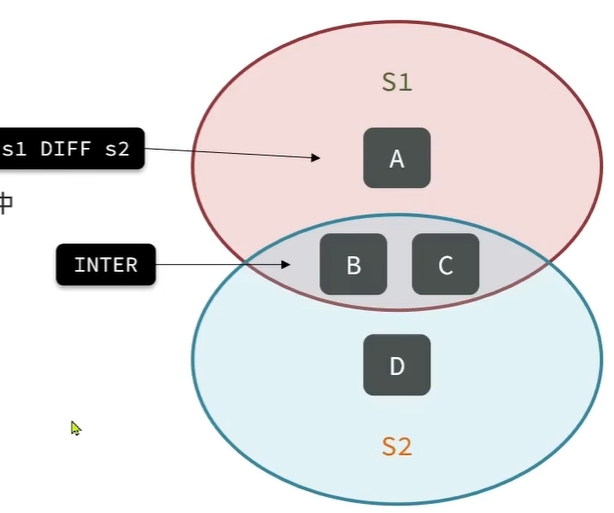

**练习**

将下列数据用 Redis 的 Set 集合来存储：

- 张三的好友有：李四、王五、赵六
- 李四的好友有：王五、麻子、二狗

利用 Set 的命令实现下列功能：

- 计算张三和李四的好友有几人
- 计算张三和李四有哪些共同好友
- 查询哪些人是张三的好友却不是李四的好友
- 查询哪些人是李四的好友却不是张三的好友
- 查询张三和李四的好友总共有哪些人
- 判断李四是否是张三的好友
- 判断张三是否是李四的好友
- 将李四从张三的好友列表中移除

```bash
#张三的好友有：李四、王五、赵六
127.0.0.1:6379> sadd zs lisi wangwu zhaoliu
(integer) 3
#李四的好友有：王五、麻子、二狗
127.0.0.1:6379> sadd ls wangwu mazi ergou
(integer) 3
#计算张三，李四的好友有几人
127.0.0.1:6379> scard zs
(integer) 3
127.0.0.1:6379> scard ls
(integer) 3
#计算张三和李四有哪些共同好友
 sinter zs ls
1) "wangwu"
#查询哪些人是张三的好友却不是李四的好友 
127.0.0.1:6379> sdiff zs ls
1) "lisi"
2) "zhaoliu"
#查询哪些人是李四的好友却不是张三的好友
127.0.0.1:6379> sdiff ls zs
1) "mazi"
2) "ergou"
#查询张三和李四的好友总共有哪些人
127.0.0.1:6379> sunion zs ls
1) "lisi"
2) "wangwu"
3) "zhaoliu"
4) "mazi"
5) "ergou"
#判断李四是否是张三的好友
127.0.0.1:6379> sismember zs lisi
(integer) 1
#判断张三是否是李四的好友
127.0.0.1:6379> sismember ls zs
(integer) 0
#将李四从张三的好友列表中移除
127.0.0.1:6379> srem zs lisi
(integer) 1
```


## 10. SortedSet类型

可排序的set集合，和treeSet类似，但底层差别很大，SortedSet每个元素带有score属性，基于这个实现排序

底层实现是一个跳表+hash表

特征：可排序，不重复，查询速度快

SortedSet 的常见命令有：

- ZADD key score member：添加一个或多个元素到 sorted set，如果已经存在则更新其 score 值
- ZREM key member：删除 sorted set 中的一个指定元素
- ZSCORE key member：获取 sorted set 中的指定元素的 score 值
- ZRANK key member：获取 sorted set 中的指定元素的排名
- ZCARD key：获取 sorted set 中的元素个数
- ZCOUNT key min max：统计 score 值在给定范围内的所有元素的个数
- ZINCRBY key increment member：让 sorted set 中的指定元素自增，步长为指定的 increment 值
- ZRANGE key min max：按照 score 排序后，获取指定排名范围内的元素
- ZRANGEBYSCORE key min max：按照 score 排序后，获取指定 score 范围内的元素
- ZDIFF、ZINTER、ZUNION：求差集、交集、并集

**练习**

将班级的下列学生得分存入 Redis 的 SortedSet 中：

Jack 85, Lucy 89, Rose 82, Tom 95, Jerry 78, Amy 92, Miles 76

并实现下列功能：

- 删除 Tom 同学
- 获取 Amy 同学的分数
- 获取 Rose 同学的排名
- 查询 80 分以下有几个学生
- 给 Amy 同学加 2 分
- 查出成绩前 3 名的同学
- 查出成绩 80 分以下的所有同学


## 11. redis的java客户端

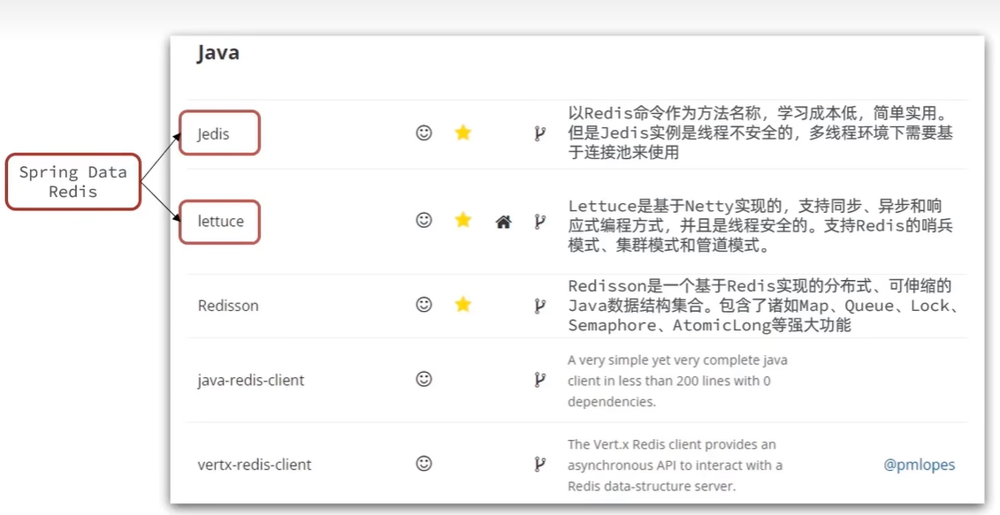


## 12. jedis

官网：http://github.com/redis/jedis

```xml
<dependency>
            <groupId>redis.clients</groupId>
            <artifactId>jedis</artifactId>
            <version>3.7.0</version>
        </dependency>
```

```java
public class AppTest{
    private Jedis jedis;

    @BeforeEach
    void setUp(){
        //1.建立连接
        jedis = new Jedis("192.168.59.128",6379);
        //2.密码
        jedis.auth("789987");
        //选则库
        jedis.select(0);
    }

    @Test
    void test(){
        String name = jedis.set("name", "peter");
        System.out.println(name);
        System.out.println(jedis.get("name"));
    }

    @AfterEach
    void tearDown(){
        if (jedis != null){
            jedis.close();
        }
    }
}
```

```bash
127.0.0.1:6379> get name
"peter"
127.0.0.1:6379> 
```


### 12.1 jedis连接池

jedis本身不安全，频繁的创建销毁会损耗性能，因此推荐连接池代替jedis直连

```java
public class JedisFactory {
    private static final JedisPool jedisPool;

    static {
        //配置连接
        JedisPoolConfig poolConfig = new JedisPoolConfig();
        //最大连接
        poolConfig.setMaxTotal(4);
        //最大空闲连接数
        poolConfig.setMaxIdle(4);
        //最小空闲连接数
        poolConfig.setMinIdle(0);
        //设置等待时间 ms
        poolConfig.setMaxWaitMillis(200);
        jedisPool = new JedisPool(poolConfig,"192.168.59.128",6379,1000,"789987");
    }

    public static Jedis getJedis(){
        return jedisPool.getResource();
    }
}
```

```java
public class AppTest{
    private Jedis jedis;

    @BeforeEach
    void setUp(){
        //1.建立连接
        jedis = JedisFactory.getJedis();
        //2.密码
        jedis.auth("789987");
        //选则库
        jedis.select(0);
    }

    @Test
    void test02(){
        String name = jedis.lpop("users");
        System.out.println(name);
    }
    @AfterEach
    void tearDown(){
        if (jedis != null){
            jedis.close();
        }
    }
}
```


## 13. Spring Data Redis

SpringData 是 Spring 中数据操作的模块，包含对各种数据库的集成，其中对 Redis 的集成模块就叫做 SpringDataRedis，官网地址：https://spring.io/projects/spring-data-redis

- 提供了对不同 Redis 客户端的整合（Lettuce 和 Jedis）
- 提供了 RedisTemplate 统一 API 来操作 Redis
- 支持 Redis 的发布订阅模型
- 支持 Redis 哨兵和 Redis 集群
- 支持基于 Lettuce 的响应式编程
- 支持基于 JDK、JSON、字符串、Spring 对象的数据序列化及反序列化
- 支持基于 Redis 的 JDKCollection 实现

### 13.1 Spring Data Redis入门

SpringDataRedis提供了redisTemplate工具类，封装了各种对redis的操作，不同类型封装到不同的api中

| API                           | 返回值类型        | 说明                    |
| ----------------------------- | ----------------- | ----------------------- |
| `redisTemplate.opsForValue()` | `ValueOperations` | 操作 String 类型数据    |
| `redisTemplate.opsForHash()`  | `HashOperations`  | 操作 Hash 类型数据      |
| `redisTemplate.opsForList()`  | `ListOperations`  | 操作 List 类型数据      |
| `redisTemplate.opsForSet()`   | `SetOperations`   | 操作 Set 类型数据       |
| `redisTemplate.opsForZSet()`  | `ZSetOperations`  | 操作 SortedSet 类型数据 |
| `redisTemplate`               |                   | 通用的命令              |

```xml
<!--  redis依赖      -->
<dependency>
    <groupId>org.springframework.boot</groupId>
    <artifactId>spring-boot-starter-data-redis</artifactId>
</dependency>
<!-- 连接池依赖       -->
<dependency>
    <groupId>org.apache.commons</groupId>
    <artifactId>commons-pool2</artifactId>
</dependency>
```


# 实战篇

基于黑马点评

## 1. 导入黑马点评项目

git仓库 ：https://github.com/crimson-516/hmdp-redis-resource.git

导入好后运行浏览器输入：http://localhost:8081/shop-type/list

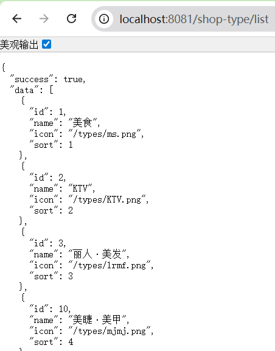

前端资料在nginx文件夹 nginx-1.18.0

启动nginx

1. 在nginx打开cmd输入 ：start nginx.exe

2. 浏览器F12打开手机模式输入：http://127.0.0.1:8080/


3. 关闭在nginx的终端输入：nginx -s stop 

## 2. 登录与注册

### 2.1 基于session实现登录

#### 2.1.1 发送验证码

UserController.java

```java
@Resource
private IUserService userService;
@PostMapping("code")
public Result sendCode(@RequestParam("phone") String phone, HttpSession session) {
    // 发送短信验证码并保存验证码
    return userService.sendCode(phone,session);
}
```

IUserService

```java
public interface IUserService extends IService<User> {
    Result sendCode(String phone, HttpSession session);
}
```

UserServiceImpl

```java
@Override
    public Result sendCode(String phone, HttpSession session) {
        //1.校验手机号
        if (RegexUtils.isPhoneInvalid(phone)){
            //2.不符合返回错误信息
            return Result.fail("手机号格式错误!");
        }
        //3.对了生成验证码
        //4.验证码存session，并返回
        String code = RandomUtil.randomNumbers(6);
        session.setAttribute("code",code);
        log.debug("发送验证码成功{}",code);
        return Result.ok();
}
```

#### 2.2.2 登录与注册

UserController.java

```java
@PostMapping("/login")
public Result login(@RequestBody LoginFormDTO loginForm, HttpSession session){
    //  实现登录功能
    return userService.login(loginForm,session);
}
```

IUserService

```java
public interface IUserService extends IService<User> {

    Result sendCode(String phone, HttpSession session);
    Result login(LoginFormDTO loginForm, HttpSession session);
}
```

UserServiceImpl

```java
@Override
public Result login(LoginFormDTO loginForm, HttpSession session) {
    //1,校验手机号
        String phone = loginForm.getPhone();
        if (RegexUtils.isPhoneInvalid(phone)){
            //2.不符合返回错误信息
            return Result.fail("手机号格式错误!");
     }

    //校验验证码
    Object cacheCode = session.getAttribute("code");
    if (cacheCode==null)return Result.fail("验证码过期");
    if (!loginForm.getCode().equals(cacheCode)) {
        return Result.fail("验证码不一致");
    }
    //查手机号
    User user = query().eq("phone", loginForm.getPhone()).one();
    //第一次登录
    if (user==null){
        user = createUserWithPhone(loginForm.getPhone());
    }
    session.setAttribute("user",user);
    return Result.ok();
}

private User createUserWithPhone(String phone) {
    User user = new User();
    user.setPhone(phone);
    user.setNickName(USER_NICK_NAME_PREFIX+RandomUtil.randomString(10));
    user.setCreateTime(LocalDateTime.now());
    save(user);
    return user;
}
```

#### 2.2.3 登录拦截校验

utils/LoginIntercepter.java

```java
public class LoginIntercepter implements HandlerInterceptor {
    @Override
    public boolean preHandle(HttpServletRequest request, HttpServletResponse response, Object handler) throws Exception {
        //1获取session并拿到用户
        HttpSession session = request.getSession();
        User user =(User) session.getAttribute("user");
        //2.判断用户是否存在
        if (user==null) {
            //3.不存在拦截
            response.setStatus(401);
            return false;
        }
        //4.存在，保存用户信息到threadLocal
        UserDTO userDTO = new UserDTO();
        userDTO.setNickName(user.getNickName());
        userDTO.setId(user.getId());
        userDTO.setIcon(user.getIcon());

        UserHolder.saveUser(userDTO);
        //5.放行
        return true;
    }

    @Override
    public void afterCompletion(HttpServletRequest request, HttpServletResponse response, Object handler, Exception ex) throws Exception {
        UserHolder.removeUser();
        HandlerInterceptor.super.afterCompletion(request, response, handler, ex);
    }
}
```

将写好的拦截器放入

```java
@Configuration
public class MVCConfig implements WebMvcConfigurer {
    @Override
    public void addInterceptors(InterceptorRegistry registry) {
        registry.addInterceptor(new LoginIntercepter())
                //以下接口排除与拦截器之外
                .excludePathPatterns(
                        "/blog/hot",
                        "/upload/**",
                        "/voucher/**",
                        "/shop/*",
                        "/shop-type/**",
                        "/user/code",
                        "/user/login"
                );
    }
}
```

页面点击登录后能看到用户信息

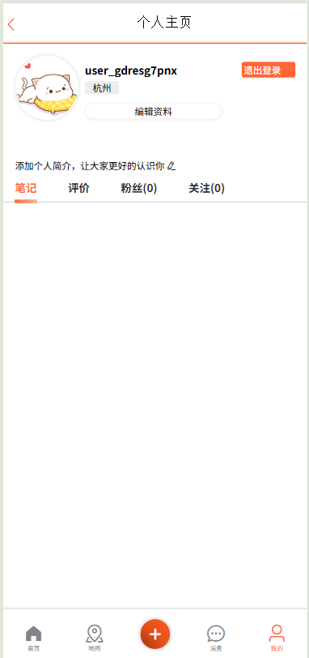

### 2.2 集群session共享问题

多台tomcat不共享session空间，请求切换不同tomcat服务器时session丢失问题

替代方案应该满足

1. 数据共享

2. 内存存储

3. kv结构

保存登录的用户信息，可以使用 String 结构，以 JSON 字符串来保存，比较直观：

| KEY          | VALUE                 |
| ------------ | --------------------- |
| heima:user:1 | {name:"Jack", age:21} |
| heima:user:2 | {name:"Rose", age:18} |

Hash 结构可以将对象中的每个字段独立存储，可以针对单个字段做 CRUD，并且内存占用更少：

| KEY          | field | value |
| ------------ | ----- | ----- |
| heima:user:1 | name  | Jack  |
|              | age   | 21    |
| heima:user:2 | name  | Rose  |
|              | age   | 18    |

### 2.3. 基于redis实现共享session登录

```java
@Slf4j
@Service
public class UserServiceImpl extends ServiceImpl<UserMapper, User> implements IUserService {

    @Resource
    private RegexUtils regexUtils;
    @Resource
    private UserMapper userMapper;
    @Resource
    private StringRedisTemplate stringRedisTemplate;

    @Override
    public Result sendCode(String phone, HttpSession session) {
        //1.校验手机号
        if (RegexUtils.isPhoneInvalid(phone)){
            //2.不符合返回错误信息
            return Result.fail("手机号格式错误!");
        }
        //3.对了生成验证码
        //4.验证码存session，并返回
        String code = RandomUtil.randomNumbers(6);
        //session.setAttribute("code",code);
        //将验证码存到redis，key为手机号,过期时间为2分钟
        stringRedisTemplate.opsForValue().set(LOGIN_CODE_KEY+phone,code,LOGIN_CODE_TTL, TimeUnit.MINUTES);
        log.debug("发送验证码成功：{}",code);
        return Result.ok();
    }

    @Override
    public Result login(LoginFormDTO loginForm, HttpSession session) {
        //1,校验手机号
        String phone = loginForm.getPhone();

        if (RegexUtils.isPhoneInvalid(phone)){
            //2.不符合返回错误信息
            return Result.fail("手机号格式错误!");
        }

        //校验验证码
        //Object cacheCode = session.getAttribute("code");
        //if (cacheCode==null)return Result.fail("验证码过期");
        //从redis获取验证码
        String cacheCode = stringRedisTemplate.opsForValue().get(LOGIN_CODE_KEY + phone);
        if (cacheCode == null) return Result.fail("验证码过期");
        //查手机号
        if (!loginForm.getCode().equals(cacheCode)) {
            return Result.fail("验证码不一致！");
        }
        User user = query().eq("phone", loginForm.getPhone()).one();
        //第一次登录
        if (user==null){
            //创建用户
            user = createUserWithPhone(loginForm.getPhone());
        }
        //保存用户信息到redis的Hash类型，生成随机token为key，并将token返回
        String token = UUID.randomUUID().toString(true);
        //将user对象转为hash存储
        UserDTO userDTO = BeanUtil.copyProperties(user, UserDTO.class);
        Map<String, Object> userMap = BeanUtil.beanToMap(userDTO,new HashMap<>(), CopyOptions.create()
                //填充忽略null
                .setIgnoreNullValue(true)
                //字段值修改器
                .setFieldValueEditor((fieldName,fieldValue)->fieldValue.toString()));
        String tokenKey = LOGIN_USER_KEY+token;
        stringRedisTemplate.opsForHash().putAll(tokenKey,userMap);
        //设置token有效期 30分钟
        stringRedisTemplate.expire(tokenKey,LOGIN_USER_TTL,TimeUnit.MINUTES);
        //session.setAttribute("user",user);
        return Result.ok(token);
    }

    private User createUserWithPhone(String phone) {
        User user = new User();
        user.setPhone(phone);
        user.setNickName(USER_NICK_NAME_PREFIX+RandomUtil.randomString(10));
        user.setCreateTime(LocalDateTime.now());
        save(user);
        return user;
    }
}
```

```java
public class LoginIntercepter implements HandlerInterceptor {


    private StringRedisTemplate stringRedisTemplate;

    public LoginIntercepter(StringRedisTemplate stringRedisTemplate) {
        this.stringRedisTemplate = stringRedisTemplate;
    }

    @Override
    public boolean preHandle(HttpServletRequest request, HttpServletResponse response, Object handler) throws Exception {
        //1获取session并拿到用户
        //HttpSession session = request.getSession();
        //User user =(User) session.getAttribute("user");

        //获取token从请求头
        String token = request.getHeader("authorization");
        //判断token是否是null
        if (StrUtil.isBlank(token)){
            response.setStatus(401);
            return false;
        }
        //从redis获取user通过token
        String key = LOGIN_USER_KEY+token;
        Map<Object, Object> userMap = stringRedisTemplate.opsForHash().entries(key);
        //2.判断用户是否存在
        if (userMap.isEmpty()) {
            //3.不存在拦截
            response.setStatus(401);
            return false;
        }
        //4.存在，保存用户信息到threadLocal 准换成userdto，是否忽略转换错误
        UserDTO userDTO = BeanUtil.fillBeanWithMap(userMap, new UserDTO(), false);
        UserHolder.saveUser(userDTO);
        //刷新token有效期
        stringRedisTemplate.expire(key, LOGIN_USER_TTL, TimeUnit.MINUTES);
        //5.放行
        return true;
    }

    @Override
    public void afterCompletion(HttpServletRequest request, HttpServletResponse response, Object handler, Exception ex) throws Exception {
        UserHolder.removeUser();
        HandlerInterceptor.super.afterCompletion(request, response, handler, ex);
    }
}
```

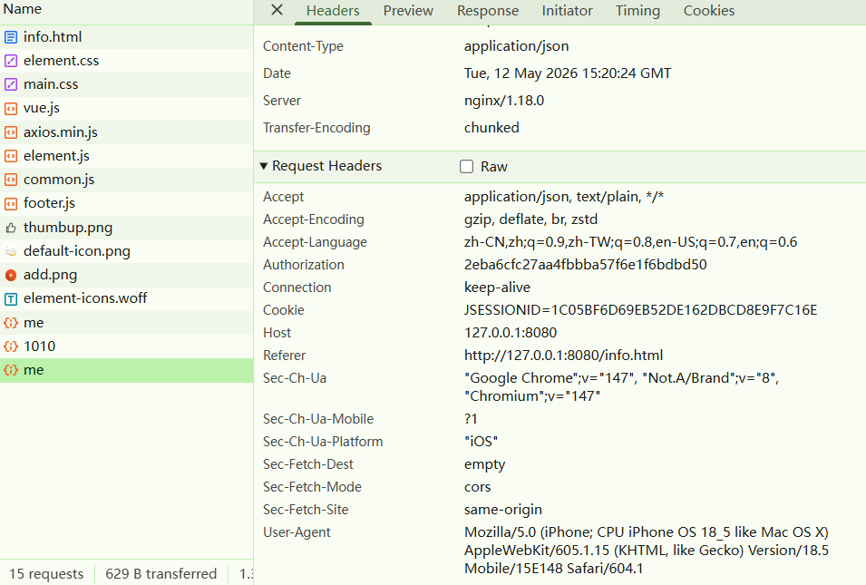

### 2.4 拦截器登录优化

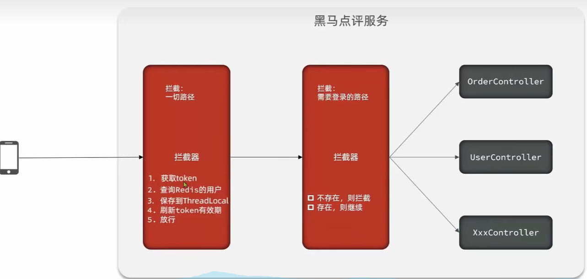

```java
@Configuration
public class MVCConfig implements WebMvcConfigurer {
    @Resource
    private StringRedisTemplate stringRedisTemplate;

    @Override
    public void addInterceptors(InterceptorRegistry registry) {
        registry.addInterceptor(new LoginIntercepter())
                //以下接口排除与拦截器之外
                .excludePathPatterns(
                        "/blog/hot",
                        "/upload/**",
                        "/voucher/**",
                        "/shop/*",
                        "/shop-type/**",
                        "/user/code",
                        "/user/login"
                ).order(1);
        //order()拦截器执行顺序
        registry.addInterceptor(new RefreshLoginIntercepter(stringRedisTemplate)).addPathPatterns("/**").order(0);
    }
}
```

```java
public class RefreshLoginIntercepter implements HandlerInterceptor {


    private StringRedisTemplate stringRedisTemplate;

    public RefreshLoginIntercepter(StringRedisTemplate stringRedisTemplate) {
        this.stringRedisTemplate = stringRedisTemplate;
    }

    @Override
    public boolean preHandle(HttpServletRequest request, HttpServletResponse response, Object handler) throws Exception {
        //1获取session并拿到用户
        //HttpSession session = request.getSession();
        //User user =(User) session.getAttribute("user");

        //获取token从请求头
        String token = request.getHeader("authorization");
        //判断token是否是null
        if (StrUtil.isBlank(token)){
            return true;
        }
        //从redis获取user通过token
        String key = LOGIN_USER_KEY+token;
        Map<Object, Object> userMap = stringRedisTemplate.opsForHash().entries(key);
        //2.判断用户是否存在
        if (userMap.isEmpty()) {
            return true;
        }
        //4.存在，保存用户信息到threadLocal 准换成userdto，是否忽略转换错误
        UserDTO userDTO = BeanUtil.fillBeanWithMap(userMap, new UserDTO(), false);
        UserHolder.saveUser(userDTO);
        //刷新token有效期
        stringRedisTemplate.expire(key, LOGIN_USER_TTL, TimeUnit.MINUTES);
        //5.放行
        return true;
    }

    @Override
    public void afterCompletion(HttpServletRequest request, HttpServletResponse response, Object handler, Exception ex) throws Exception {
        UserHolder.removeUser();
        HandlerInterceptor.super.afterCompletion(request, response, handler, ex);
    }
}
```

```java
public class LoginIntercepter implements HandlerInterceptor {

    @Override
    public boolean preHandle(HttpServletRequest request, HttpServletResponse response, Object handler) throws Exception {
        //1.判断是否拦截（threadLocal中是否有用户）
        if (UserHolder.getUser() == null) {
            response.setStatus(401);
            return false;
        }
        //5.放行
        return true;
    }
}
```


## 3. 商户查询缓存

### 3.1 什么是缓存

缓存是数据交换的缓冲区（cache）是数据临时存储的地方，io性能高

作用：

1. 降低后端负载
2. 提高io效率，降低响应时间


### 3.2 添加redis缓存

ShopController.java

```java
@GetMapping("/{id}")
public Result queryShopById(@PathVariable("id") Long id) {

    return shopService.queryById(id);
}
```

```java
public interface IShopService extends IService<Shop> {

    Result queryById(Long id);
}
```

```java
@Service
public class ShopServiceImpl extends ServiceImpl<ShopMapper, Shop> implements IShopService {

    @Resource
    private StringRedisTemplate stringRedisTemplate;

    @Resource
    private ShopMapper shopMapper;

    @Override
    public Result queryById(Long id) {
        String idKey = RedisConstants.CACHE_SHOP_KEY+id;
        //1.从redis中根据id获取商品信息
        Map<Object,Object> product = stringRedisTemplate.opsForHash().entries(idKey);
        //2.判断是否命中
        if (!product.isEmpty()){
            //3.命中转为shop对象
            Shop shop = BeanUtil.fillBeanWithMap(product, new Shop(), false);
            return Result.ok(shop);
        }

        //4.没命中则去数据库进行查询
        Shop shop = shopMapper.selectById(id);
        if (shop==null) {
            return Result.fail("不存在");
        }
        //5.存到redis
        Map<String, Object> productMap = BeanUtil.beanToMap(shop, new HashMap<>(), CopyOptions.create()
                //填充忽略null
                .setIgnoreNullValue(true)
                //字段值修改器
                .setFieldValueEditor((fieldName, fieldValue) -> {
                    if (fieldValue == null) {
                        return ""; // 空值给空字符串
                    }
                    return fieldValue.toString();
                }));
        stringRedisTemplate.opsForHash().putAll(idKey,productMap);
        //6.设置过期时间
        stringRedisTemplate.expire(idKey,CACHE_SHOP_TTL, TimeUnit.MINUTES);
        return Result.ok(shop);
    }
}
```

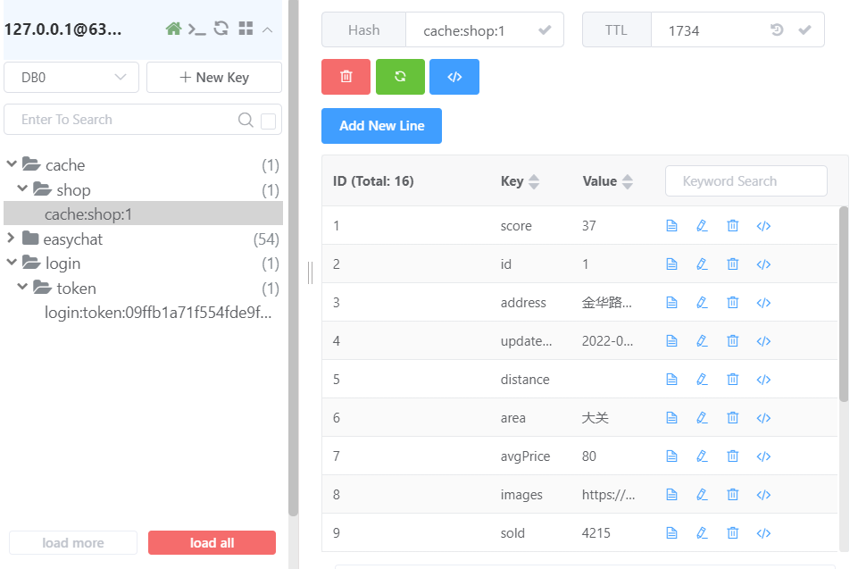


#### 3.2.1 练习

将商品根据类型放入redis中


```java
@RestController
@RequestMapping("/shop-type")
public class ShopTypeController {
    @Resource
    private IShopTypeService typeService;

    @GetMapping("list")
    public Result queryTypeList() {
        return typeService.queryShopListByType();
    }
}
```

```java
@Service
public class ShopTypeServiceImpl extends ServiceImpl<ShopTypeMapper, ShopType> implements IShopTypeService {

    @Resource
    private StringRedisTemplate stringRedisTemplate;

    //根据商品类型进行查询
    @Override
    public Result queryShopListByType() {
        String key = RedisConstants.CACHE_SHOP_TYPE;
        //1.先从redis查找
        List<String> shopTypeJsonList = stringRedisTemplate.opsForList().range(key, 0, -1);
        if (!shopTypeJsonList.isEmpty()){
            List<ShopType> shopTypesList = new ArrayList<>();
            for (String json : shopTypeJsonList) {
                ShopType shopType = JSONUtil.toBean(json, ShopType.class);
                shopTypesList.add(shopType);
            }
            //2.命中则返回
            return Result.ok(shopTypesList);
        }
        //3.没有则去数据库查找
        List<ShopType> queryShopType = query().orderByAsc("sort").list();
        //4.没查到
        if (queryShopType.isEmpty()) {
            return Result.fail("没有该商品类型");
        }
        //5.数据库查到的信息放入redis缓存
        //转换类型格式
        List<String> redisList = new ArrayList<>();
        for (ShopType type : queryShopType) {
            redisList.add(JSONUtil.toJsonStr(type));
        }
        stringRedisTemplate.opsForList().rightPushAll(key, redisList);
        //6.设置redis缓存过期时间
        stringRedisTemplate.expire(key,RedisConstants.CACHE_SHOP_TYPE_TTL, TimeUnit.MINUTES);
        return Result.ok(queryShopType);
    }
}
```

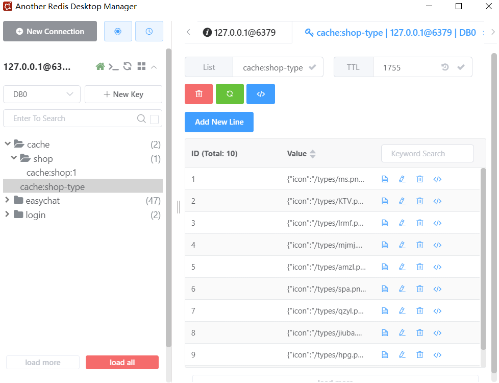


### 3.3 缓存更新策略

|              | 内存淘汰                                                     | 超时剔除                                                     | 主动更新                                     |
| ------------ | ------------------------------------------------------------ | ------------------------------------------------------------ | -------------------------------------------- |
| **说明**     | 不用自己维护，利用 Redis 的内存淘汰机制，当内存不足时自动淘汰部分数据。下次查询时更新缓存。 | 给缓存数据添加 TTL 时间，到期后自动删除缓存。下次查询时更新缓存。 | 编写业务逻辑，在修改数据库的同时，更新缓存。 |
| **一致性**   | 差                                                           | 一般                                                         | 好                                           |
| **维护成本** | 无                                                           | 低                                                           | 高                                           |

**业务场景**：

- 低一致性需求：使用内存淘汰机制。例如店铺类型的查询缓存
- 高一致性需求：主动更新，并以超时剔除作为兜底方案。例如店铺详情查询的缓存

1. 有缓存调用者在更新数据库的同时更新缓存
2. 缓存与数据库整合为一个服务，调用者调用时不关心缓存一致性
3. 调用者只操作缓存，其他线程异步将缓存持久化到数据库，保持一致性


**缓存更新策略的最佳实践方案**：

1. 低一致性需求：使用 Redis 自带的内存淘汰机制
2. 高一致性需求：主动更新，并以超时剔除作为兜底方案

◆ 读操作：

- 缓存命中则直接返回
- 缓存未命中则查询数据库，并写入缓存，设定超时时间

◆ 写操作：

- 先写数据库，然后再删除缓存
- 要确保数据库与缓存操作的原子性


#### 3.3.1 给查询商铺的缓存添加超时剔除和主动更新策略

修改 ShopController 中的业务逻辑，满足下面的需求：

① 根据 id 查询店铺时，如果缓存未命中，则查询数据库，将数据库结果写入缓存，并设置超时时间

② 根据 id 修改店铺时，先修改数据库，再删除缓存

ShopController.java

```java
@GetMapping("/{id}")
public Result queryShopById(@PathVariable("id") Long id) {

    return shopService.queryById(id);
}
```

```java
@Override
@Transactional
public Result update(Shop shop) {
    Long id = shop.getId();
    if (id== null){
        return Result.fail("店铺id不能为空");
    }
    //1.更新数据库
    updateById(shop);
    //2.删除缓存
    String key = RedisConstants.CACHE_SHOP_KEY+id;
    stringRedisTemplate.delete(key);
    return Result.ok();
}
```

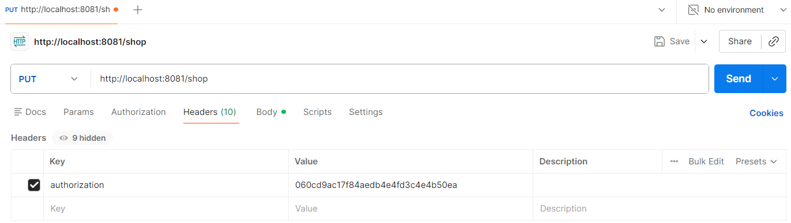

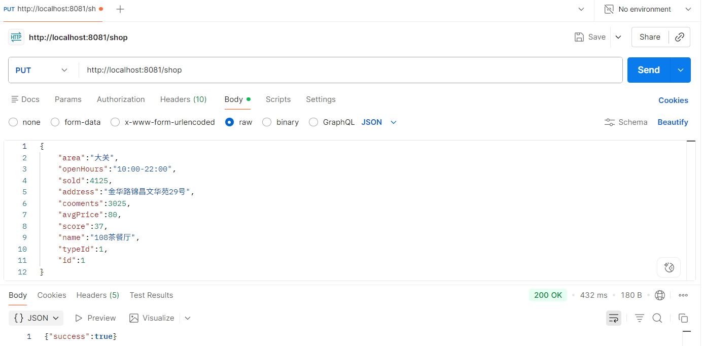


### 3.4 缓存穿透*

指客户端恶意多次发送无效请求，该数据在缓存中和数据库都不存在数据库返回null，缓存永远不会生效，请求会打到数据库

解决方案：

1. 缓存空对象

   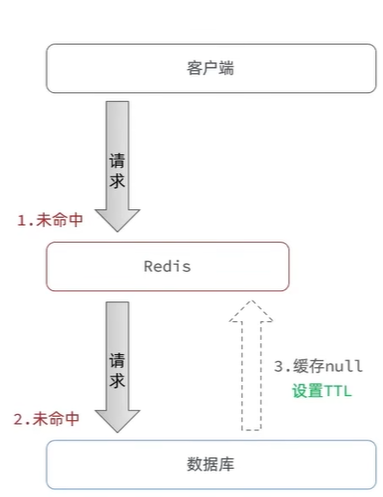

   优点：简单，维护方便

   缺点：额外的内存消耗，可能造成短期不一致


1. 布隆过滤

​		在redis和客户端再加一层布隆过滤器

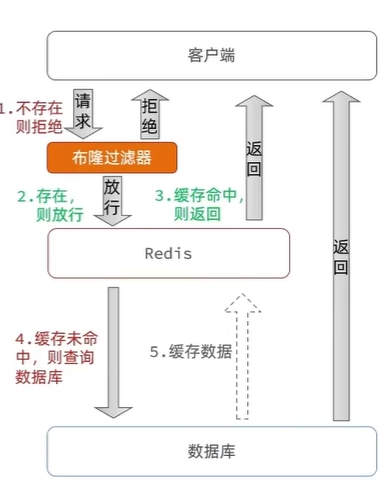

​		优点：内存占用少，没有多余key

​		缺点：实现复杂，存在误判


#### 3.4.1 优化商铺查询

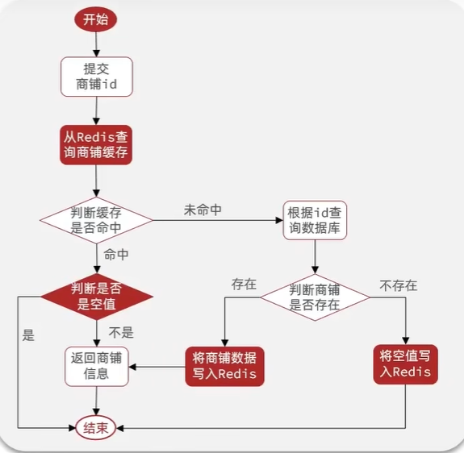

```java
@Override
public Result queryById(Long id) {
    String idKey = RedisConstants.CACHE_SHOP_KEY+id;
    //1.从redis中根据id获取商品信息
    Map<Object,Object> product = stringRedisTemplate.opsForHash().entries(idKey);
    //2.判断是否命中
    if (product != null){
        Result.fail("店铺不存在");
    }
    if (!product.isEmpty()){
        //3.命中转为shop对象
        Shop shop = BeanUtil.fillBeanWithMap(product, new Shop(), false);
        return Result.ok(shop);
    }

    //4.没命中则去数据库进行查询
    Shop shop = shopMapper.selectById(id);
    if (shop==null) {
        // 将空值写入redis
        stringRedisTemplate.opsForValue().set(idKey,"",CACHE_NULL_TTL,TimeUnit.MINUTES);
        return Result.fail("不存在");
    }
    //5.存到redis
    Map<String, Object> productMap = BeanUtil.beanToMap(shop, new HashMap<>(), CopyOptions.create()
            //填充忽略null
            .setIgnoreNullValue(true)
            //字段值修改器
            .setFieldValueEditor((fieldName, fieldValue) -> {
                if (fieldValue == null) {
                    return ""; // 空值给空字符串
                }
                return fieldValue.toString();
            }));
    stringRedisTemplate.opsForHash().putAll(idKey,productMap);
    //6.设置过期时间
    stringRedisTemplate.expire(idKey,CACHE_SHOP_TTL, TimeUnit.MINUTES);
    return Result.ok(shop);
}
```

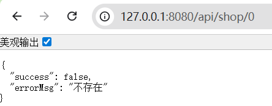

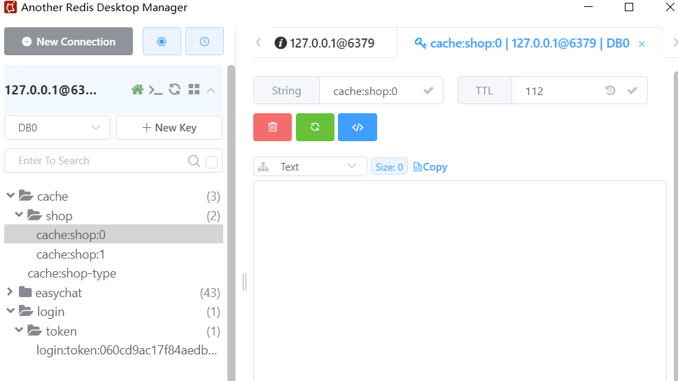


### 3.5 缓存雪崩*

**缓存雪崩**是指在同一时段大量的缓存 key 同时失效或者 Redis 服务宕机，导致大量请求到达数据库。

解决方案：

◆ 给不同的 Key 的 TTL 添加随机值

◆ 利用 Redis 集群提高服务的可用性

◆ 给缓存业务添加降级限流策略

◆ 给业务添加多级缓存


### 3.6 缓存击穿*

**缓存击穿**问题也叫热点 Key 问题，就是一个被**高并发访问**并且**缓存重建业务较复杂**的 key 突然失效了，无数的请求访问会在瞬间给数据库带来巨大的冲击。

举个例子：

- 黑马点评里，**“108 茶餐厅” 这个店铺**，是平台顶流网红店，每秒有上千人查看详情页。
- 这个店铺的缓存 Key：`shop:1`，就是一个**热点 Key**，每时每刻都有大量请求盯着它。

缓存重建业务较复杂

当缓存里没有数据时，程序需要去数据库查数据，再写回缓存。

- 普通重建：直接一条 SQL 查数据，1 毫秒搞定。

- 复杂重建：需要

  多表联查、聚合计算、排序统计

  ，比如：

  - 查店铺基础信息

  - 查近 7 天销量排行

  - 查所有用户评价并计算平均分

  - 生成店铺推荐菜品列表

    整个过程可能要 几百毫秒甚至 1 秒才能完成。


Key 突然失效

比如：

- 这个店铺的缓存 Key 设置了 TTL，刚好在高峰期过期了
- 或者被后台手动清掉了
- 或者 Redis 宕机，Key 丢了

三个条件同时发生，会发生什么？（缓存击穿）

我们模拟一下这个瞬间：

1. 第 0 毫秒：`shop:1` 缓存 Key 失效了

2. 第 1 毫秒：第 1 个用户请求进来，发现缓存没数据，开始去查数据库（复杂重建）

3. 第 2 毫秒：第 2 个用户请求进来，缓存还是空的，也去查数据库

4. 第 3 毫秒：第 3 个用户请求进来，缓存还是空的，也去查数据库

   ...

   在这几百毫秒里，

   成千上万的请求都没拿到缓存，直接冲向数据库！

结果：

- 数据库瞬间被上千个相同的查询请求打满
- CPU、IO 直接拉满，甚至可能直接宕机
- 后续所有请求都超时失败，整个系统崩溃

一句话总结

缓存击穿，就是**一个超高流量的热点数据，在缓存失效的瞬间，大量并发请求直接穿透缓存，全部打到数据库上，造成数据库瞬间压力过大甚至宕机**。

补充：和缓存雪崩的区别

- **缓存击穿**：**一个**热点 Key 失效，导致所有请求都打数据库
- **缓存雪崩**：**大量**Key 同时失效，导致所有请求都打数据库

击穿是单点爆破，雪崩是全面爆破，但都会把数据库打废。

**解决方案**：

1. 互斥锁：缺点互相等待

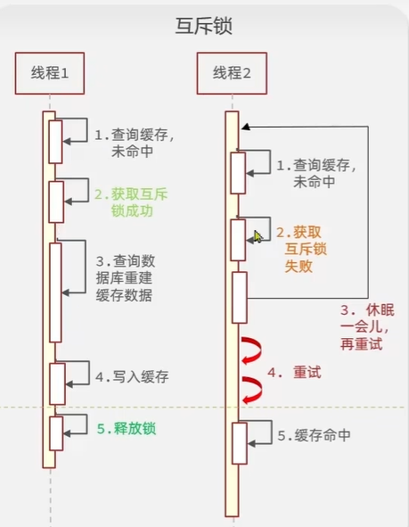

2. 逻辑过期

不给 Redis 里的 Key 设置真实的 TTL（自动删除），而是在缓存数据里额外存一个 “过期时间” 字段。

缓存 Key**永远不删**，一直在 Redis 里

数据里自己带一个`expireTime`字段，表示它什么时候算 “过期”

每次读缓存时，**程序自己判断数据是否过期**，而不是靠 Redis 自动删

| 解决方案     | 优点                                 | 缺点                                   |
| ------------ | ------------------------------------ | -------------------------------------- |
| **互斥锁**   | 没有额外的内存消耗保证一致性实现简单 | 线程需要等待，性能受影响可能有死锁风险 |
| **逻辑过期** | 线程无需等待，性能较好               | 不保证一致性有额外内存消耗实现复杂     |

#### 3.6.1 基于互斥锁方式解决缓存击穿

根据id查询商铺的业务

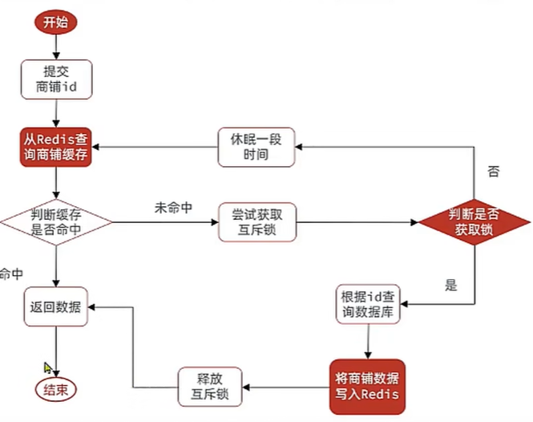

通过redis的**setnx** 操作来进行，拿到锁的才能修改

```java
@Service
public class ShopServiceImpl extends ServiceImpl<ShopMapper, Shop> implements IShopService {

    @Resource
    private StringRedisTemplate stringRedisTemplate;

    // 解决缓存击穿问题
    @Override
    public Result queryById(Long id) {
        // 互斥锁解决缓存击穿
        Shop shop = queryWithMutex(id);
        if (shop == null) return Result.fail("店铺不存在");
        return Result.ok(shop);
    }

    /**
     * 互斥锁解决缓存击穿
     */
    public Shop queryWithMutex(Long id) {
        String key = CACHE_SHOP_KEY + id;

        // 1. 从Redis查询缓存
        String shopJson = stringRedisTemplate.opsForValue().get(key);

        // 2. 判断是否存在
        if (StrUtil.isNotBlank(shopJson)) {
            // 存在，直接返回
            return JSONUtil.toBean(shopJson, Shop.class);
        }

        // 3. 判断是否为空值（解决缓存穿透）
        if (shopJson != null) {
            // 空字符串，直接返回null
            return null;
        }

        Shop shop = null;
        String lockKey = LOCK_SHOP_KEY + id;
        try {
            // 4. 尝试获取锁
            boolean isLock = tryGetLock(lockKey);
            // 5. 获取失败，休眠重试
            while (!isLock) {
                Thread.sleep(50);
                isLock = tryGetLock(lockKey);
            }
            // 6. 成功，查询数据库
            shop = getById(id);
            // 模拟重建延时
            Thread.sleep(200);

            // 7. 数据库不存在，返回空值
            if (shop == null) {
                stringRedisTemplate.opsForValue().set(key, "", CACHE_NULL_TTL, TimeUnit.SECONDS);
                return null;
            }
            // 8. 数据库存在，写入Redis
            stringRedisTemplate.opsForValue().set(key, JSONUtil.toJsonStr(shop), CACHE_SHOP_TTL, TimeUnit.MINUTES);

        } catch (InterruptedException e) {
            throw new RuntimeException(e);
        } finally {
            // 9. 释放锁（必须放finally！）
            unlock(lockKey);
        }

        return shop;
    }

    /**
     * 缓存穿透（已修复）
     */
    public Shop queryWithPassThrough(Long id) {
        String idKey = RedisConstants.CACHE_SHOP_KEY + id;
        // 1. 从redis查询
        String shopJson = stringRedisTemplate.opsForValue().get(idKey);

        // 2. 存在直接返回
        if (StrUtil.isNotBlank(shopJson)) {
            return JSONUtil.toBean(shopJson, Shop.class);
        }

        // 3. 存在空值
        if (shopJson != null) {
            return null;
        }

        // 4. 不存在查数据库
        Shop shop = getById(id);
        if (shop == null) {
            // 解决缓存穿透：写入空值
            stringRedisTemplate.opsForValue().set(idKey, "", CACHE_NULL_TTL, TimeUnit.SECONDS);
            return null;
        }

        // 5. 写入redis
        stringRedisTemplate.opsForValue().set(idKey, JSONUtil.toJsonStr(shop), CACHE_SHOP_TTL, TimeUnit.MINUTES);
        return shop;
    }

    @Override
    @Transactional
    public Result update(Shop shop) {
        Long id = shop.getId();
        if (id == null) {
            return Result.fail("店铺id不能为空");
        }
        // 1. 更新数据库
        updateById(shop);
        // 2. 删除缓存
        String key = RedisConstants.CACHE_SHOP_KEY + id;
        stringRedisTemplate.delete(key);
        return Result.ok();
    }

    // 获取锁
    private boolean tryGetLock(String key) {
        Boolean flag = stringRedisTemplate.opsForValue().setIfAbsent(key, "1", 10, TimeUnit.SECONDS);
        return BooleanUtil.isTrue(flag);
    }

    // 释放锁
    private void unlock(String key) {
        stringRedisTemplate.delete(key);
    }
}
```


#### 3.6.2 基于逻辑过期解决缓存击穿

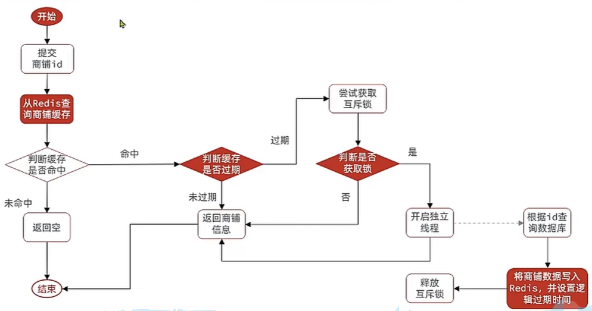

```java
private static final ExecutorService CACHE_REBUILD_EXECUTOR = Executors.newFixedThreadPool(10);
public Shop queryWithLogicalExpire(Long id) {
    String idKey = CACHE_SHOP_KEY + id;
    // 1. 从redis查询
    String shopJson = stringRedisTemplate.opsForValue().get(idKey);
    // 2. 存在直接返回
    if (StrUtil.isBlank(shopJson)) {
        return null;
    }
    //判断是否过期
    //将json转为对象
    RedisData redisData = JSONUtil.toBean(shopJson, RedisData.class);
    JSONObject data = (JSONObject) redisData.getData();
    Shop shop = JSONUtil.toBean(data, Shop.class);
    LocalDateTime expireTime = redisData.getExpireTime();
    if (expireTime.isAfter(LocalDateTime.now())){
        //未过期
        return shop;
    }
    //过期，需要缓存重建
    //缓存重建
    //获得互斥锁
    String lockKey = LOCK_SHOP_KEY+id;
    //判断是否获取锁成功
    boolean flag = tryGetLock(lockKey);
    if (flag){
        //成功开启独立线程，实现缓存重建
        CACHE_REBUILD_EXECUTOR.submit(()->{
            try {
                //重建缓存
                this.saveShop2Redis(id, 20L);
            }catch (Exception e){
                throw new RuntimeException(e);
            }finally {
                //释放锁
                unlock(lockKey);
            }
        });
    }

    //返回过期商铺信息
    return shop;
}
```


### 3.7 缓存封装工具封装

基于 StringRedisTemplate 封装一个缓存工具类，满足下列需求：

✓ 方法 1：将任意 Java 对象序列化为 json 并存储在 string 类型的 key 中，并且可以设置 TTL 过期时间

✓ 方法 2：将任意 Java 对象序列化为 json 并存储在 string 类型的 key 中，并且可以设置逻辑过期时间，用于处理缓存击穿问题

✓ 方法 3：根据指定的 key 查询缓存，并反序列化为指定类型，利用缓存空值的方式解决缓存穿透问题

✓ 方法 4：根据指定的 key 查询缓存，并反序列化为指定类型，需要利用逻辑过期解决缓存击穿问题

```java
@Slf4j
@Component
public class CacheClient {
    private StringRedisTemplate stringRedisTemplate;

    public CacheClient(StringRedisTemplate stringRedisTemplate){
        this.stringRedisTemplate = stringRedisTemplate;
    }
    public void set(String key, Object value, Long time, TimeUnit unit){
        stringRedisTemplate.opsForValue().set(key, JSONUtil.toJsonStr(value),time,unit);
    }
    public void setWithLogicalExpire(String key, Object value, Long time, TimeUnit unit){
        //逻辑过期
        RedisData redisData = new RedisData();
        redisData.setData(value);
        redisData.setExpireTime(LocalDateTime.now().plusSeconds(unit.toSeconds(time)));
        stringRedisTemplate.opsForValue().set(key, JSONUtil.toJsonStr(redisData));
    }
    public <T,ID> T queryWithPassThrough(String keyPrefix, ID id, Class<T> type, Function<ID,T> dbFallback ,Long time,TimeUnit unit) {
        String idKey = keyPrefix + id;
        // 1. 从redis查询
        String Json = stringRedisTemplate.opsForValue().get(idKey);

        // 2. 存在直接返回
        if (StrUtil.isNotBlank(Json)) {
            return JSONUtil.toBean(Json, type);
        }

        // 3. 存在空值
        if (Json != null) {
            return null;
        }

        // 4. 不存在查数据库
        T r = dbFallback.apply(id);
        if (r == null|| JSONUtil.toJsonStr(r).equals("{}")) {
            // 解决缓存穿透：写入空值
            stringRedisTemplate.opsForValue().set(idKey, "", CACHE_NULL_TTL, TimeUnit.SECONDS);
            return null;
        }

        // 5. 写入redis
        this.set(idKey,r,time,unit);
        return r;
    }
}
```


## 4. 优惠券秒杀


当用户抢购时就会生成订单并保存到 tb_voucher_order 这张表中，而订单表如果使用数据库自增 ID 就存在一些问题

1. id规律性太明显

2. 受表单数据量限制


### 4.1 全局唯一ID

指一种在分布式系统下用生成全局唯一id的工具，一般满足一下要求：

唯一性，高可用，高性能，递增性，安全性

为了增加id的安全性，可用不使用redis自增的数值，而是拼接一些其他信息

**Redis 分段自增 ID 策略**（也叫 **Redis 时间戳 + 自增 分布式 ID**）

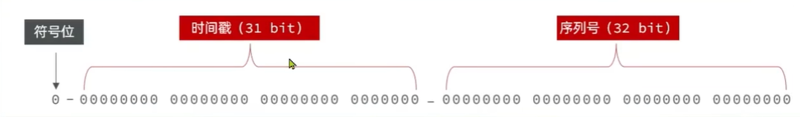

id组成：1bit永远为0，时间戳：31bit以秒为单位，序列号：32bit秒内计数器，支持美秒产生2^32个不同id

```java
@Component
public class RedisIdWorker {


    //LocalDateTime time = LocalDateTime.of(2026, 1, 1, 0, 0, 0);
    //long l = time.toEpochSecond(ZoneOffset.UTC);
    //从一个特定时间开始算
    private static final long BEGIN_TIMESTAMP =1767273600L;
    private static final int COUNT_BITS = 32;

    private StringRedisTemplate stringRedisTemplate;

    public RedisIdWorker(StringRedisTemplate stringRedisTemplate) {
        this.stringRedisTemplate = stringRedisTemplate;
    }

    public long nextId(String prefix){
        //1.生成时间戳,获取当前时间
        LocalDateTime now = LocalDateTime.now();
        long currentSecond = now.toEpochSecond(ZoneOffset.UTC);
        long timeStamp = currentSecond-BEGIN_TIMESTAMP;
        //2.生成序列号
        //获取当前日期精确到天
        String format = now.format(DateTimeFormatter.ofPattern("yyyy:MM:dd"));
        //自增长
        Long count = stringRedisTemplate.opsForValue().increment(RedisConstants.INCREMENT_KEY + prefix + ":"+format);
        //3.拼接返回
        return timeStamp << COUNT_BITS | count;
    }
}
```

全局唯一di生成策略：UUID，Redis自增，snowflake算法


### 4.2 实现优惠卷秒杀下单

每个店铺都可以发布优惠券，分平价卷，特价卷，评价卷随便购买，特价卷需要秒杀抢购

```json
{
    "shopId": 1,
    "title": "100元代金券",
    "subTitle": "周一至周五均可使用",
    "rules": "全场通用\\n无需预约\\n可无限叠加\\n不兑现\\n不找零\\n仅限堂食",
    "payValue": 8000,
    "actualValue": 10000,
    "type": 1,
    "stock": 100,
    "beginTime":"2022-01-26T10:09:17",
    "endTime":"2022-01-26T14:09:17"
}
```

！需要手动更改卷的过期时间在数据库，拦截器将优惠卷的路径放行

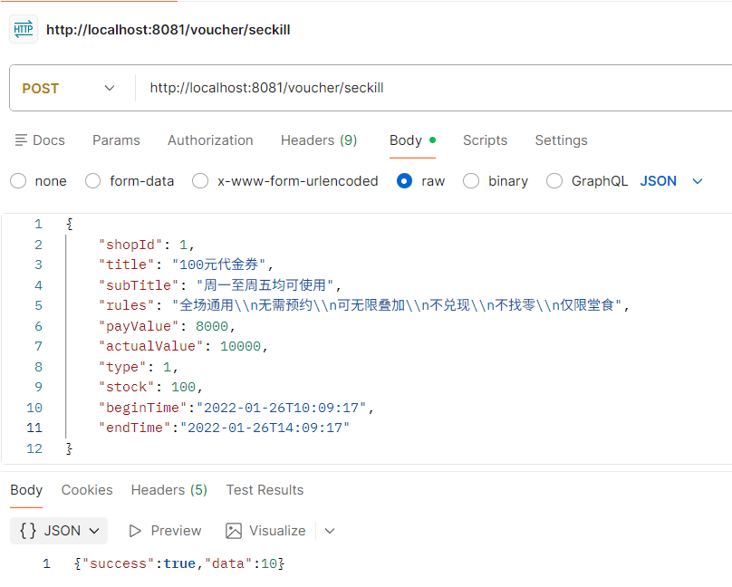


下单时要考虑的问题

1. 秒杀是否开始或结束，未在时间范围内无法下单
2. 库存是否充足，不足无法下单

```java
@Service
public class VoucherOrderServiceImpl extends ServiceImpl<VoucherOrderMapper, VoucherOrder> implements IVoucherOrderService {

    @Resource
    private ISeckillVoucherService iSeckillVoucherService;
    @Resource
    RedisIdWorker redisIdWorker;

    @Override
    @Transactional
    public Result seckillVoucher(Long voucherId) {
        //查询优惠券信息
        SeckillVoucher voucher = iSeckillVoucherService.getById(voucherId);
        //判断是否到时间
        LocalDateTime beginTime = voucher.getBeginTime();
        LocalDateTime endTime = voucher.getEndTime();
        //过期直接返回未到时间
        if (LocalDateTime.now().isBefore(beginTime)){
            return Result.fail("活动尚未开始");
        }
        if (LocalDateTime.now().isAfter(endTime)){
            return Result.fail("活动已结束");
        }
        //没过期，判断库存是否充足
        Integer stock = voucher.getStock();
        //库存不充足，返回
        if (stock<1){
            return Result.fail("库存不足");
        }
        Long userId = UserHolder.getUser().getId();
        // 4. 一人一单判断
        Integer count = query().eq("user_id", userId).eq("voucher_id", voucherId).count();
        if (count > 0) {
            return Result.fail("用户已经购买过一次！");
        }
        //充足，扣库存,加了乐观锁,防超卖！
        boolean flag = iSeckillVoucherService
                .update()
                .setSql("stock=stock-1")
                .gt("stock", 0) // 库存>0才能扣，最安全
                .eq("voucher_id", voucherId)
                .update();
        if (!flag){
            return Result.fail("库存不足");
        }
        //创建订单，返回订单id
        VoucherOrder order = new VoucherOrder();
        //创建订单id
        long orderId = redisIdWorker.nextId("order");
        order.setId(orderId);
        //创建用户id
        order.setUserId(userId);
        //创建代金卷id
        order.setVoucherId(voucherId);
        //写入数据库
        save(order);
        return Result.ok(orderId);
    }
}
```


### 4.3 超卖问题

在线程执行下单时此时另一个线程也在下单，但是刚好数据库只有1张秒杀卷了，此时2个线程都下单会造成订单数量的异常

典型的多线程安全问题，针对这一问题常见方案就是加锁

1. 悲观锁：认为线程安全问题一定会发生，在操作数据之前先获取锁，确保线程串行执行，例如：Synchronize，Lock。

2. 乐观锁：认为线程安全问题不一定会发生，因此不加锁，只在更新数据时判断有没有其他线程对数据进行修改，没修改，安全才更新。已经被其他线程修改了，则说明发生了安全问题，重试或异常。

```java
//充足，扣库存,加了乐观锁,防超卖！
boolean flag = iSeckillVoucherService
        .update()
        .setSql("stock=stock-1")
        .gt("stock", 0) // 库存>0才能扣，最安全
        .eq("voucher_id", voucherId)
        .update();
```

**悲观锁：添加同步锁，让线程串行执行**

- 优点：简单粗暴
- 缺点：性能一般

**乐观锁：不加锁，在更新时判断是否有其它线程在修改**

- 优点：性能好
- 缺点：存在成功率低的问题

**💡 补充说明（结合秒杀场景）**

- **悲观锁**：在高并发场景下，会把请求串行化，能保证数据安全，但会极大降低系统吞吐量，秒杀场景一般不直接用。
- **乐观锁**：在更新时通过条件判断（如 `stock > 0` 或版本号）来避免冲突，性能高，但如果并发量极大，会出现大量请求失败（更新失败），需要配合重试或队列来优化。


### 4.4 一人一单

```java
@Service
public class VoucherOrderServiceImpl extends ServiceImpl<VoucherOrderMapper, VoucherOrder> implements IVoucherOrderService {

    @Resource
    private ISeckillVoucherService iSeckillVoucherService;
    @Resource
    RedisIdWorker redisIdWorker;

    @Override
    @Transactional
    public Result seckillVoucher(Long voucherId) {
        //查询优惠券信息
        SeckillVoucher voucher = iSeckillVoucherService.getById(voucherId);
        //判断是否到时间
        LocalDateTime beginTime = voucher.getBeginTime();
        LocalDateTime endTime = voucher.getEndTime();
        //过期直接返回未到时间
        if (LocalDateTime.now().isBefore(beginTime)){
            return Result.fail("活动尚未开始");
        }
        if (LocalDateTime.now().isAfter(endTime)){
            return Result.fail("活动已结束");
        }
        //没过期，判断库存是否充足
        Integer stock = voucher.getStock();
        //库存不充足，返回
        if (stock<1){
            return Result.fail("库存不足");
        }
        Long userId = UserHolder.getUser().getId();
        synchronized (userId.toString().intern()) {
            //获取事物代理对象（事物）
            IVoucherOrderService proxy =(IVoucherOrderService) AopContext.currentProxy();
            return proxy.createVoucherOrder(voucherId) ;
        }
    }

    @Transactional
    public Result createVoucherOrder(Long voucherId){
        Long userId = UserHolder.getUser().getId();
            // 4. 一人一单判断
            Integer count = query().eq("user_id", userId).eq("voucher_id", voucherId).count();
            if (count > 0) {
                return Result.fail("用户已经购买过一次！");
            }
            //充足，扣库存,加了乐观锁,防超卖！
            boolean flag = iSeckillVoucherService
                    .update()
                    .setSql("stock=stock-1")
                    .gt("stock", 0) // 库存>0才能扣，最安全
                    .eq("voucher_id", voucherId)
                    .update();
            if (!flag) {
                return Result.fail("库存不足");
            }
            //创建订单，返回订单id
            VoucherOrder order = new VoucherOrder();
            //创建订单id
            long orderId = redisIdWorker.nextId("order");
            order.setId(orderId);
            //创建用户id
            order.setUserId(userId);
            //创建代金卷id
            order.setVoucherId(voucherId);
            //写入数据库
            save(order);
            return Result.ok(orderId);
        }
}
```

1. 为什么要用 `synchronized (userId.toString().intern())`？

​		目的：同一个用户，只能一个线程进入，防止一人买多单！

​		你想：同一个用户，100 个请求同时进来抢优惠券

如果不加锁 → 100 个线程同时判断 → 都没订单 → 都创建订单 → 一人买 100 单！

所以：**必须给同一个用户加锁！**

```java
userId.toString().intern()
```

2. 为什么不能直接调用 `createVoucherOrder()`？

**因为直接调用，事务会失效！**

```java
createVoucherOrder(voucherId); // 直接调用
```

这叫 **内部方法调用**。Spring 事务的原理： **必须走代理对象，事务才生效！** 直接调用 = **不走代理 = 事务失效！**

3. 为什么要写 `AopContext.currentProxy()`？ **目的：拿到【事务代理对象】，让事务生效！**

```java
//拿到当前类的代理对象！然后用代理对象去调用：
IVoucherOrderService proxy = (IVoucherOrderService) AopContext.currentProxy();
```

1. 为什么内部调用事务无效？Spring 事务底层靠 **AOP 动态代理**：

- 外部调用 → 走**代理对象** → 前置拦截、开启事务、提交 / 回滚
- 本类里直接 `createVoucherOrder()` → 本质是 `this.createVoucherOrder()`
- **this 是原对象，不是代理对象** → AOP 拦截不到 → **事务完全不生效**

Spring 事务基于 AOP 代理，本类内部方法直接调用属于 this 调用，不走代理，事务失效；必须通过 AopContext 获取当前代理对象，用代理调用事务方法才能让事务生效。

```java
synchronized (userId.toString().intern()) {
    //获取事物代理对象（事物）
    IVoucherOrderService proxy =(IVoucherOrderService) AopContext.currentProxy();
    return proxy.createVoucherOrder(voucherId) ;
}
```

pom.xml添加依赖

```xml
<dependency>
    <groupId>org.aspectj</groupId>
    <artifactId>aspectjweaver</artifactId>
</dependency>
```

启动类加注解

```java
@MapperScan("com.hmdp.mapper")
@SpringBootApplication
@EnableAspectJAutoProxy(exposeProxy = true)
public class HmDianPingApplication {

    public static void main(String[] args) {
        SpringApplication.run(HmDianPingApplication.class, args);
    }

}
```

但是有个问题，这个加锁的方式只能使用在单机模式，如果是集群多台服务器就不行了，因为每个服务器是一个单独的jvm。

所以我们要让多个jvm只能用一把锁


### 4.5 分布式锁 *

在微服务 / 集群分布式部署场景下，传统本地锁（synchronized、ReentrantLock）只能控制单机内多线程互斥，无法跨服务、跨机器保证资源互斥。

而**分布式锁**就是为了解决集群部署时，本地锁失效的问题，实现跨服务器的全局并发控制，保证共享资源同一时间只被一个节点操作。

#### 4.5.1 基于redis分布式锁 setnx key value

获取锁：setnx lock thread1 释放锁 (手动释放/超时释放)：del lock ；

且获取锁和设置过期时间必须同时成功才行，可以通过set实现：set lock thread1 ex 10 nx

 (给thread1设置10s过期时间并加锁，nx**互斥**不存在才能set存在失败)

```java
public interface ILock {
    //尝试获取锁
    boolean tryLock(long timeoutSec);
    //释放锁
    void unlock();
}
```

```java
public class SimpleRedisLock implements ILock{

    //定义业务名称
    private String name;

    private StringRedisTemplate stringRedisTemplate;

    private static final String KEY_PREFIX = "lock:";

    public SimpleRedisLock(String name,StringRedisTemplate stringRedisTemplate) {
        this.name = name;
        this.stringRedisTemplate = stringRedisTemplate;
    }

    //获取锁
    @Override
    public boolean tryLock(long timeoutSec) {
        //获取线程标示
        long threadId = Thread.currentThread().getId();
        //获取锁
        //用了 setIfAbsent（对应 Redis 命令 SETNX），互斥性实现
        Boolean success = stringRedisTemplate.opsForValue().setIfAbsent(
                KEY_PREFIX + name,
                threadId + "",
                timeoutSec,
                TimeUnit.SECONDS);
        //防止自动拆箱为null
        return Boolean.TRUE.equals(success);
    }
    //释放锁
    @Override
    public void unlock() {
        stringRedisTemplate.delete(KEY_PREFIX+name);
    }
}
```

```java
@Service
public class VoucherOrderServiceImpl extends ServiceImpl<VoucherOrderMapper, VoucherOrder> implements IVoucherOrderService {

    @Resource
    private ISeckillVoucherService iSeckillVoucherService;
    @Resource
    RedisIdWorker redisIdWorker;
    @Resource
    StringRedisTemplate stringRedisTemplate;

    @Override
    @Transactional
    public Result seckillVoucher(Long voucherId) {
        //查询优惠券信息
        SeckillVoucher voucher = iSeckillVoucherService.getById(voucherId);
        //判断是否到时间
        LocalDateTime beginTime = voucher.getBeginTime();
        LocalDateTime endTime = voucher.getEndTime();
        //过期直接返回未到时间
        if (LocalDateTime.now().isBefore(beginTime)){
            return Result.fail("活动尚未开始");
        }
        if (LocalDateTime.now().isAfter(endTime)){
            return Result.fail("活动已结束");
        }
        //没过期，判断库存是否充足
        Integer stock = voucher.getStock();
        //库存不充足，返回
        if (stock<1){
            return Result.fail("库存不足");
        }
//--------------------------分布式锁---------------------------------------------------------
        Long userId = UserHolder.getUser().getId();
        SimpleRedisLock lock = new SimpleRedisLock("order:" + userId, stringRedisTemplate);
        //获取事物代理对象（事物）
        boolean isLock = lock.tryLock(3);
        if (!isLock){
            return Result.fail("一个账号只能有一单");
        }
        try {
            IVoucherOrderService proxy =(IVoucherOrderService) AopContext.currentProxy();
            return proxy.createVoucherOrder(voucherId) ;
        }finally {
            //释放锁
            lock.unlock();
        }
        
    }
    ...
}
```

但有个这段代码**2个致命 BUG**，**锁存在误删问题**，线程id存在冲突

问题1：

- 线程 A 加锁 → 业务超时 → 锁过期
- 线程 B 加锁成功
- 线程 A 执行完，**把 B 的锁删了**
- 导致**锁失效，并发安全崩溃**

问题2：

- jvm中每个服务器单独处理一个id，集群模式会有id冲突的问题，线程 ID **只在当前 JVM 里唯一**，**跨服务器、跨 JVM 不唯一！**

```java
public class SimpleRedisLock implements ILock{

    //定义业务名称
    private String name;

    private StringRedisTemplate stringRedisTemplate;

    private static final String KEY_PREFIX = "lock:";
    private static final String THREAD_ID = UUID.randomUUID().toString(true)+"-";

    public SimpleRedisLock(String name,StringRedisTemplate stringRedisTemplate) {
        this.name = name;
        this.stringRedisTemplate = stringRedisTemplate;
    }

    //获取锁
    @Override
    public boolean tryLock(long timeoutSec) {
        //获取线程标示
        String threadId = THREAD_ID+Thread.currentThread().getId();
        //获取锁
        //用了 setIfAbsent（对应 Redis 命令 SETNX），互斥性实现
        Boolean success = stringRedisTemplate.opsForValue().setIfAbsent(
                KEY_PREFIX + name,
                threadId,
                timeoutSec,
                TimeUnit.SECONDS);
        //防止自动拆箱为null
        return Boolean.TRUE.equals(success);
    }
    //释放锁
    @Override
    public void unlock() {
        //获取线程id
        String threadId = THREAD_ID+Thread.currentThread().getId();
        //获取redis的锁标示
        String lockId = stringRedisTemplate.opsForValue().get(KEY_PREFIX + name);
        //判断是否一致
        if(threadId.equals(lockId)){
            stringRedisTemplate.delete(KEY_PREFIX+name);
        }
    }
}
```

还有一个问题，GC 阻塞导致误解锁

场景复现

1. 线程 A 拿到锁，执行业务
2. 业务还没跑完，**突然触发 Full GC**，线程被暂停 STW 阻塞
3. 锁到达过期时间，Redis 自动删锁释放
4. 线程 B 顺利抢到同一把锁开始执行业务
5. GC 结束，线程 A 恢复运行，走到`finally`执行解锁
6. 线程 A 直接删掉**线程 B 持有的锁**，锁彻底失效，并发乱套


redis提供了Lua脚本一个脚本编写多条redis命令，确保执行时的原子性

```lua
--比较线程表示是否与锁一致
if(redis.call('get',KEY[1])== ARGV[1]) then
    --释放锁del key
    return redis.call('del',KEY[1])
end
return 0
```

```java
private static final DefaultRedisScript<Long> UNLOCK_SCRIPT ;
    static {
        UNLOCK_SCRIPT = new DefaultRedisScript<>();
        UNLOCK_SCRIPT.setLocation(new ClassPathResource("unlock.lua"));
        UNLOCK_SCRIPT.setResultType(Long.class);
    }
public void unlock(){
    stringRedisTemplate.execute(
            UNLOCK_SCRIPT,
            Collections.singletonList(KEY_PREFIX+name),
            THREAD_ID+Thread.currentThread().getId());
}
```

### 4.6 Redis优化秒杀

基于setnx实现的分布式锁有下面的问题

1. 不可重入：同一个线程无法多次获得同一把锁
2. 不可重试：获取锁一次失败了直接返回false，没有重试机制
3. 超时释放：业务执行较长也会主动释放锁，存在安全隐患
4. 主从一致：主从同步存在延迟，主宕机如果从并同步中的锁数据，会出现锁实现

**Redisson**：是一个基于redis的基础上实现的java驻内存数据网格，提供了一系列分布式的java对象，还提供了许多分布式服务

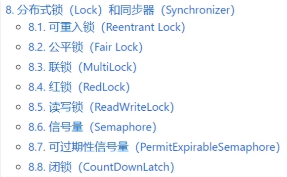

引入依赖

```xml
<dependency>
    <groupId>org.redisson</groupId>
    <artifactId>redisson</artifactId>
    <version>4.0.0</version>
</dependency>
```

配置redisson

```java
@Configuration
public class RedissonConfig {
    @Bean
    public RedissonClient redissonClient(){
        Config config = new Config();
        config.useSingleServer().setAddress("redis://127.0.0.1:6379");
        return Redisson.create(config);
    }
}
```

```java
@Override
    public Result seckillVoucher(Long voucherId) throws InterruptedException {
        //查询优惠券信息
        SeckillVoucher voucher = iSeckillVoucherService.getById(voucherId);
        //判断是否到时间
        LocalDateTime beginTime = voucher.getBeginTime();
        LocalDateTime endTime = voucher.getEndTime();
        //过期直接返回未到时间
        if (LocalDateTime.now().isBefore(beginTime)){
            return Result.fail("活动尚未开始");
        }
        if (LocalDateTime.now().isAfter(endTime)){
            return Result.fail("活动已结束");
        }
        //没过期，判断库存是否充足
        Integer stock = voucher.getStock();
        //库存不充足，返回
        if (stock<1){
            return Result.fail("库存不足");
        }
        Long userId = UserHolder.getUser().getId();
        //SimpleRedisLock lock = new SimpleRedisLock("order:" + userId, stringRedisTemplate);
        RLock lock = redissonClient.getLock("lock:order:" + userId);
        //获取事物代理对象（事物）
        boolean isLock = lock.tryLock(1,10,TimeUnit.SECONDS);
        if (!isLock){
            return Result.fail("一个账号只能有一单");
        }
        try {
            //获取当前类的 Spring 代理对象，确保事务生效,同类调用事务方法，必须拿代理！
            IVoucherOrderService proxy =(IVoucherOrderService) AopContext.currentProxy();
            return proxy.createVoucherOrder(voucherId) ;
        }finally {
            //释放锁
            lock.unlock();
        }
    }
```

```java
@Transactional
public Result createVoucherOrder(Long voucherId){
    Long userId = UserHolder.getUser().getId();
        // 4. 一人一单判断
        Integer count = query().eq("user_id", userId).eq("voucher_id", voucherId).count();
        if (count > 0) {
            return Result.fail("用户已经购买过一次！");
        }
        //充足，扣库存,加了乐观锁,防超卖！
        boolean flag = iSeckillVoucherService
                .update()
                .setSql("stock=stock-1")
                .gt("stock", 0) // 库存>0才能扣，最安全
                .eq("voucher_id", voucherId)
                .update();
        if (!flag) {
            return Result.fail("库存不足");
        }
        //创建订单，返回订单id
        VoucherOrder order = new VoucherOrder();
        //创建订单id
        long orderId = redisIdWorker.nextId("order");
        order.setId(orderId);
        //创建用户id
        order.setUserId(userId);
        //创建代金卷id
        order.setVoucherId(voucherId);
        //写入数据库
        save(order);
        return Result.ok(orderId);
    }
```

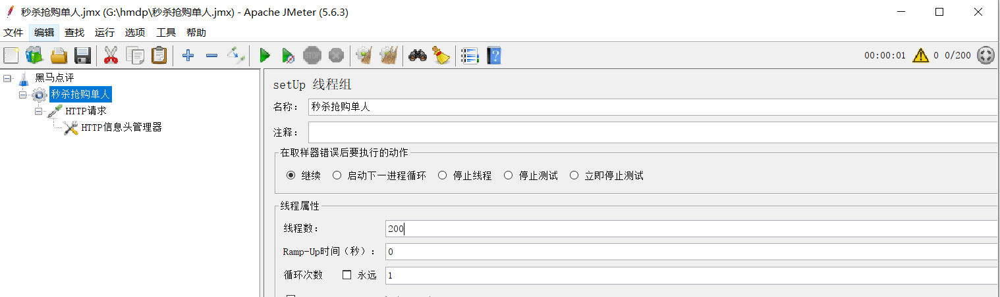

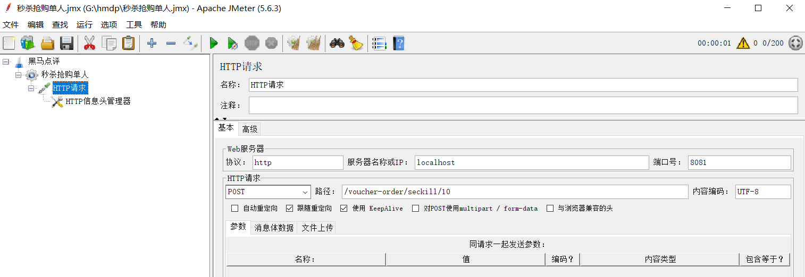

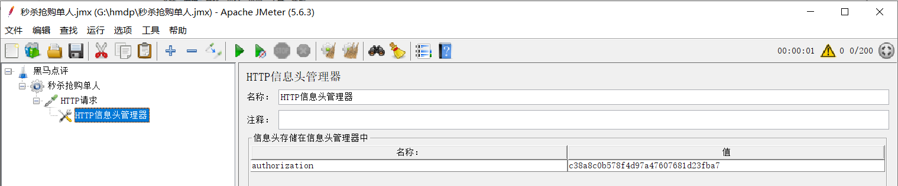


### 4.7 Redis消息对列实现异步秒杀

消息队列（Message Queue），字面意思就是存放消息的队列。最简单的消息队列模型包括 3 个角色：

- 消息队列：存储和管理消息，也被称为消息代理（Message Broker）
- 生产者：发送消息到消息队列
- 消费者：从消息队列获取消息并处理消息

redis能用的队列方式：

- List：简单队列，**没有 ACK、没有重试、丢了就没**
- Pub/Sub：广播，**不持久化，离线消息全丢**
- Streams：Redis 5.0+ 才出，**勉强算靠谱的轻量队列**

#### 4.7.1 基于list结构模拟对列

redis的list数据结构是一个双向链表，左存右取，左取右存

基于 List 的消息队列有哪些优缺点？

优点：

- 利用 Redis 存储，不受限于 JVM 内存上限
- 基于 Redis 的持久化机制，数据安全性有保证
- 可以满足消息有序性

缺点：

- 无法避免消息丢失
- 只支持单消费者

#### 4.7.2 基于 PubSub 的消息队列

PubSub（发布订阅）是 Redis2.0 版本引入的消息传递模型。顾名思义，消费者可以订阅一个或多个 channel，生产者向对应 channel 发送消息后，所有订阅者都能收到相关消息。

- SUBSCRIBE channel [channel] ：订阅一个或多个频道
- PUBLISH channel msg：向一个频道发消息
- PSUBSCRIBE pattern [pattern]：订阅与pattern格式匹配的频道

基于 PubSub 的消息队列有哪些优缺点？

优点：

- 采用发布订阅模型，支持多生产、多消费

缺点：

- 不支持数据持久化
- 无法避免消息丢失
- 消息堆积有上限，超出时数据丢失


#### 4.7.3 基于Stream的消息队列

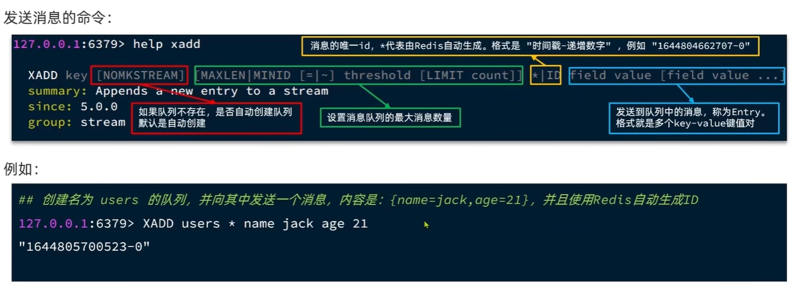

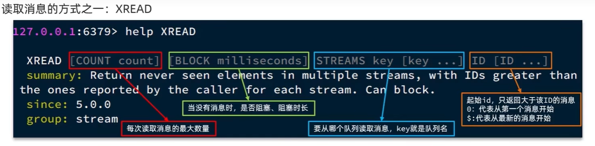

优点：

- 消息可以回溯读取
- 可以对应多个消费者
- 可以阻塞读取

缺点：

- 消息有漏读的风险

##### 4.7.3.1 基于Stream的消息队列-消费者组

消费者组：将多个消费者划分成一个组，监听同一个队列

特点：

- 消息分流：同一个消费者组的不同消费者会争抢处理消息，从而加快处理
- 消息标示：消费者组会维护一个标示，记录最后一个被处理的消息，哪怕消费者宕机重启，还会从标示的那个消息开始往后读
- 消息确认：消费者获取消息后，消息出于pending状态（待处理），并存入pending-list，处理完后需要XACK确认，标记为已处理，从pending-list移出

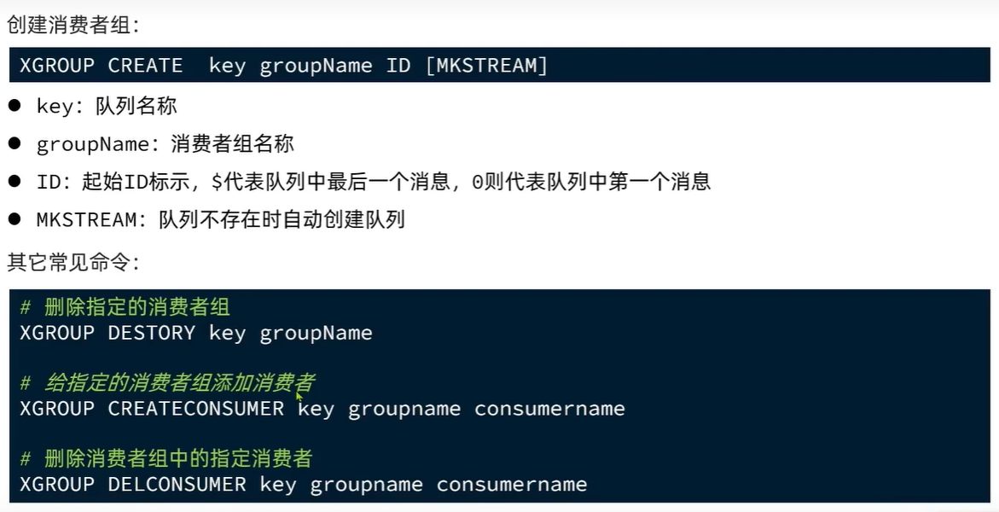

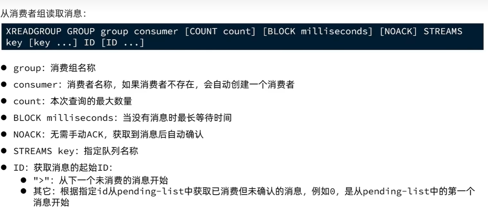

# 高级篇

## 1. 分布式缓存

### 1.1 redis持久化

RDB

RDB 全称 Redis Database Backup file（Redis 数据备份文件），也被叫做 Redis 数据快照。简单来说就是把内存中的所有数据都记录到磁盘中。当 Redis 实例故障重启后，从磁盘读取快照文件，恢复数据。

默认保存在当前运行目录

